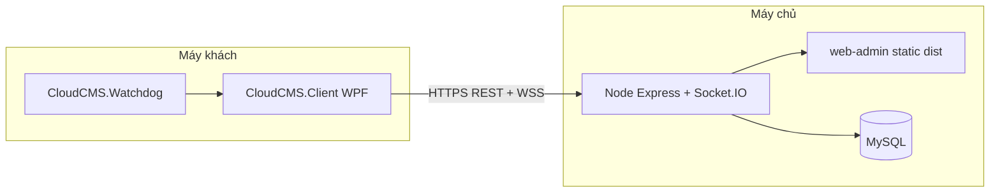

# CloudCMS — Tài liệu bàn giao dự án

Tài liệu này giúp **người mới** nắm phạm vi repo, cách chạy local, build, deploy và chỗ cần đọc thêm. Cập nhật khi kiến trúc hoặc quy trình thay đổi.

---

## 1. Mục đích sản phẩm (tóm tắt)

Hệ thống quản lý **máy trạm / quán net**: máy PC chạy client fullscreen (màn hình khóa + đăng nhập), admin quản lý qua **web**, server tập trung (REST + Socket.IO), có **tenant** (mã quán), **máy trạm** theo MAC, **gói dịch vụ / license**, quy tắc URL, thống kê usage, màn hình chờ (slideshow), v.v.

---

## 2. Kiến trúc tổng quan



- **Backend** phục vụ API (`/api/...`), Socket.IO (`/socket.io`), và có thể phục vụ luôn **bản build** `web-admin/dist` nếu thư mục tồn tại (xem `backend/src/index.js`).
- **Client PC** (.NET 9 WPF) chạy trên Windows; **Watchdog** giữ client sống (scheduled task).
- **Cơ sở dữ liệu**: MySQL (Prisma). Local dùng XAMPP MySQL; AWS dùng Amazon RDS MySQL. Không dùng SQLite trong schema hiện tại.

---

## 3. Cấu trúc thư mục gốc

| Thư mục / file | Vai trò |
|----------------|---------|
| `backend/` | API Node.js (Express), Prisma, Socket.IO, upload lock-screen |
| `web-admin/` | React + Vite + TypeScript — giao diện quản trị |
| `client-pc/` | `CloudCMS.Client` (WPF), `CloudCMS.Watchdog`, script Inno Setup (`install/`) |
| `mobile-app/` | Flutter — dashboard admin tối giản (tuỳ chọn) |
| `deploy/` | Script đồng bộ lên VPS, `vps-install.sh`, nginx mẫu, v.v. |
| `docker-compose.yml` | MySQL + Redis (tuỳ chọn dev/local nếu dùng Docker) |
| `downloads/` | File tải qua backend `/downloads` (vd. bộ cài client) — có thể đặt `.exe` ở đây |
| `docs/` | Runbook, onboarding thương mại, checklist, báo cáo phase |

---

## 4. Backend (`backend/`)

### Stack

- Node.js (ESM), Express, Prisma, Socket.IO, Redis adapter (tuỳ chọn, nhiều instance).
- Cấu hình: `backend/.env` (không commit; xem `backend/.env.example`).

### Biến môi trường quan trọng

| Biến | Ý nghĩa |
|------|---------|
| `DATABASE_URL` | Chuỗi MySQL (bắt buộc production) |
| `CLOUDCMS_DATABASE_URL` | Ghi đè `DATABASE_URL` nếu có (xem `src/databaseUrl/resolve.js`) |
| `JWT_SECRET` | Ký JWT cho web admin |
| `REDIS_URL` | Tuỳ chọn — Socket.IO adapter khi scale |
| `PORT` | Mặc định 3000 |
| `CLOUDCMS_LOCK_SCREEN_DIR` | Thư mục lưu **file ảnh** lock-screen (nên persistent trên VPS) |

### Lệnh thường dùng

```bash
cd backend
npm ci
npm run dev          # dev: node --watch
npm start            # production: node src/index.js
npx prisma generate
npm run db:migrate:deploy   # migrate trên môi trường có DB (production)
npm run db:seed             # seed user/tenant mặc định chỉ khi chưa có (an toàn chạy lại)
npm run db:backup           # mysqldump — cần client MySQL
npm run build:web           # build web-admin từ backend (gọi prefix ../web-admin)
```

### Entry & routing

- Entry: `src/index.js` (import `ensureDatabaseUrl.js` trước Prisma).
- Routes trong `src/routes/` (auth, computers, sessions, users, stats, url-rules, super admin, subscription, lock-screen admin, usage, webrtc).

### Health

- `GET /health` — liveness.
- `GET /api/health/db` — kiểm tra DB + đếm user.

Chi tiết vận hành: `docs/RUNBOOK.md`.

---

## 5. Web admin (`web-admin/`)

### Stack

- React 19, Vite 8, TypeScript, react-router, PWA (vite-plugin-pwa), socket.io-client.

### Lệnh

```bash
cd web-admin
npm ci
npm run dev      # Vite dev server (thường port 5173 — xem vite.config)
npm run build    # output: web-admin/dist
```

### Phục vụ production

- Backend tự `express.static` thư mục `web-admin/dist` nếu có (cùng origin với API).
- Hoặc nginx phục vụ static riêng — tùy triển khai.

---

## 6. Client máy trạm (`client-pc/`)

### Projects (.NET 9 Windows)

| Project | Vai trò |
|---------|---------|
| `CloudCMS.Client` | WPF — màn khóa, đăng nhập, socket, usage, URL rules, WebRTC, v.v. |
| `CloudCMS.Watchdog` | Nền — restart client nếu tắt |

### Cấu hình cần biết

- **Server URL**: hằng trong `CloudCMS.Client/MainWindow.xaml.cs` (`ServerUrl`) — đổi trước khi build cho môi trường khác.
- **Tenant**: lưu local (`TenantConfigStore`), nhập lần đầu trên form.
- **Manifest**: app chạy **Administrator** (`app.manifest`) — phục vụ chính sách khóa màn hình.

### Build & cài đặt Windows

- Chi tiết: `client-pc/BUILD_WINDOWS.md`
- Tổng quan tính năng: `client-pc/CLIENT_PC_OVERVIEW.md`
- Bộ cài Inno / thương mại: `client-pc/install/README-COMMERCIAL.md`, script `install/build-installer.ps1`
- Version đồng bộ: `client-pc/Version.props`, `install/sync-version.ps1`

**Lưu ý:** Build .NET cần máy **Windows** (hoặc CI Windows) + SDK phù hợp.

---

## 7. Mobile (`mobile-app/`)

- Flutter (`cloudcms_mobile`) — admin dashboard tối giản, HTTP + socket.io_client.
- Cần Flutter SDK; không bắt buộc cho luồng PC + web chính.

```bash
cd mobile-app
flutter pub get
flutter run
```

---

## 8. Triển khai (Local DB, Docker tuỳ chọn, VPS)

### Local DB

Ưu tiên hiện tại là dùng XAMPP MySQL cho local development vì máy dev cần cấu hình DB nhẹ và không phụ thuộc Docker.

```text
MySQL host: localhost
MySQL port: 3306
Database: cloudcms
Example DATABASE_URL: mysql://root:@localhost:3306/cloudcms
```

Nếu dùng Docker ở máy khác, cấu hình compose phải dùng MySQL + Redis và volume tương ứng để dữ liệu bền khi restart container.

### VPS (script có sẵn)

- Đồng bộ + build + PM2: `deploy/vps-full-deploy.sh` (chạy **máy dev**).
- Cài đặt trên server: `deploy/vps-install.sh` (Node, pm2, migrate, build web, health).
- Đồng bộ file: `deploy/rsync-to-vps.sh` — **không** rsync `backend/.env` từ dev (tránh ghi đè production).
- Nhập mật khẩu SSH an toàn: `deploy/prompt-sshpass-deploy.sh`.

Biến môi trường khi deploy: `VPS`, `VPS_PORT`, `REMOTE_DIR` (mặc định xem trong script).

### Nginx / HTTPS

- Gợi ý trong output của `vps-install.sh`; mẫu cấu hình: `deploy/nginx-cloudcms.conf`, `deploy/nginx-cloudcms-full.conf`; script: `deploy/vps-setup-nginx-https.sh`.

---

## 9. Dữ liệu & an toàn vận hành

- **MySQL** chứa toàn bộ dữ liệu nghiệp vụ; **không** nằm trong thư mục git. Giữ nguyên `DATABASE_URL` khi deploy code mới.
- **Schema**: `prisma migrate deploy` trên production — **không** dùng `migrate dev` / `db push` thiếu hiểu biết trên prod.
- **Seed**: idempotent — không reset mật khẩu user đã tồn tại (xem `backend/prisma/seed.js`).
- **Ảnh lock-screen**: file trên đĩa — cấu hình `CLOUDCMS_LOCK_SCREEN_DIR` nếu không muốn mất ảnh khi deploy xóa thư mục app.
- **Backup**: `npm run db:backup` hoặc backup managed DB.

---

## 10. Tài liệu tham chiếu trong repo

| File | Nội dung |
|------|----------|
| `docs/RUNBOOK.md` | Health, deploy, rollback, log |
| `docs/COMMERCIAL_ONBOARDING.md` | Onboarding khách / quán |
| `client-pc/BUILD_WINDOWS.md` | Build client + Inno |
| `client-pc/CLIENT_PC_OVERVIEW.md` | Chi tiết client PC |
| `client-pc/install/README-COMMERCIAL.md` | Installer, checksum, ký số |
| `backend/.env.example` | Gợi ý biến môi trường |
| `docs/BASELINE_CHECKLIST.md` | Đo baseline hạ tầng |

Các file `docs/phases*` / `docs/phases-commercial*` là báo cáo milestone — đọc khi cần ngữ cảnh lịch sử.

---

## 11. Checklist người mới vào

1. Đọc mục **Kiến trúc** và **Cấu trúc thư mục** ở trên.
2. Bật XAMPP MySQL, tạo database `cloudcms`, copy `backend/.env.example` → `backend/.env`, chỉnh `DATABASE_URL`.
3. `cd backend && npm ci && npm run db:migrate:deploy && npm run db:seed && npm run dev`.
4. `cd web-admin && npm ci && npm run dev` (hoặc build `dist` và để backend phục vụ).
5. Mở `http://localhost:3000` nếu backend đã mount `web-admin/dist` (sau `npm run build` trong web-admin hoặc `npm run build:web` từ backend).
6. Client PC: đọc `BUILD_WINDOWS.md` — cần máy Windows để build.
7. Deploy VPS: đọc `deploy/vps-full-deploy.sh` đầu file (comment) và `docs/RUNBOOK.md`.

---

## 12. Ghi chú phiên bản & repo

- Repo có thể không dùng git ở một số môi trường — vẫn nên dùng version control (tag release backend + client).
- **Node**: khuyến nghị LTS tương thích với `package.json` engines nếu có thêm sau này.

---

*Tài liệu này là điểm vào tổng quát; chi tiết kỹ thuật nằm trong các file được link — cập nhật khi thêm module hoặc đổi quy trình build/deploy.*
