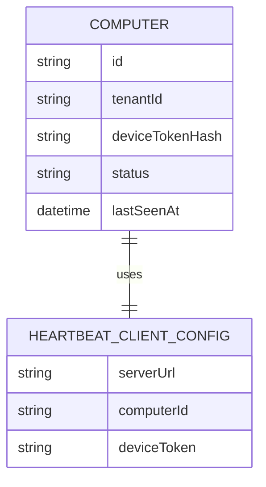
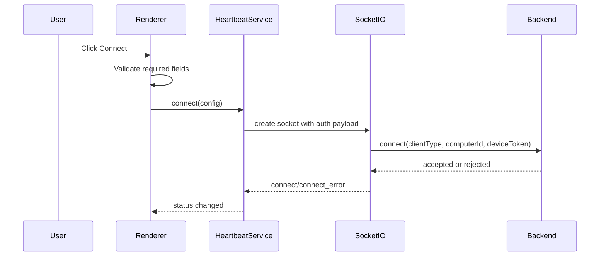
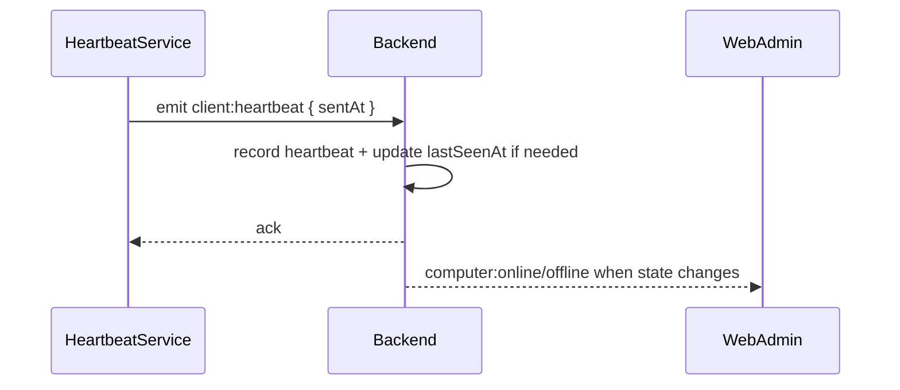
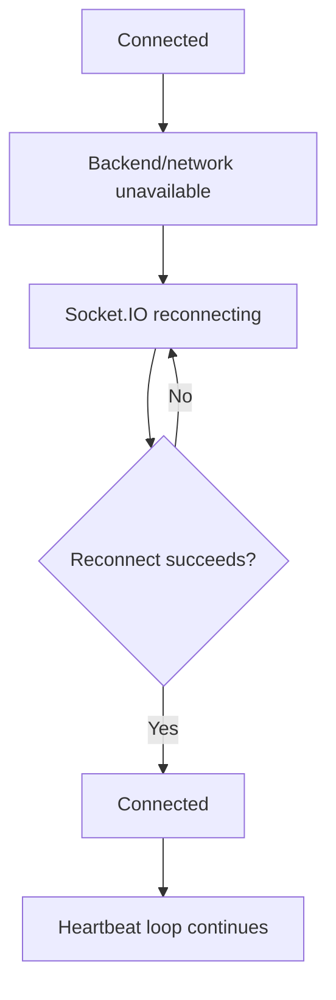

# Technical Design Document: CloudCMS Desktop Heartbeat Client

Date: 2026-05-29

Source SPEC: `docs/SPEC/WPF/SPEC.md`

Target output: `desktop-client/heartbeat-client`

Note: The target folder remains `docs/tdd/WPF` because that was the requested documentation path. The implementation described here is not WPF/.NET. It is an Electron + TypeScript desktop app because the product requirement was clarified to "desktop app only."

## 1. Overview

CloudCMS Desktop Heartbeat Client is a local desktop utility installed on a registered shop computer. It connects to the existing backend Socket.IO realtime module as a `computer` client and emits periodic heartbeat events so the backend and Web Admin can reflect online/offline state.

The feature is client-only. It creates a new Electron + TypeScript app under `desktop-client/heartbeat-client` and reuses the existing backend realtime protocol:

```text
Electron desktop app -> Socket.IO auth -> client:heartbeat -> backend presence store -> Web Admin realtime state
```

The MVP intentionally excludes lockscreen behavior, tray mode, Windows startup integration, installer packaging, DPAPI/keychain secret storage, multi-computer management in one app, and Web Admin room-map UI.

## 2. Requirements

### 2.1 Functional Requirements

- As a shop operator, I want to enter `serverUrl`, `computerId`, and `deviceToken` so this computer can authenticate with the local backend.
- As a shop operator, I want to save the local configuration so the app can reload credentials after restart.
- As a shop operator, I want to connect and disconnect manually so I can test realtime presence during local development.
- As a shop operator, I want to see connection state, last heartbeat time, last acknowledgement time, and safe error messages so I know whether the client is working.
- As a registered computer, the app must connect to Socket.IO with `auth = { clientType: "computer", computerId, deviceToken }`.
- As a registered computer, the app must emit `client:heartbeat` every 10 seconds while connected.
- As a registered computer, the app must recover from temporary backend/network disruptions through Socket.IO reconnect.
- As a developer/operator, I want invalid token and unreachable backend failures to be visible without exposing the raw device token.

Functional rules:

- Default `serverUrl` is `http://localhost:3000`.
- Config is stored at `%AppData%/CloudCMS/heartbeat-client.json`.
- `computerId` and `deviceToken` are obtained from existing computer registration or token reissue flows.
- The renderer must not access Node filesystem APIs directly.
- The app must not send `deviceToken` in query strings or renderer logs.
- Manual disconnect must stop the heartbeat loop and close the socket.
- App close must stop the heartbeat loop and disconnect the socket.

### 2.2 Non-Functional Requirements

- Security:
  - Do not log raw `deviceToken`.
  - Do not expose raw `deviceToken` outside the masked input and Socket.IO auth payload.
  - Store the token in plain JSON only for MVP/local development.
  - Keep Electron renderer sandboxed from direct Node access.
- Reliability:
  - Reconnect after backend restart or short network interruption.
  - Prevent duplicate heartbeat timers after reconnect or repeated Connect clicks.
  - Handle Socket.IO connect errors without crashing the desktop process.
- Maintainability:
  - Separate Electron main/preload/config responsibilities from renderer UI and heartbeat logic.
  - Keep protocol constants (`client:heartbeat`, `clientType: "computer"`) centralized.
  - Use TypeScript types for config, connection state, and status snapshots.
- Usability:
  - Inputs must have visible labels.
  - Error messages must be text-based and actionable.
  - Buttons must be keyboard reachable.
- Performance:
  - Heartbeat interval is 10 seconds.
  - The app should stay idle between heartbeat ticks.
  - No polling REST endpoints is required for MVP.

## 3. Technical Design

### 3.1. Data Model Changes

No backend database schema changes are required.

The existing backend `Computer` model already contains fields required for authentication and presence:

- `id`
- `tenantId`
- `deviceTokenHash`
- `status`
- `lastSeenAt`

The desktop app introduces a local JSON config file only:

```ts
export type HeartbeatClientConfig = {
  serverUrl: string;
  computerId: string;
  deviceToken: string;
};
```

Config path:

```text
%AppData%/CloudCMS/heartbeat-client.json
```

Status model:

```ts
export type HeartbeatConnectionState =
  | "Disconnected"
  | "Connecting"
  | "Connected"
  | "Reconnecting"
  | "Error";

export type HeartbeatStatus = {
  state: HeartbeatConnectionState;
  lastHeartbeatSentAt: string | null;
  lastAckAt: string | null;
  lastError: string | null;
};
```

Mermaid data relationship:



### 3.2. API Changes

No REST API changes are required.

The desktop app uses the existing Socket.IO protocol.

Socket.IO auth handshake:

```ts
{
  clientType: "computer",
  computerId: config.computerId,
  deviceToken: config.deviceToken
}
```

Heartbeat event:

```ts
socket.emit("client:heartbeat", {
  sentAt: new Date().toISOString()
});
```

Backend expectations:

- The backend validates `clientType`, `computerId`, and `deviceToken`.
- The backend rejects inactive, blocked, missing, or invalid-token computers.
- On accepted connection, backend emits `computer:online` to watching admins.
- On disconnect or heartbeat timeout, backend emits `computer:offline`.

Socket.IO route/middleware mapping:

```text
Socket.IO connection
  -> realtime authentication middleware
  -> authenticateRealtimeComputerHandshake
  -> realtime presence registration
  -> registerClientHeartbeatHandler
  -> realtimePresenceStore.recordHeartbeat
```

### 3.3. UI Changes

This feature adds a new desktop UI, not a Web Admin UI change.

Main window controls:

- `Server URL` text input.
- `Computer ID` text input.
- `Device Token` password input.
- `Save` button.
- `Connect` button.
- `Disconnect` button.
- Status panel with:
  - connection state
  - last heartbeat sent timestamp
  - last acknowledgement timestamp
  - safe error message

Proposed renderer layout:

```text
+--------------------------------------------------+
| CloudCMS Heartbeat Client                         |
+--------------------------------------------------+
| Server URL       [ http://localhost:3000        ] |
| Computer ID      [                              ] |
| Device Token     [ ***************              ] |
|                                                  |
| [Save] [Connect] [Disconnect]                    |
|                                                  |
| State: Connected                                  |
| Last heartbeat: 2026-05-29 10:00:00              |
| Last ack:       2026-05-29 10:00:00              |
| Error:          -                                |
+--------------------------------------------------+
```

### 3.4. Logic Flow

Connect flow:



Heartbeat flow:



Reconnect flow:



Implementation boundaries:

- Main process:
  - create `BrowserWindow`
  - configure app lifecycle
  - handle config IPC
- Preload:
  - expose `config.load`, `config.save` APIs
  - expose no generic Node primitives
- Renderer:
  - render form and status
  - call config API
  - own `HeartbeatService`
- Heartbeat service:
  - create/dispose Socket.IO client
  - maintain heartbeat timer
  - emit status snapshots

### 3.5. Dependencies

Runtime/dev dependencies:

- `electron` for desktop runtime.
- `typescript` for static typing.
- `vite` for renderer development/build.
- `@vitejs/plugin-react` if React renderer is used.
- `react` and `react-dom` for renderer UI.
- `socket.io-client` for backend-compatible realtime transport.
- `vitest` for unit tests.
- `@testing-library/react` for renderer component tests if React is used.

Package manager:

- Use `npm` to match the current repository defaults.

Configuration:

- No backend `.env` changes are required.
- Desktop app default server URL is `http://localhost:3000`.

### 3.6. Security Considerations

- Device tokens are secrets.
- The app must not log the token in renderer console, main process logs, error messages, IPC payload debug logs, or test snapshots.
- The token must not be placed in URL query strings.
- The token is sent only inside Socket.IO auth payload.
- Plain JSON token storage is accepted for MVP/local demo only.
- Renderer process must use preload IPC instead of direct Node file access.
- Error messages should be normalized:
  - `Unauthorized realtime connection`
  - `Cannot connect to server`
  - `Connection interrupted; retrying`
- Future hardening should use Windows DPAPI or a cross-platform keychain package before production deployment.

### 3.7. Performance and Reliability Considerations

- Heartbeat interval is 10 seconds; this is well below the backend 90-second heartbeat timeout.
- Only one active Socket.IO client should exist per app window.
- Only one heartbeat timer should exist per connection.
- Repeated Connect clicks must not create duplicate sockets or timers.
- Disconnect and app close must stop timers before destroying the socket.
- Socket.IO auto-reconnect should be enabled with bounded retry delay.
- Backend downtime should not freeze the UI.
- The app should remain responsive while reconnecting.

### 3.8. Observability and Operations

Local UI observability:

- Display connection state.
- Display last heartbeat sent timestamp.
- Display last acknowledgement timestamp.
- Display last safe error message.

Logging:

- MVP should avoid file logging unless needed.
- Console logs must not include `deviceToken`.
- If logs are added later, redact token fields.

Manual operations:

- Operator gets `computerId` and `deviceToken` from computer registration or token reissue.
- Operator enters credentials once and saves.
- Operator starts backend and Web Admin for local validation.

CI/build expectations:

- `npm run typecheck`
- `npm run test`
- `npm run build`

## 4. Testing Plan

Unit tests:

- Config store returns default config when file is missing.
- Config store writes and reads JSON correctly.
- Config validation rejects empty `serverUrl`, `computerId`, and `deviceToken`.
- Heartbeat service does not create duplicate timers when `connect` is called repeatedly.
- Heartbeat service stops timer on disconnect.
- Error normalizer maps unauthorized and connection failures to safe UI messages.

Renderer tests:

- Form renders all labels and controls.
- Save action calls config save API.
- Connect action validates required fields before calling heartbeat service.
- Status panel updates when service emits status snapshots.
- Token input uses password masking.

Integration tests:

- Mock `socket.io-client` to verify auth payload:

```ts
{
  clientType: "computer",
  computerId: "computer-1",
  deviceToken: "secret-token"
}
```

- Mock heartbeat ack and assert `lastAckAt` updates.
- Mock reconnect events and assert state becomes `Reconnecting` then `Connected`.

Manual QA:

- Start backend on `http://localhost:3000`.
- Register or reissue a computer token.
- Launch desktop app.
- Enter `serverUrl`, `computerId`, and `deviceToken`.
- Connect and confirm Web Admin shows online.
- Wait for multiple heartbeat intervals and confirm timestamps update.
- Disconnect or close app and confirm backend/Web Admin eventually shows offline.
- Enter a wrong token and confirm safe unauthorized error.
- Restart backend and confirm app reconnects.

## 5. Open Questions

- Should `docs/SPEC/WPF` and `docs/tdd/WPF` be renamed to `DesktopHeartbeat` now that the implementation is not WPF?
- Should the renderer use React or plain TypeScript DOM? Default is React + Vite for consistency with web-admin.
- Should token storage remain plain JSON through submission, or should DPAPI/keychain encryption be added before final delivery?
- Should the final desktop app include packaging/installer tasks in a later phase?

## 6. Alternatives Considered

- WPF/.NET desktop app:
  - Rejected for this iteration because the user clarified that any desktop app is acceptable, and the team prefers JavaScript.
- Node.js console app:
  - Rejected because it would not provide the requested desktop UI for entering credentials and status monitoring.
- Tauri + TypeScript:
  - Deferred because it adds Rust toolchain complexity. It may be revisited if app size becomes a priority.
- Electron + TypeScript:
  - Selected because it is a real desktop app, uses familiar JavaScript tooling, and integrates directly with `socket.io-client`.
