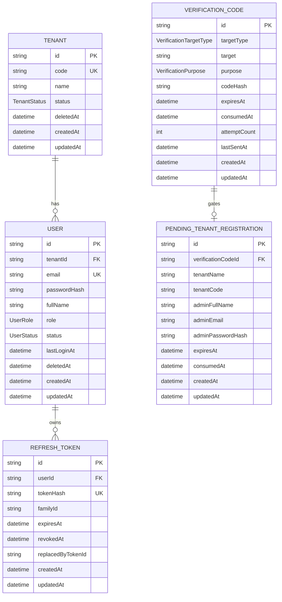
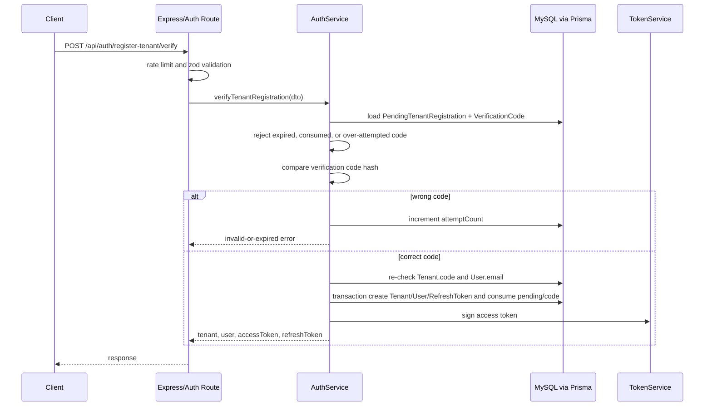
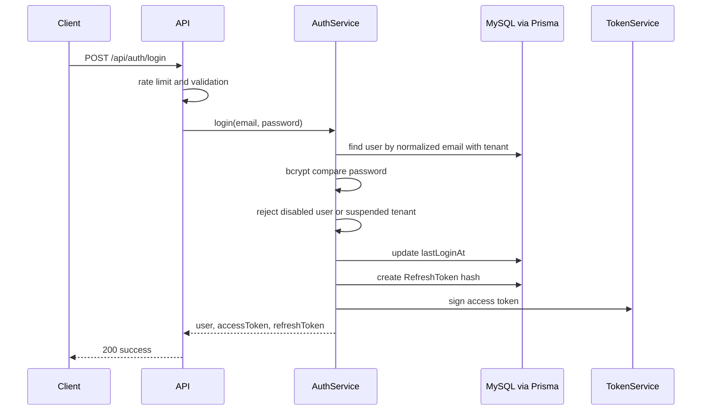
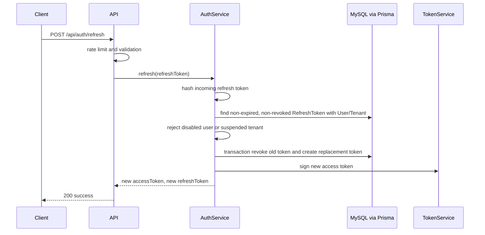
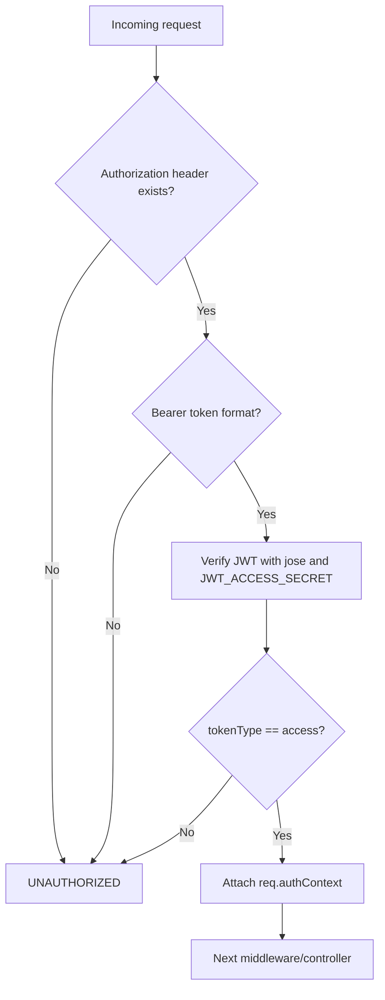

# Technical Design Document: CloudCMS Auth Module

## 1. Overview

The `auth` module is the first business module after the CloudCMS backend Foundation. It replaces the current placeholder auth context with real authentication for CloudCMS admin APIs.

This TDD is based on:

- Source SPEC: `docs/SPEC/auth/SPEC.md`
- Auth module design: `docs/module/auth/2026-05-19-cloudcms-auth-design.md`
- Backend foundation TDD: `docs/tdd/foundation/technical-design.md`
- Current backend source under `backend/`

Confirmed implementation context:

- Runtime: Node.js 22.
- Package manager: `npm`.
- Language: TypeScript with `module = NodeNext`.
- API framework: Express.
- ORM: Prisma v6.
- Database: MySQL.
- Test runner: Vitest with Supertest.
- Logger: Pino through the Foundation logger.
- Existing pattern: route -> controller -> service -> Prisma/shared adapters.
- Existing validation: `zod` through `validateRequest`.
- Existing error handling: `AppError` and centralized `errorHandler`.
- Existing rate-limit support: token bucket middleware and in-memory store.
- Existing auth context: placeholder only, implemented in `backend/src/shared/middleware/auth-context.ts`.

Auth owns:

- Public tenant registration request.
- Email verification for tenant registration.
- Tenant and first `shop_admin` creation after verification.
- Login.
- Refresh-token rotation.
- Logout.
- Current-user lookup.
- JWT access-token middleware and route-level role helpers.

Auth does not own:

- Tenant CRUD after initial registration.
- User/staff CRUD after initial tenant onboarding.
- Detailed permission management beyond role helpers.
- Client PC registration, device tokens, Socket.IO authentication, sessions, URL rules, assets, subscriptions, or full audit persistence.

## 2. Requirements

### 2.1 Functional Requirements

- The backend must expose `POST /api/auth/register-tenant` to accept the full tenant registration form, create pending registration data, and send an email verification code.
- The backend must expose `POST /api/auth/register-tenant/verify` to verify the email code, create the tenant and first `shop_admin`, auto-login, and return tokens.
- The backend must expose `POST /api/auth/login` to authenticate an existing active user with email and password.
- The backend must expose `POST /api/auth/refresh` to rotate a valid refresh token and issue a new access token.
- The backend must expose `POST /api/auth/logout` to revoke a refresh token idempotently.
- The backend must expose `GET /api/auth/me` to return the current authenticated user and tenant.
- Tenant registration must create only a `shop_admin`.
- Public tenant registration must not create `staff` or `super_admin`.
- Every user email must be globally unique.
- Emails must be normalized with `trim().toLowerCase()` before storage and lookup.
- `Tenant` and `User` records must not be created before verification succeeds.
- Verification must check `tenantCode` and `adminEmail` both when pending registration is created and again when verification completes.
- Access tokens must be JWT access tokens.
- Refresh tokens must be random opaque secrets and must rotate on every refresh.
- Refresh tokens must be stored only as hashes.
- Verification codes must be stored only as hashes.
- Local development and production must send verification email through configured SMTP.
- Automated tests must use a mock email sender and must not send real email.
- Auth middleware must attach `userId`, `tenantId`, `role`, and `tokenType` to `req.authContext` after validating a JWT access token.
- RBAC helpers must support `authRequired`, `requireRole`, and `requireTenantUser`.

### 2.2 Non-Functional Requirements

- Security: raw passwords, password hashes, access tokens, refresh tokens, token hashes, verification codes, code hashes, authorization headers, SMTP passwords, and JWT secrets must never be logged.
- Security: login failures must not reveal whether the email exists.
- Security: verification failures must use a generic invalid-or-expired response.
- Security: production error responses must not expose stack traces.
- Security: all request payloads must be validated with `zod` before service execution.
- Security: sensitive auth routes must use route-specific rate limits.
- Maintainability: Auth source must follow the existing module boundary under `backend/src/modules/auth/`.
- Maintainability: shared email delivery must live under `backend/src/shared/email/`.
- Maintainability: Prisma CLI, migrations, database setup, and server commands remain user/team-run actions.
- Reliability: register verification must create tenant, user, consumed markers, and refresh token in one database transaction.
- Reliability: logout must be idempotent.
- Reliability: refresh-token rotation must revoke the old token before returning the new token.
- Observability: every important auth outcome must emit structured logs with `requestId` and safe identifiers.
- Observability: logs should include masked or hashed email identifiers instead of raw email when feasible.
- Testability: token, password, verification, email sender, and service logic must be testable without opening a network port.
- Compatibility: new dependencies must not conflict with existing dependencies in `backend/package.json`.

## 3. Technical Design

### 3.1. Data Model Changes

Auth adds five Prisma models and supporting enums to `backend/prisma/schema.prisma`.

#### Enums

```prisma
enum TenantStatus {
  ACTIVE
  SUSPENDED
}

enum UserRole {
  super_admin
  shop_admin
  staff
}

enum UserStatus {
  ACTIVE
  DISABLED
}

enum VerificationTargetType {
  EMAIL
}

enum VerificationPurpose {
  REGISTER_TENANT
}
```

#### Tenant

```prisma
model Tenant {
  id        String       @id @default(uuid())
  code      String       @unique
  name      String
  status    TenantStatus @default(ACTIVE)
  deletedAt DateTime?
  createdAt DateTime     @default(now())
  updatedAt DateTime     @updatedAt

  users User[]
}
```

#### User

```prisma
model User {
  id           String     @id @default(uuid())
  tenantId     String?
  email        String     @unique
  passwordHash String
  fullName     String
  role         UserRole
  status       UserStatus @default(ACTIVE)
  lastLoginAt  DateTime?
  deletedAt    DateTime?
  createdAt    DateTime   @default(now())
  updatedAt    DateTime   @updatedAt

  tenant        Tenant?        @relation(fields: [tenantId], references: [id])
  refreshTokens RefreshToken[]

  @@index([tenantId])
  @@index([role])
  @@index([status])
}
```

Service-layer invariants:

- `super_admin` may have `tenantId = null`.
- `shop_admin` and `staff` must have `tenantId`.
- Public tenant registration creates exactly one `shop_admin`.

#### RefreshToken

```prisma
model RefreshToken {
  id                String    @id @default(uuid())
  userId            String
  tokenHash          String    @unique
  familyId           String
  expiresAt          DateTime
  revokedAt          DateTime?
  replacedByTokenId  String?
  createdAt          DateTime  @default(now())
  updatedAt          DateTime  @updatedAt

  user User @relation(fields: [userId], references: [id])

  @@index([userId, revokedAt])
  @@index([expiresAt])
  @@index([familyId])
}
```

#### VerificationCode

```prisma
model VerificationCode {
  id           String                 @id @default(uuid())
  targetType   VerificationTargetType
  target       String
  purpose      VerificationPurpose
  codeHash     String
  expiresAt    DateTime
  consumedAt   DateTime?
  attemptCount Int                    @default(0)
  lastSentAt   DateTime
  createdAt    DateTime               @default(now())
  updatedAt    DateTime               @updatedAt

  pendingTenantRegistration PendingTenantRegistration?

  @@index([target, purpose, consumedAt])
  @@index([expiresAt])
}
```

#### PendingTenantRegistration

```prisma
model PendingTenantRegistration {
  id                 String    @id @default(uuid())
  verificationCodeId String    @unique
  tenantName         String
  tenantCode         String
  adminFullName      String
  adminEmail         String
  adminPasswordHash  String
  expiresAt          DateTime
  consumedAt         DateTime?
  createdAt          DateTime  @default(now())
  updatedAt          DateTime  @updatedAt

  verificationCode VerificationCode @relation(fields: [verificationCodeId], references: [id])

  @@index([adminEmail, consumedAt])
  @@index([tenantCode, consumedAt])
  @@index([expiresAt])
}
```

#### ERD



### 3.2. API Changes

All endpoints are mounted from `authRouter` in `backend/src/modules/auth/auth.routes.ts`. The router is mounted in `backend/src/app.ts` before `notFoundHandler`.

General middleware order:

```text
requestId -> requestLogger -> helmet -> cors -> body parsers -> authContextMiddleware -> authRouter -> notFoundHandler -> errorHandler
```

Route-level middleware order:

```text
rateLimit -> validateRequest -> auth controller -> auth service -> errorHandler
```

For `GET /api/auth/me`:

```text
authRequired -> validateRequest if needed -> auth controller -> auth service -> errorHandler
```

#### `POST /api/auth/register-tenant`

Purpose: create pending tenant registration and send verification code.

Authentication: public.

Rate-limit key:

```text
IP + normalized adminEmail
```

Request:

```json
{
  "tenantName": "Cyber Game Q1",
  "tenantCode": "CYBER_Q1",
  "adminFullName": "Nguyen Van A",
  "adminEmail": "admin@cyberq1.vn",
  "adminPassword": "StrongPassword123!"
}
```

Response:

```json
{
  "success": true,
  "data": {
    "registrationId": "pending-registration-id",
    "email": "admin@cyberq1.vn",
    "expiresInSeconds": 600,
    "resendAfterSeconds": 60
  }
}
```

Expected errors:

- `VALIDATION_ERROR` for invalid payload.
- `CONFLICT` for duplicate tenant code.
- `CONFLICT` for duplicate admin email.
- `RATE_LIMITED` for rate-limit violations.
- `INTERNAL_ERROR` for unexpected email or database failures.

Controller/service mapping:

```text
auth.routes.ts
-> validateRequest(registerTenantSchema)
-> authController.registerTenant
-> authService.registerTenant
-> passwordHasher.hash
-> verificationService.generateCode/hashCode
-> prisma.verificationCode.create
-> prisma.pendingTenantRegistration.create
-> emailSender.sendVerificationCode
```

#### `POST /api/auth/register-tenant/verify`

Purpose: verify code and complete tenant onboarding.

Authentication: public.

Rate-limit key:

```text
registrationId + IP
```

Request:

```json
{
  "registrationId": "pending-registration-id",
  "verificationCode": "483920"
}
```

Response:

```json
{
  "success": true,
  "data": {
    "tenant": {
      "id": "tenant-id",
      "code": "CYBER_Q1",
      "name": "Cyber Game Q1",
      "status": "ACTIVE"
    },
    "user": {
      "id": "user-id",
      "email": "admin@cyberq1.vn",
      "fullName": "Nguyen Van A",
      "role": "shop_admin",
      "tenantId": "tenant-id"
    },
    "accessToken": "jwt-access-token",
    "refreshToken": "refresh-token"
  }
}
```

Expected errors:

- `VALIDATION_ERROR` for invalid payload.
- `UNAUTHORIZED` or `VALIDATION_ERROR` with a generic invalid-or-expired message for wrong, expired, consumed, or over-attempted verification codes.
- `CONFLICT` if tenant code or email became unavailable after pending registration was created.
- `RATE_LIMITED` for rate-limit violations.

Controller/service mapping:

```text
auth.routes.ts
-> validateRequest(verifyTenantRegistrationSchema)
-> authController.verifyTenantRegistration
-> authService.verifyTenantRegistration
-> prisma.pendingTenantRegistration.findUnique
-> verificationService.verifyCodeHash
-> prisma.$transaction
   -> tenant.create
   -> user.create
   -> verificationCode.update consumedAt
   -> pendingTenantRegistration.update consumedAt
   -> refreshToken.create
-> tokenService.signAccessToken
```

#### `POST /api/auth/login`

Purpose: authenticate user with email and password.

Authentication: public.

Rate-limit key:

```text
IP + normalized email
```

Request:

```json
{
  "email": "admin@cyberq1.vn",
  "password": "StrongPassword123!"
}
```

Response:

```json
{
  "success": true,
  "data": {
    "user": {
      "id": "user-id",
      "email": "admin@cyberq1.vn",
      "fullName": "Nguyen Van A",
      "role": "shop_admin",
      "tenantId": "tenant-id"
    },
    "accessToken": "jwt-access-token",
    "refreshToken": "refresh-token"
  }
}
```

Expected errors:

- `VALIDATION_ERROR` for invalid payload.
- `UNAUTHORIZED` with a generic message for wrong email or password.
- `FORBIDDEN` for disabled user or suspended tenant.
- `RATE_LIMITED` for rate-limit violations.

#### `POST /api/auth/refresh`

Purpose: rotate a refresh token and issue a new access token.

Authentication: public by access token, protected by possession of refresh token.

Rate-limit key:

```text
token family if known, else IP
```

Request:

```json
{
  "refreshToken": "refresh-token"
}
```

Response:

```json
{
  "success": true,
  "data": {
    "accessToken": "new-jwt-access-token",
    "refreshToken": "new-refresh-token"
  }
}
```

Expected errors:

- `VALIDATION_ERROR` for invalid payload.
- `UNAUTHORIZED` for missing, expired, revoked, or unknown refresh token.
- `FORBIDDEN` for disabled user or suspended tenant.
- `RATE_LIMITED` for rate-limit violations.

#### `POST /api/auth/logout`

Purpose: revoke a refresh token idempotently.

Authentication: public by access token, protected by possession of refresh token.

Request:

```json
{
  "refreshToken": "refresh-token"
}
```

Response:

```json
{
  "success": true,
  "data": {
    "loggedOut": true
  }
}
```

Rules:

- Hash incoming token.
- Revoke matching token if found and not already revoked.
- Return success even if token does not exist, is expired, or already revoked.

#### `GET /api/auth/me`

Purpose: return the current authenticated user and tenant.

Authentication: `Authorization: Bearer <accessToken>`.

Middleware stack:

```text
authRequired -> authController.me -> authService.getCurrentUser
```

Response:

```json
{
  "success": true,
  "data": {
    "user": {
      "id": "user-id",
      "email": "admin@cyberq1.vn",
      "fullName": "Nguyen Van A",
      "role": "shop_admin",
      "tenantId": "tenant-id"
    },
    "tenant": {
      "id": "tenant-id",
      "code": "CYBER_Q1",
      "name": "Cyber Game Q1",
      "status": "ACTIVE"
    }
  }
}
```

Expected errors:

- `UNAUTHORIZED` for missing, malformed, invalid, or expired access token.
- `FORBIDDEN` for disabled user or suspended tenant.
- `NOT_FOUND` if the JWT subject no longer maps to an existing user.

### 3.3. UI Changes

No backend UI is implemented in this module.

Expected frontend/admin-console follow-up:

- Registration form collects tenant name, tenant code, admin full name, admin email, and admin password.
- Verification screen collects the code and uses `registrationId` from `register-tenant`.
- Login screen stores returned tokens in client-managed secure state.
- Authenticated API calls send `Authorization: Bearer <accessToken>`.
- Logout clears local tokens after calling `POST /api/auth/logout`.

### 3.4. Logic Flow

#### Tenant Registration Request

```mermaid
sequenceDiagram
    participant Client
    participant API as Express/Auth Route
    participant Service as AuthService
    participant DB as MySQL via Prisma
    participant Email as EmailSender

    Client->>API: POST /api/auth/register-tenant
    API->>API: rate limit and zod validation
    API->>Service: registerTenant(dto)
    Service->>Service: normalize adminEmail
    Service->>DB: check Tenant.code
    Service->>DB: check User.email
    Service->>Service: hash adminPassword with bcrypt
    Service->>Service: generate and hash verification code
    Service->>DB: create VerificationCode
    Service->>DB: create PendingTenantRegistration
    Service->>Email: sendVerificationCode(email, code, REGISTER_TENANT)
    Email-->>Service: sent
    Service-->>API: registrationId, email, TTL
    API-->>Client: 200 success
```



#### Tenant Registration Verification



#### Login



#### Refresh



#### Auth Middleware



### 3.5. Dependencies

Current `backend/package.json` has no JWT, password-hashing, or SMTP dependency. The Auth module can add these dependencies without conflict.

Recommended dependencies:

```text
jose
bcrypt
nodemailer
```

Recommended dev dependencies:

```text
@types/bcrypt
@types/nodemailer
```

#### JWT Library Decision

Use `jose` for JWT signing and verification.

Reasons:

- Compatible with Node.js 22 and the project's `NodeNext` TypeScript module configuration.
- Does not require a separate `@types/*` package.
- Modern API for JWT signing/verification.
- No existing JWT dependency is present, so it does not conflict with current packages.

Alternative:

- `jsonwebtoken` is also viable, but it is older, commonly used through CommonJS patterns, and would require `@types/jsonwebtoken` for TypeScript.

#### Password Hashing Decision

Use `bcrypt` for the MVP.

Reasons:

- It is mature, widely used, and well understood by Node.js backend teams.
- It is sufficient for password hashing when configured with an appropriate cost factor.
- It has a lower adoption and deployment risk than `argon2` for this project right now.
- The user explicitly asked why not bcrypt; compatibility is the priority for this module.

Recommended config:

```text
AUTH_BCRYPT_COST=12
```

Alternative:

- `argon2` has stronger memory-hard properties and is a strong long-term choice, but it adds more native/runtime considerations. It can be revisited later if password security requirements increase.

#### Email Dependency

Use `nodemailer` for SMTP email sending.

Reasons:

- SMTP is the protocol and configured SMTP is the external mail server/provider; Node.js does not include a high-level SMTP mail client in the standard library.
- It directly matches the requirement for configured SMTP in local development and production.
- It is easy to wrap behind an `EmailSender` interface.
- Tests can inject `MockEmailSender` and avoid network calls.
- Implementing raw SMTP over `node:net`/`node:tls` would add unnecessary protocol and security risk.

#### Environment Variables

Existing variables:

```text
JWT_ACCESS_SECRET
JWT_REFRESH_SECRET
```

New or updated variables:

```text
JWT_ACCESS_TOKEN_TTL_SECONDS=900
REFRESH_TOKEN_TTL_DAYS=30
VERIFICATION_CODE_TTL_SECONDS=600
PENDING_REGISTRATION_TTL_SECONDS=900
AUTH_BCRYPT_COST=12
SMTP_HOST=
SMTP_PORT=
SMTP_SECURE=
SMTP_USER=
SMTP_PASSWORD=
SMTP_FROM_EMAIL=
SMTP_FROM_NAME=
```

Notes:

- Keep real SMTP values out of source control.
- `.env.example` should contain placeholders only.
- Tests should select the mock email sender without requiring real SMTP credentials.

### 3.6. Security Considerations

#### Secrets And Logging

- Extend Pino redaction paths to include:
  - `req.body.adminPassword`
  - `req.body.password`
  - `req.body.verificationCode`
  - `req.body.refreshToken`
  - `req.headers.authorization`
  - `SMTP_PASSWORD`
  - `JWT_ACCESS_SECRET`
  - `JWT_REFRESH_SECRET`
- Auth services must log event metadata, not raw request bodies.
- Use `maskedEmail` or `emailHash` for logs.
- Never log `passwordHash`, `tokenHash`, or `codeHash`.

#### Passwords

- Hash passwords with `bcrypt`.
- Store only `passwordHash`.
- Enforce minimum password validation in `auth.schema.ts`.
- Never return password hashes from any API.

#### Tokens

- Access tokens are short-lived JWTs.
- Refresh tokens are random opaque strings generated with `node:crypto`.
- Store only a hash of the refresh token.
- Use SHA-256 or HMAC-SHA-256 with a server secret for refresh-token hashing.
- Rotate refresh tokens on every successful refresh.
- Revoke old refresh token in the same transaction that creates the replacement.

JWT payload:

```text
sub = userId
tenantId
role
tokenType = access
iat
exp
```

#### Verification Codes

- Generate numeric or alphanumeric one-time codes with `node:crypto`.
- Store only `codeHash`.
- Reject expired, consumed, or over-attempted codes.
- Increment `attemptCount` on wrong code.
- Treat codes with about 5 failed attempts as unusable.

#### Auth Errors

- Login failure must return a generic invalid credentials error.
- Verification failure must return a generic invalid-or-expired code error.
- Duplicate tenant code and duplicate email during registration can return clear form-level conflicts.
- Production responses must not expose stack traces.

### 3.7. Performance and Reliability Considerations

- Register verification must use `prisma.$transaction` for tenant creation, user creation, token creation, and consumed markers.
- Duplicate `tenantCode` and `adminEmail` must be checked again inside or immediately before the verification transaction to reduce race-condition risk.
- Unique database constraints remain the final protection against duplicate records.
- `POST /api/auth/logout` must remain idempotent.
- `POST /api/auth/refresh` must reject expired and revoked tokens.
- Old refresh tokens must not remain valid after rotation.
- Route-level rate limits should reuse the existing token bucket middleware.
- The current rate-limit store is in-memory and suitable for the local/single-node MVP only.
- If the backend later runs multiple instances, rate-limit storage should move to Redis or another shared store.
- Email sending can be synchronous for the MVP because registration is interactive. If SMTP latency becomes a problem, introduce a queue later.
- The application must not run Prisma migrations or schema pushes during startup.

Suggested route-level rate limits:

```text
POST /api/auth/register-tenant
key: IP + adminEmail
capacity: 3
refill: 1 token / 20 minutes

POST /api/auth/register-tenant/verify
key: registrationId + IP
capacity: 5
refill: blocked until code expires or a new code is issued

POST /api/auth/login
key: IP + email
capacity: 5
refill: 1 token / 3 minutes

POST /api/auth/refresh
key: token family or IP fallback
capacity: 30
refill: 1 token / 2 seconds

POST /api/auth/logout
key: IP
capacity: 30
refill: 1 token / 2 seconds
```

Implementation note:

- Existing `createRateLimitMiddleware` supports capacity/refill/keyStrategy. For verify blocking until code expiry, use a strict token bucket approximation in MVP or add a small auth-specific limiter helper if needed.

### 3.8. Observability and Operations

Auth must emit structured logs through the existing Pino logger.

Important events:

```text
register_tenant_requested
register_tenant_verification_sent
register_tenant_verification_failed
register_tenant_completed
login_succeeded
login_failed
refresh_succeeded
refresh_failed
logout_completed
me_loaded
auth_token_invalid
auth_token_expired
rate_limit_hit
```

Recommended log fields:

```text
requestId
event
userId if known
tenantId if known
role if known
maskedEmail or emailHash
tenantCode
ip
userAgent
status
reason
durationMs
```

Operational updates:

- Update `backend/.env.example` with Auth and SMTP variables.
- Update local setup documentation if SMTP setup instructions are needed.
- Keep tests isolated from real SMTP.
- Keep Prisma migrations as explicit user/team-run commands.

## 4. Implementation Plan

### 4.1 Source Files

Create:

```text
backend/src/modules/auth/auth.routes.ts
backend/src/modules/auth/auth.controller.ts
backend/src/modules/auth/auth.service.ts
backend/src/modules/auth/auth.schema.ts
backend/src/modules/auth/auth.types.ts
backend/src/modules/auth/auth.tokens.ts
backend/src/modules/auth/auth.password.ts
backend/src/modules/auth/auth.verification.ts
backend/src/modules/auth/auth.middleware.ts
backend/src/modules/auth/auth.rbac.ts
backend/src/modules/auth/auth.logging.ts
backend/src/shared/email/email-sender.ts
backend/src/shared/email/smtp-email-sender.ts
backend/src/shared/email/mock-email-sender.ts
```

Update:

```text
backend/prisma/schema.prisma
backend/src/config/env.ts
backend/.env.example
backend/src/shared/middleware/auth-context.ts
backend/src/shared/middleware/auth-context.types.d.ts
backend/src/shared/logging/logger.ts
backend/src/app.ts
backend/package.json
```

### 4.2 Auth Module Responsibilities

`auth.schema.ts`:

- Define zod schemas for all request bodies.
- Normalize email through schema transform or service helper.
- Enforce password minimum policy.

`auth.controller.ts`:

- Keep controllers thin.
- Read validated request body and `req.authContext`.
- Call service methods.
- Return Foundation response shape.
- Pass errors to `next(error)`.

`auth.service.ts`:

- Own business flows and DB transactions.
- Avoid leaking secrets into logs or responses.
- Use injected or imported helper services for token/password/email concerns.

`auth.tokens.ts`:

- Generate refresh tokens.
- Hash refresh tokens.
- Sign JWT access tokens using `jose`.
- Verify JWT access tokens.
- Encode `tokenType = access`.

`auth.password.ts`:

- Hash passwords with `bcrypt`.
- Compare password to password hash.
- Hide bcrypt configuration behind a small local API.

`auth.verification.ts`:

- Generate verification codes.
- Hash verification codes.
- Compare submitted code with stored hash.
- Centralize TTL and attempt-limit logic.

`auth.middleware.ts`:

- Implement `authRequired`.
- Verify bearer access token.
- Attach `req.authContext`.
- Return `UNAUTHORIZED` through `AppError`.

`auth.rbac.ts`:

- Implement `requireRole(...roles)`.
- Implement `requireTenantUser`.
- Return `FORBIDDEN` through `AppError`.

`auth.logging.ts`:

- Mask or hash email.
- Emit safe auth event logs.
- Ensure raw secrets are never logged.

### 4.3 App Wiring

Update `backend/src/app.ts`:

```text
requestIdMiddleware
requestLogger
helmet
cors
json/urlencoded body parsers
authContextMiddleware
healthRouter
authRouter
notFoundHandler
errorHandler
```

The Auth router should be mounted before `notFoundHandler`.

### 4.4 Auth Context Typing

Replace placeholder-only context with:

```ts
export type AuthRole = "super_admin" | "shop_admin" | "staff";

export type AuthContext = {
  tenantId?: string | null;
  userId?: string;
  role?: AuthRole;
  tokenType?: "access";
  computerId?: string;
};
```

Notes:

- Keep `computerId` only if needed by later modules.
- For `super_admin`, `tenantId` is `null`.
- For tenant users, `tenantId` is a string.

## 5. Testing Plan

### 5.1 Unit Tests

Create unit tests for:

- Email normalization.
- Password hashing and verification with bcrypt.
- Failed password comparison.
- Refresh token generation.
- Refresh token hashing.
- Verification code generation.
- Verification code hashing and comparison.
- JWT signing and verification with `jose`.
- Expired JWT rejection.
- Wrong `tokenType` rejection.
- Missing bearer token rejection.
- Email masking or hashing for logs.
- Zod schema validation for each route body.

### 5.2 Service Tests

Create service-level tests for:

- `registerTenant` creates `PendingTenantRegistration` and `VerificationCode`.
- `registerTenant` does not create `Tenant` or `User` before verification.
- `registerTenant` rejects duplicate tenant code.
- `registerTenant` rejects duplicate admin email.
- `verifyTenantRegistration` with correct code creates `Tenant` and `shop_admin`.
- `verifyTenantRegistration` marks pending registration and verification code as consumed.
- `verifyTenantRegistration` creates refresh token and returns tokens.
- `verifyTenantRegistration` rejects wrong code.
- `verifyTenantRegistration` rejects expired code.
- `verifyTenantRegistration` rejects too many attempts.
- `verifyTenantRegistration` checks tenant code and email again before creation.
- `login` returns access and refresh tokens.
- `login` failure returns a generic error.
- `login` rejects disabled user.
- `login` rejects suspended tenant.
- `refresh` rotates old token to new token.
- `refresh` rejects revoked token.
- `refresh` rejects expired token.
- `logout` revokes refresh token.
- `logout` succeeds for unknown or already invalid token.
- `getCurrentUser` returns user and tenant.

### 5.3 API Tests

Use Supertest against `app` without opening a network port.

Create API tests for:

- `POST /api/auth/register-tenant` returns `registrationId`.
- `POST /api/auth/register-tenant` calls mock `EmailSender`.
- `POST /api/auth/register-tenant/verify` returns tenant, user, and tokens.
- Login works after registration verification.
- `GET /api/auth/me` works with a valid access token.
- `GET /api/auth/me` without token returns `UNAUTHORIZED`.
- `GET /api/auth/me` with malformed token returns `UNAUTHORIZED`.
- `POST /api/auth/refresh` with a valid token returns new tokens.
- `POST /api/auth/logout` is idempotent.
- Auth responses never include `passwordHash`, `tokenHash`, or `codeHash`.
- Rate-limited routes return `RATE_LIMITED` after configured limits.

### 5.4 Security And Logging Tests

Create tests for:

- Login failure does not reveal whether email exists.
- Verification failure uses generic invalid-or-expired message.
- Expired access token is rejected.
- Revoked refresh token cannot be reused.
- Consumed verification code cannot be reused.
- Tenant registration cannot create `super_admin` or `staff`.
- Auth failure logs include `requestId`.
- Auth logs use `maskedEmail` or `emailHash`.
- Logs never include raw password, access token, refresh token, verification code, token hash, or code hash.

### 5.5 Email Tests

Create tests for:

- Test environment uses `MockEmailSender`.
- Tenant registration calls `sendVerificationCode` with correct email and purpose.
- SMTP sender validates required SMTP env when selected.
- Mock sender never calls network.

### 5.6 Manual Verification

Manual verification steps after implementation and user-provided SMTP env:

```text
1. Run database migration manually.
2. Run prisma generate manually if needed.
3. Start backend with real local SMTP env.
4. Submit tenant registration form.
5. Confirm verification email is received.
6. Submit verification code.
7. Confirm tenant/user/tokens are returned.
8. Call GET /api/auth/me with access token.
9. Refresh token and confirm old refresh token is revoked.
10. Logout and confirm refresh token can no longer be used.
```

## 6. Open Questions

- Exact Prisma migration name is not defined here because migration execution is user/team-run.
- Exact frontend token storage strategy is outside this backend TDD.
- Redis rate-limit store is not part of Auth MVP; revisit when running multiple backend instances.

## 7. Alternatives Considered

### `jsonwebtoken` Instead Of `jose`

`jsonwebtoken` is a viable JWT library, but `jose` is preferred because the project uses Node.js 22 and `NodeNext`, `jose` has modern TypeScript-friendly APIs, and it does not require an additional type package.

### `argon2` Instead Of `bcrypt`

`argon2` provides stronger memory-hard password hashing properties. It is not selected for this MVP because `bcrypt` is mature, widely supported, easier to operate in this stack, and aligned with the user's compatibility concern. If higher password-hardening requirements appear later, the password helper can be adapted behind the same `auth.password.ts` API.

### Creating Tenant/User Immediately Before Email Verification

This was rejected because it allows fake or mistyped email addresses to create real tenant/user rows. The approved flow stores pending registration first and creates real records only after verification succeeds.

### Storing Raw Refresh Tokens Or Verification Codes

This was rejected for security reasons. Only hashes are stored. Raw secrets are returned or sent once and never persisted.

### Building A Full Audit Table In Auth MVP

This was rejected because Auth MVP only needs safe service-level hooks and structured logs. Full audit persistence belongs to a later audit module.
