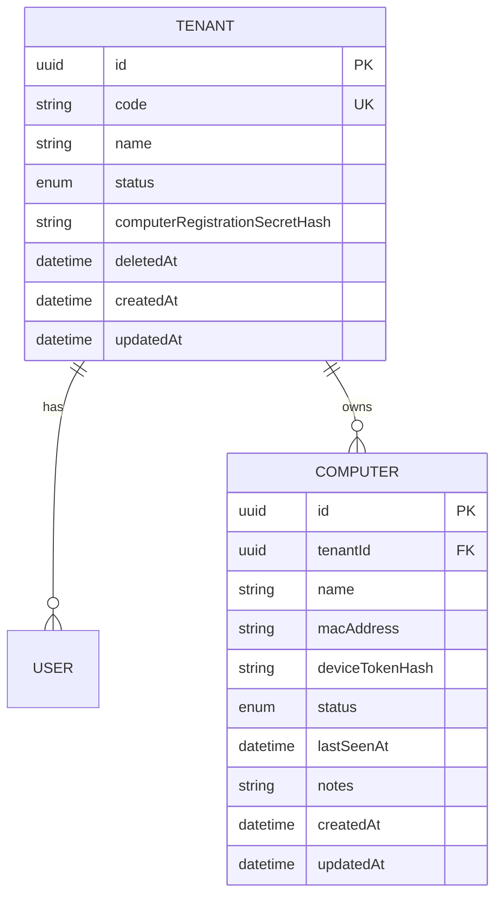
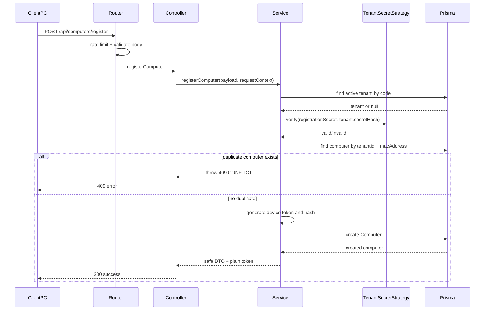
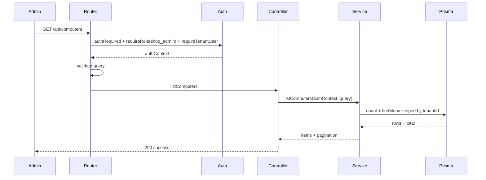
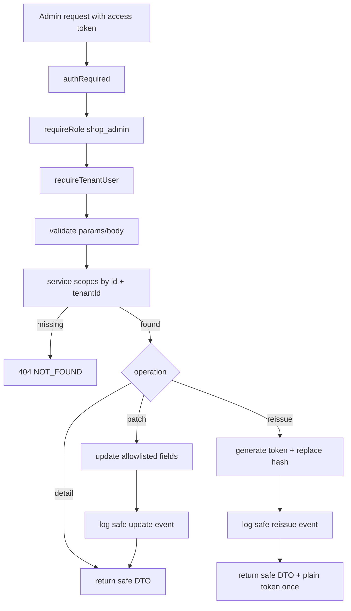

# Technical Design Document: CloudCMS Computers Module

Date: 2026-05-23

Source SPEC: `docs/SPEC/computers/SPEC.md`

Source design: `docs/module/computers/2026-05-23-computers-module-design.md`

## 1. Overview

The Computers module introduces tenant-scoped client PC identity for CloudCMS. A client PC registers itself with a tenant code, a tenant registration secret, and a MAC address. On successful registration, the backend creates a `Computer` record and returns a plain device token exactly once while storing only a token hash.

The module also provides admin management endpoints for `shop_admin` users to list, view, update, and reissue device tokens for computers inside their own tenant. It intentionally does not implement realtime heartbeat, Socket.IO authentication, sessions, usage sync, or URL policy behavior. Those later modules will consume the computer identity and device token primitives created here.

The design follows the existing Express module pattern used by Auth, Tenants, and Users:

```text
routes -> middleware/validation -> controller -> service -> Prisma
```

## 2. Requirements

### 2.1 Functional Requirements

- As a client PC, I want to register with `tenantCode`, `registrationSecret`, and `macAddress` so the backend can create my computer identity.
- As a client PC, I want to receive a device token after successful registration so future realtime/session modules can authenticate me.
- As a `shop_admin`, I want to list computers in my tenant with pagination, filtering, search, and sorting so I can manage installed client PCs.
- As a `shop_admin`, I want to view one computer in my tenant so I can inspect its current profile and status.
- As a `shop_admin`, I want to update allowlisted computer fields (`name`, `status`, `notes`) so I can maintain operational metadata.
- As a `shop_admin`, I want to reissue a device token for a computer so a reinstalled or lost-token client can be recovered without registering a duplicate MAC.
- As a backend developer, I want the registration secret verification isolated behind a strategy interface so future invite-code or claim-token flows can be added without rewriting controllers.

Functional rules:

- `POST /api/computers/register` must not require admin JWT.
- Register must require a valid active tenant, a valid registration secret, and a normalized MAC address.
- Register must return `409 CONFLICT` for duplicate `(tenantId, macAddress)`.
- Register must not silently update existing computers.
- Admin endpoints must require `shop_admin`, valid access token, and tenant context.
- Admin endpoints must always scope by `req.authContext.tenantId`.
- Device token plaintext must be returned only after register or reissue.
- API responses must never expose `deviceTokenHash`.

### 2.2 Non-Functional Requirements

- Security:
  - Device tokens must be random high-entropy secrets.
  - Device tokens and tenant registration secrets must be stored only as hashes.
  - MAC address must be treated as metadata, not proof of ownership.
  - Register endpoint must be rate-limited.
  - Unknown and sensitive input fields must be rejected.
- Reliability:
  - Duplicate registration behavior must be deterministic: `409 CONFLICT`.
  - Reissue token must replace the stored hash atomically.
  - Tenant isolation must be enforced in service logic, not only route middleware.
- Maintainability:
  - Follow existing module file split: routes, controller, service, schema, types, mapper, logging.
  - Reuse shared validation, errors, logging, Prisma, rate-limit, and auth helpers.
  - Keep future registration auth strategies isolated behind `RegistrationAuthStrategy`.
- Observability:
  - Emit structured logs for register, conflict, update, and token reissue.
  - Include request and actor context where available.
  - Never log raw registration secret, device token, token hash, authorization header, or raw register/reissue body.
- Operations:
  - Existing health endpoints remain sufficient for MVP.
  - Prisma CLI, migrations, DB commands, server commands, and setup commands are user/team-run actions.

## 3. Technical Design

### 3.1. Data Model Changes

The current Prisma schema contains `Tenant`, `User`, `RefreshToken`, `VerificationCode`, and `PendingTenantRegistration`. Computers requires new device identity storage and tenant registration secret storage.

#### New Enum

```prisma
enum ComputerStatus {
  ACTIVE
  INACTIVE
  BLOCKED
}
```

Rules:

- `ACTIVE`: normal registered computer.
- `INACTIVE`: admin-disabled or offline-oriented operational state.
- `BLOCKED`: computer should not be allowed to authenticate in future device-token flows.

#### Tenant Update

The `Tenant` model needs a registration-secret hash field for computer registration.

Recommended field:

```prisma
model Tenant {
  id                             String       @id @default(uuid())
  code                           String       @unique
  name                           String
  status                         TenantStatus @default(ACTIVE)
  computerRegistrationSecretHash String?
  deletedAt                      DateTime?
  createdAt                      DateTime     @default(now())
  updatedAt                      DateTime     @updatedAt

  users     User[]
  computers Computer[]
}
```

Design notes:

- The field is nullable during rollout so existing tenant rows can migrate safely.
- A tenant without `computerRegistrationSecretHash` cannot register computers until the secret is configured.
- The plain registration secret is never stored.
- Secret creation/rotation UX is not part of the Computers MVP unless implementation discovers a required admin path.

#### New Computer Model

```prisma
model Computer {
  id              String         @id @default(uuid())
  tenantId        String
  tenant          Tenant         @relation(fields: [tenantId], references: [id])
  name            String?
  macAddress      String
  deviceTokenHash String
  status          ComputerStatus @default(ACTIVE)
  lastSeenAt      DateTime?
  notes           String?
  createdAt       DateTime       @default(now())
  updatedAt       DateTime       @updatedAt

  @@unique([tenantId, macAddress])
  @@index([tenantId, createdAt])
  @@index([tenantId, status])
}
```

Data rules:

- `tenantId` is required and references `Tenant.id`.
- `(tenantId, macAddress)` enforces duplicate registration conflict.
- `deviceTokenHash` stores only the hash of the latest active device token.
- `lastSeenAt` is reserved for future realtime/heartbeat work.
- `macAddress` should be stored in normalized uppercase canonical format.

#### Optional Future Model

`ComputerTokenRotation` is deferred unless audit persistence is required before the Audit module exists.

```prisma
model ComputerTokenRotation {
  id         String   @id @default(uuid())
  computerId String
  rotatedBy  String?
  reason     String?
  rotatedAt  DateTime @default(now())
}
```

#### ERD



### 3.2. API Changes

All endpoints mount under:

```text
/api/computers
```

#### Router And Middleware Stack

```text
POST /api/computers/register
-> computersRegisterRateLimit
-> validateRequest({ body: registerComputerSchema })
-> computersController.registerComputer
-> computersService.registerComputer
```

```text
GET /api/computers
-> authRequired
-> requireRole("shop_admin")
-> requireTenantUser
-> validateRequest({ query: listComputersQuerySchema })
-> computersController.listComputers
-> computersService.listComputers
```

```text
GET /api/computers/:id
-> authRequired
-> requireRole("shop_admin")
-> requireTenantUser
-> validateRequest({ params: computerIdParamsSchema })
-> computersController.getComputerById
-> computersService.getComputerById
```

```text
PATCH /api/computers/:id
-> authRequired
-> requireRole("shop_admin")
-> requireTenantUser
-> validateRequest({ params: computerIdParamsSchema, body: updateComputerSchema })
-> computersController.updateComputerById
-> computersService.updateComputerById
```

```text
POST /api/computers/:id/reissue-token
-> authRequired
-> requireRole("shop_admin")
-> requireTenantUser
-> validateRequest({ params: computerIdParamsSchema, body: reissueDeviceTokenSchema })
-> computersController.reissueDeviceToken
-> computersService.reissueDeviceToken
```

#### `POST /api/computers/register`

Authentication:

- Public route.
- Requires valid `tenantCode` and `registrationSecret`.
- Uses register-specific rate limit.

Request:

```json
{
  "tenantCode": "CYBER01",
  "registrationSecret": "tenant-registration-secret",
  "macAddress": "AA:BB:CC:DD:EE:FF",
  "name": "PC-01"
}
```

Success response:

```json
{
  "success": true,
  "data": {
    "computer": {
      "id": "computer-id",
      "tenantId": "tenant-id",
      "name": "PC-01",
      "macAddress": "AA:BB:CC:DD:EE:FF",
      "status": "ACTIVE",
      "lastSeenAt": null,
      "notes": null,
      "createdAt": "2026-05-23T00:00:00.000Z",
      "updatedAt": "2026-05-23T00:00:00.000Z"
    },
    "deviceToken": "plain-device-token-returned-once"
  }
}
```

Failure responses:

- `400 VALIDATION_ERROR`: invalid payload or MAC format.
- `401 UNAUTHORIZED`: invalid registration secret.
- `404 NOT_FOUND`: tenant code does not resolve to an active tenant.
- `409 CONFLICT`: duplicate `(tenantId, macAddress)`.
- `429 TOO_MANY_REQUESTS`: register rate limit exceeded.

Retry expectation:

- Clients may retry validation/network failures.
- Clients should not retry `409` as a registration recovery path; admin reissue token is the recovery flow.

#### `GET /api/computers`

Authentication:

- `Authorization: Bearer <accessToken>`
- `shop_admin` only.

Query:

```text
?page=1&pageSize=20&status=ACTIVE&q=pc&sort=createdAt:desc
```

Success response:

```json
{
  "success": true,
  "data": {
    "items": [
      {
        "id": "computer-id",
        "tenantId": "tenant-id",
        "name": "PC-01",
        "macAddress": "AA:BB:CC:DD:EE:FF",
        "status": "ACTIVE",
        "lastSeenAt": null,
        "notes": null,
        "createdAt": "2026-05-23T00:00:00.000Z",
        "updatedAt": "2026-05-23T00:00:00.000Z"
      }
    ],
    "pagination": {
      "page": 1,
      "pageSize": 20,
      "total": 1,
      "totalPages": 1
    }
  }
}
```

Query behavior:

- `page`: default `1`, min `1`.
- `pageSize`: default `20`, min `1`, max `100`.
- `status`: optional `ACTIVE`, `INACTIVE`, `BLOCKED`.
- `q`: optional search over `name` and `macAddress`, max `100`.
- `sort`: allowlist `createdAt:desc`, `createdAt:asc`, `name:asc`, `name:desc`.

#### `GET /api/computers/:id`

Authentication:

- `Authorization: Bearer <accessToken>`
- `shop_admin` only.

Success response:

```json
{
  "success": true,
  "data": {
    "computer": {
      "id": "computer-id",
      "tenantId": "tenant-id",
      "name": "PC-01",
      "macAddress": "AA:BB:CC:DD:EE:FF",
      "status": "ACTIVE",
      "lastSeenAt": null,
      "notes": null,
      "createdAt": "2026-05-23T00:00:00.000Z",
      "updatedAt": "2026-05-23T00:00:00.000Z"
    }
  }
}
```

Not found behavior:

- Unknown `id`, cross-tenant `id`, or inaccessible computer all return `404 NOT_FOUND`.

#### `PATCH /api/computers/:id`

Authentication:

- `Authorization: Bearer <accessToken>`
- `shop_admin` only.

Request:

```json
{
  "name": "PC-01 Front Desk",
  "status": "ACTIVE",
  "notes": "Near cashier"
}
```

Success response:

```json
{
  "success": true,
  "data": {
    "computer": {
      "id": "computer-id",
      "tenantId": "tenant-id",
      "name": "PC-01 Front Desk",
      "macAddress": "AA:BB:CC:DD:EE:FF",
      "status": "ACTIVE",
      "lastSeenAt": null,
      "notes": "Near cashier",
      "createdAt": "2026-05-23T00:00:00.000Z",
      "updatedAt": "2026-05-23T00:00:00.000Z"
    }
  }
}
```

Validation behavior:

- At least one allowlisted field is required.
- Unknown fields are rejected.
- Sensitive fields are rejected: `tenantId`, `macAddress`, `deviceToken`, `deviceTokenHash`, `lastSeenAt`, `createdAt`, `updatedAt`.

#### `POST /api/computers/:id/reissue-token`

Authentication:

- `Authorization: Bearer <accessToken>`
- `shop_admin` only.

Request:

```json
{
  "reason": "Client PC was reinstalled"
}
```

Success response:

```json
{
  "success": true,
  "data": {
    "computer": {
      "id": "computer-id",
      "tenantId": "tenant-id",
      "name": "PC-01",
      "macAddress": "AA:BB:CC:DD:EE:FF",
      "status": "ACTIVE",
      "lastSeenAt": null,
      "notes": null,
      "createdAt": "2026-05-23T00:00:00.000Z",
      "updatedAt": "2026-05-23T00:00:00.000Z"
    },
    "deviceToken": "new-plain-device-token-returned-once"
  }
}
```

Operational behavior:

- The old token hash is replaced.
- The plain new token is returned only once.
- Log `computer.token.reissued` with actor and tenant context.

### 3.3. UI Changes

No UI implementation is included in the backend MVP.

Future Web Admin screens may need:

- Computer list view with pagination, status filter, and search.
- Computer detail/update form for `name`, `status`, and `notes`.
- Reissue token action with confirmation and one-time token display.

Client PC app changes may need:

- Register screen/config flow for tenant code and registration secret.
- Secure local storage for the returned device token.
- Recovery flow that uses admin-issued token after reinstall or lost token.

### 3.4. Logic Flow

#### Register Computer



#### Admin List



#### Admin Detail, Update, Reissue



#### Error Flow

```text
validation failure
-> validateRequest throws AppError(400, VALIDATION_ERROR)
-> errorHandler returns shared error shape

auth failure on admin endpoint
-> authRequired throws AppError(401, UNAUTHORIZED)
-> errorHandler returns shared error shape

role/tenant failure
-> requireRole or requireTenantUser throws AppError(403, FORBIDDEN)
-> errorHandler returns shared error shape

register duplicate MAC
-> service throws AppError(409, CONFLICT)
-> errorHandler returns shared error shape
```

### 3.5. Dependencies

No new npm package is required for MVP.

Reuse existing dependencies:

- `express`: routing.
- `zod`: validation.
- `@prisma/client`: database access.
- `node:crypto`: device token generation and HMAC hashing.
- Existing Auth middleware: `authRequired`, `requireRole`, `requireTenantUser`.
- Existing shared rate-limit middleware.
- Existing `AppError` and error handler.
- Existing structured logger/request logger.
- `vitest` and `supertest` for tests.

Configuration changes:

- Add registration-secret storage to `Tenant` data model.
- Device token hashing should reuse an existing secret if semantically correct or add a dedicated env var such as `DEVICE_TOKEN_HASH_SECRET`.
- Exact env var naming should be finalized during implementation.

No app startup should run Prisma migrations.

### 3.6. Security Considerations

#### Authentication

- Register endpoint uses tenant registration secret instead of admin JWT.
- Admin endpoints use existing JWT access token validation.
- Device token authentication is not implemented in this module's REST endpoints.

#### Authorization

- Only `shop_admin` can access admin endpoints in MVP.
- `staff`, `super_admin`, unauthenticated users, and device-token-only clients are denied on admin endpoints.
- Public register is conditional on tenant code + registration secret + active tenant.

#### Tenant Isolation

- Admin tenant scope is always derived from `req.authContext.tenantId`.
- Client-provided `tenantId` is rejected.
- Service methods query by `id + tenantId`, not by `id` alone.
- Cross-tenant detail, patch, and reissue return `404 NOT_FOUND`.

#### Input Protection

- Use strict Zod schemas.
- Reject unknown query/body fields.
- Normalize `tenantCode` and `macAddress`.
- Reject sensitive patch fields.
- Enforce `pageSize <= 100`.
- Search string `q` must be trimmed and length-limited.

#### Secret Handling

- Registration secret is stored only as a hash.
- Device token is stored only as a hash.
- Plain device token is returned only once.
- Reissue replaces the old token hash.
- MAC address is not a secret.

#### Logging Safety

Never log:

- `registrationSecret`
- plain `deviceToken`
- `deviceTokenHash`
- `Authorization` header
- raw register body
- raw reissue body

Safe log fields:

- `requestId`
- `tenantId`
- `computerId`
- `actorUserId`
- `actorRole`
- `ip`
- `userAgent`
- `event`

### 3.7. Performance and Reliability Considerations

- Register path performs tenant lookup, secret verification, duplicate lookup, and create.
- Unique `(tenantId, macAddress)` is required to handle concurrent duplicate register attempts.
- Service should catch Prisma unique constraint errors and map them to `409 CONFLICT`.
- List endpoint must use pagination and never return all computers at once.
- Index `(tenantId, createdAt)` supports default list sort.
- Index `(tenantId, status)` supports status filter.
- Rate limiting protects public register from brute-force tenant secret attempts.
- Reissue token should be a single update transaction where practical.
- No cache is required for MVP.
- No queue/background job is required for MVP.

### 3.8. Observability and Operations

Structured log events:

- `computer.registered`
- `computer.register.failed`
- `computer.register.conflict`
- `computer.listed`
- `computer.viewed`
- `computer.updated`
- `computer.token.reissued`

Recommended metrics if metrics infrastructure exists later:

- `computer_register_success_total`
- `computer_register_failed_total`
- `computer_register_conflict_total`
- `computer_token_reissued_total`
- endpoint latency histogram for register/list/detail/update/reissue

Health:

- Existing `/health` and `/api/health/db` remain sufficient.
- No computers-specific health endpoint is required in MVP.
- Realtime heartbeat health belongs to the later realtime module.

Operations:

- Register rate-limit should key by IP plus tenant code when possible.
- Alerting can be added later for repeated register failures by IP or tenant code.
- Lost token/reinstalled client runbook:
  1. Admin identifies existing computer by tenant and MAC/name.
  2. Admin calls reissue token.
  3. Client stores new token.
  4. Old token hash is replaced.

### 3.9. Implementation Plan

#### Prisma Schema

- Add `ComputerStatus`.
- Add `Computer`.
- Add `Tenant.computerRegistrationSecretHash`.
- Add `Tenant.computers` relation.
- Do not run Prisma CLI automatically; the user/team runs migration and client generation.

#### `computers.types.ts`

- Define `ComputerStatusValue`.
- Define `ComputerResponse`.
- Define `ComputerListResponse`.
- Define `ComputerTokenResponse`.
- Define service input types for register, list, update, and reissue.
- Define `ComputersAuthContext` based on existing auth context shape.

#### `computers.schema.ts`

- Implement `registerComputerSchema`.
- Implement `listComputersQuerySchema`.
- Implement `computerIdParamsSchema`.
- Implement `updateComputerSchema`.
- Implement `reissueDeviceTokenSchema`.
- Use `.strict()` on object schemas.
- Add normalizers for tenant code, MAC address, and optional strings.

#### `registration-auth.strategy.ts`

- Define `RegistrationAuthStrategy`.
- Implement `TenantSecretStrategy`.
- Hash and compare registration secret using the chosen secret-hash helper.
- Keep strategy injectable for tests.

#### `computers.mapper.ts`

- Implement `mapComputerToResponse`.
- Implement list pagination response mapper if useful.
- Never include `deviceTokenHash`.

#### `computers.logging.ts`

- Define event constants.
- Implement safe log helpers for register success/failure/conflict, update, and reissue.
- Add sensitive-field guards similar to Users/Tenants logging tests.

#### `computers.service.ts`

- Implement `registerComputer`.
- Implement `listComputers`.
- Implement `getComputerById`.
- Implement `updateComputerById`.
- Implement `reissueDeviceToken`.
- Ensure all admin methods take auth context and scope by tenant id.
- Map Prisma unique conflicts to `409 CONFLICT`.

#### `computers.controller.ts`

- Read validated request data.
- Read auth context for admin endpoints.
- Call service methods.
- Return shared success response shape.

#### `computers.routes.ts`

- Register public route with register rate-limit and validation.
- Add admin routes with `authRequired`, `requireRole("shop_admin")`, `requireTenantUser`, and validation.

#### `app.ts`

- Mount:

```ts
app.use("/api/computers", computersRouter);
```

## 4. Testing Plan

### 4.1 API Authentication Tests

- Missing token on `GET /api/computers` returns `401 UNAUTHORIZED`.
- Missing token on `GET /api/computers/:id` returns `401 UNAUTHORIZED`.
- Missing token on `PATCH /api/computers/:id` returns `401 UNAUTHORIZED`.
- Missing token on `POST /api/computers/:id/reissue-token` returns `401 UNAUTHORIZED`.
- Invalid or expired access token returns `401 UNAUTHORIZED`.
- `POST /api/computers/register` does not require admin JWT.

### 4.2 Authorization Tests

- `shop_admin` can access list/detail/update/reissue inside own tenant.
- `staff` is forbidden on all admin endpoints.
- `super_admin` is forbidden on all admin endpoints in MVP.
- Authenticated `shop_admin` without tenant context is forbidden.
- Device-token-only clients are not accepted on admin endpoints.

### 4.3 Register Computer Tests

- Valid register creates a computer and returns a plain device token.
- Device token hash is persisted; plain token is not persisted.
- Register normalizes tenant code and MAC address.
- Invalid tenant code returns `404 NOT_FOUND`.
- Inactive/suspended tenant returns `404 NOT_FOUND` or `403 FORBIDDEN` according to final service mapping.
- Invalid registration secret returns `401 UNAUTHORIZED`.
- Duplicate `(tenantId, macAddress)` returns `409 CONFLICT`.
- Crafted body fields like `tenantId` and `deviceTokenHash` are rejected.
- Register rate-limit returns `429 TOO_MANY_REQUESTS` when exceeded.

### 4.4 Computer List Tests

- List returns only computers from caller tenant.
- Pagination defaults to `page=1`, `pageSize=20`.
- `pageSize > 100` returns validation error.
- `status` filter works.
- `q` search matches name and MAC address.
- Sort allowlist works.
- Unknown query fields are rejected.

### 4.5 Computer Detail Tests

- Detail returns one computer in caller tenant.
- Unknown computer id returns `404 NOT_FOUND`.
- Cross-tenant computer id returns `404 NOT_FOUND`.
- Response does not include `deviceTokenHash`.

### 4.6 Computer Update Tests

- Update accepts `name`, `status`, and `notes`.
- Update requires at least one field.
- Update rejects unknown fields.
- Update rejects sensitive fields (`tenantId`, `macAddress`, `deviceTokenHash`, timestamps, `lastSeenAt`).
- Update is scoped by `id + tenantId`.
- Cross-tenant update returns `404 NOT_FOUND`.

### 4.7 Reissue Token Tests

- Reissue returns a new plain token once.
- Reissue replaces the stored token hash.
- Reissue logs `computer.token.reissued`.
- Cross-tenant reissue returns `404 NOT_FOUND`.
- Sensitive fields are not exposed in response or logs.

### 4.8 Security And Logging Tests

- Register logs never include registration secret.
- Register/reissue logs never include plain device token or token hash.
- Authorization header is never logged.
- Crafted query and patch payloads are rejected.
- Tenant isolation remains enforced even with crafted params/body.
- Prisma unique race simulation maps to `409 CONFLICT`.

### 4.9 Service/Unit Tests

- Schema unit tests for register/list/params/update/reissue.
- Mapper unit test verifies `deviceTokenHash` is omitted.
- Strategy unit tests verify correct and incorrect secret behavior.
- Service tests mock Prisma and verify tenant-scoped queries.
- Token helper tests verify token generation/hash behavior if helper is local to Computers.

### 4.10 Manual Verification

- User runs Prisma migration/client generation when schema is ready.
- Register one computer with valid tenant credentials.
- Confirm duplicate register returns `409`.
- Confirm admin list/detail/update work with a `shop_admin` token.
- Confirm admin reissue returns a new token and old hash changes.
- Confirm responses never include token hashes.

## 5. Open Questions

- Exact tenant registration secret field name is not implemented yet. Recommendation: `computerRegistrationSecretHash`.
- Exact token hashing secret/env var is not finalized. Recommendation: dedicated `DEVICE_TOKEN_HASH_SECRET` unless existing Auth refresh-token hashing secret is intentionally reused.
- Exact register rate-limit values are not finalized. Recommendation: use stricter capacity than default admin reads and key by IP + tenant code.
- Whether suspended tenant register should return `404 NOT_FOUND` or `403 FORBIDDEN` must be finalized during implementation. SPEC currently allows tenant-not-active as `404` for register and `403` for admin operations.
- Whether `ComputerTokenRotation` is needed in MVP remains deferred.

## 6. Alternatives Considered

### Silent Update On Duplicate Register

Rejected. It blurs responsibility between register and update and can hide duplicate/reinstall mistakes. The chosen behavior is `409 CONFLICT` plus admin token reissue.

### Invite Code Registration First

Deferred. Invite codes are more secure per device but add admin provisioning workflow before MVP needs it. The current MVP uses tenant registration secret plus rate limiting.

### Admin Pre-Created Claim Token

Deferred. It is the strictest onboarding model but adds the most operational steps. The module keeps `RegistrationAuthStrategy` so this can be added later.

### Device Token For Admin REST APIs

Rejected for MVP. Device tokens are for future realtime/heartbeat/session/usage flows, not admin computer management.

### Repository Layer From Day One

Deferred. Existing Tenants/Users modules use service-first patterns. Computers should match local style unless query complexity grows.

### Computers-Specific Health Endpoint

Rejected for MVP. Existing Foundation health endpoints cover app and DB health. Heartbeat health belongs to the realtime module.
