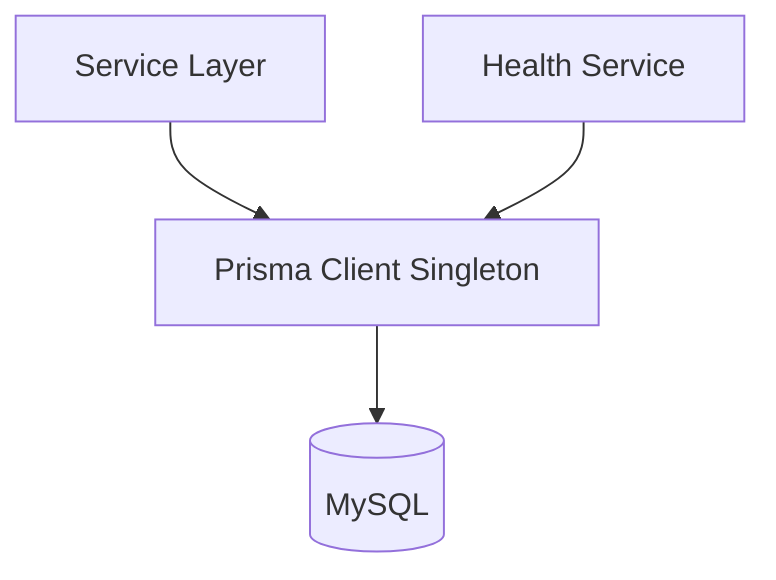
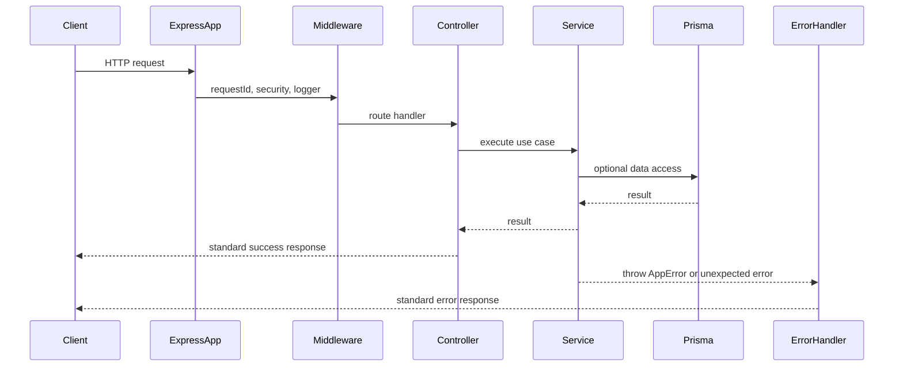
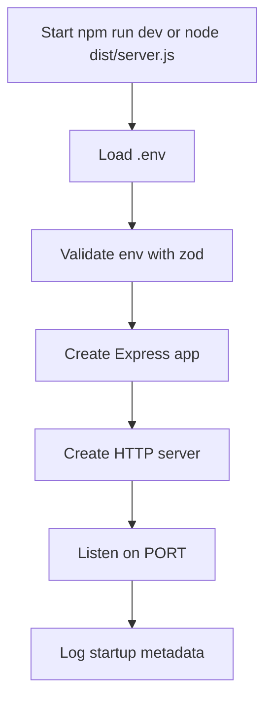
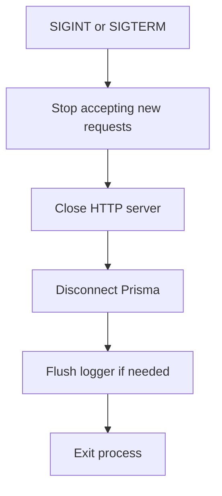
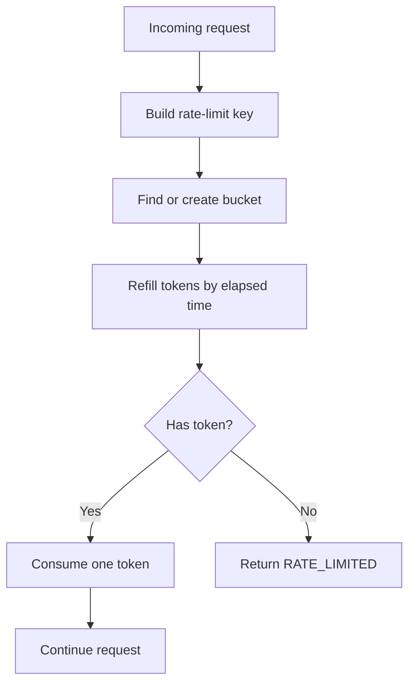

# Technical Design Document: CloudCMS Foundation Module

## 1. Overview

The `foundation` module is the first backend module for CloudCMS. It does not implement business features such as login, tenant onboarding, computer registration, realtime sessions, usage tracking, URL rules, asset upload, or license enforcement. Its purpose is to create a stable Node.js/Express backend foundation that every later module can reuse.

This TDD is based on:

- Source SPEC: `docs/SPEC/foundation/SPEC.md`
- Module design: `docs/module/2026-05-17-cloudcms-foundation-design.md`
- Backend-wide design: `docs/plans/2026-05-17-cloudcms-backend-design.md`

Confirmed implementation context:

- Backend source will be implemented in this workspace under `backend/`.
- Runtime: Node.js 22.
- Package manager: `npm`.
- Language: TypeScript.
- API framework: Express.
- ORM: Prisma.
- Database: MySQL.
- Local DB: XAMPP MySQL.
- AWS DB: Amazon RDS MySQL.
- Logger: `pino`.
- Test runner: `vitest` with `supertest`.
- Deployment target: EC2 + PM2 + Nginx.

The current workspace has documentation and rules, but no backend source tree yet. Therefore this module is a greenfield scaffold.

## 2. Requirements

### 2.1 Functional Requirements

- The backend must provide a TypeScript Express application under `backend/`.
- The application must separate app creation from server startup so tests can import the app without opening a network port.
- The application must load and validate environment variables at startup.
- The application must use Node.js 22 and npm scripts for development, test, and build workflows.
- The application must configure Prisma for MySQL with `provider = "mysql"`.
- The application must expose a singleton Prisma client for later modules.
- The application must not run Prisma CLI commands or database migrations during server startup.
- The application must expose `GET /health` for a lightweight app-alive check that does not require database access.
- The application must expose `GET /api/health/db` for a lightweight MySQL health check using a query such as `SELECT 1`.
- The application must expose `GET /api/health/runtime` for runtime information such as uptime, memory usage, Node version, and environment.
- The application must return successful responses using the shared shape `{ "success": true, "data": ... }`.
- The application must return error responses using the shared shape `{ "success": false, "error": { "code", "message", "details" } }`.
- The application must define `AppError` for expected application errors.
- The application must centralize unknown route handling through a `NOT_FOUND` response.
- The application must centralize unexpected errors through an `INTERNAL_ERROR` response.
- The application must attach a `requestId` to every request.
- The application must emit structured JSON request logs through `pino`.
- The application must provide an `auth-context` placeholder for later auth/user/device context.
- The application must provide a `zod`-based validation middleware for route `body`, `query`, and `params`.
- The application must provide a reusable Token Bucket helper and middleware wrapper.
- The application must provide a `test-app` helper for API tests.

### 2.2 Non-Functional Requirements

- Maintainability: shared concerns must live under `src/shared/` and business modules must live under `src/modules/`.
- Testability: `src/app.ts` must not call `listen`; `src/server.ts` owns network startup.
- Reliability: graceful shutdown must stop new requests, close the HTTP server, disconnect Prisma, and flush logs if needed.
- Security: `helmet`, CORS allowlist, JSON body limit, URL-encoded body limit, validation, and rate-limit helpers must be present from the foundation phase.
- Security: production error responses must not expose stack traces.
- Security: logs must not include secrets, raw JWTs, refresh tokens, database passwords, or other sensitive values.
- Performance: default JSON and URL-encoded body limits must be `1mb` to prevent oversized payload abuse.
- Performance: DB health checks must use lightweight queries and must not load business tables.
- Observability: every request log must include request ID, method, path, status code, and latency.
- Observability: logs must be structured JSON so CloudWatch can ingest them cleanly in the AWS phase.
- Scalability: the initial rate-limit store can be in-memory for a single EC2 deployment, but the helper API must allow replacing the store later.
- Team workflow: all Prisma CLI, migration, DB, and server commands must be run by the user/team, not autonomously by the assistant.

## 3. Technical Design

### 3.1. Data Model Changes

Foundation does not add business tables. The only database-related work is to create the Prisma setup for MySQL.

Target Prisma datasource:

```prisma
datasource db {
  provider = "mysql"
  url      = env("DATABASE_URL")
}
```

Local database assumptions:

```text
host: localhost
port: 3306
database: cloudcms
charset: utf8mb4
engine: InnoDB
```

No migration should be executed by the application startup flow. Any schema change must be handled later through the team's Prisma CLI workflow.

Data access design:



Affected files:

```text
backend/prisma/schema.prisma
backend/src/shared/prisma/prisma.client.ts
```

### 3.2. API Changes

Foundation introduces three health endpoints.

#### `GET /health`

Purpose: check whether the Express process is alive.

Middleware stack:

```text
requestId -> security middleware -> requestLogger -> route -> errorHandler
```

Database access: none.

Example response:

```json
{
  "success": true,
  "data": {
    "status": "ok"
  }
}
```

#### `GET /api/health/db`

Purpose: check whether MySQL can be reached through Prisma.

Middleware stack:

```text
requestId -> security middleware -> requestLogger -> route -> healthController -> healthService -> prisma -> errorHandler
```

Database access: lightweight query such as `SELECT 1`.

Example success response:

```json
{
  "success": true,
  "data": {
    "status": "ok",
    "database": "mysql"
  }
}
```

Example error response:

```json
{
  "success": false,
  "error": {
    "code": "DATABASE_ERROR",
    "message": "Database health check failed",
    "details": {
      "database": "mysql"
    }
  }
}
```

#### `GET /api/health/runtime`

Purpose: expose basic runtime data for local development and operations.

Database access: none.

Example response:

```json
{
  "success": true,
  "data": {
    "status": "ok",
    "environment": "development",
    "nodeVersion": "v22.x.x",
    "uptimeSeconds": 123,
    "memory": {
      "rss": 12345678,
      "heapUsed": 1234567,
      "heapTotal": 2345678
    }
  }
}
```

Shared error response schema:

```json
{
  "success": false,
  "error": {
    "code": "VALIDATION_ERROR",
    "message": "Invalid request data",
    "details": {}
  }
}
```

Foundation error codes:

```text
VALIDATION_ERROR
UNAUTHORIZED
FORBIDDEN
NOT_FOUND
CONFLICT
RATE_LIMITED
INTERNAL_ERROR
DATABASE_ERROR
```

### 3.3. UI Changes

No UI changes are required for the foundation module.

Later web admin or client UI work may call `/health` endpoints during local debugging, but foundation does not add visible screens, forms, buttons, or layout changes.

### 3.4. Logic Flow

#### Request lifecycle



#### Startup lifecycle



#### Shutdown lifecycle



#### Token Bucket lifecycle



Default Token Bucket configuration:

```text
RATE_LIMIT_DEFAULT_CAPACITY=60
RATE_LIMIT_DEFAULT_REFILL_TOKENS=60
RATE_LIMIT_DEFAULT_REFILL_WINDOW_SECONDS=60
RATE_LIMIT_STORE=memory
```

Meaning: each key gets up to 60 requests per 60 seconds by default. Later modules can override this by passing their own capacity, refill rate, and key strategy.

Recommended module-specific overrides:

```text
auth login: 5 requests / 15 minutes by IP + email
register tenant: 3 requests / hour by IP
register computer: 10 requests / minute by IP + tenantCode
heartbeat: 120 requests / minute by computerId
upload asset: 20 requests / minute by userId + tenantId
```

### 3.5. Dependencies

Runtime dependencies:

```text
express
cors
helmet
dotenv
zod
pino
@prisma/client
```

Development dependencies:

```text
typescript
tsx
prisma
vitest
supertest
@types/node
@types/express
@types/cors
@types/supertest
```

Environment variables:

```text
NODE_ENV=development
PORT=3000
DATABASE_URL=mysql://root:@localhost:3306/cloudcms
CORS_ORIGIN=http://localhost:5173
LOG_LEVEL=debug
JSON_BODY_LIMIT=1mb
URLENCODED_BODY_LIMIT=1mb
RATE_LIMIT_DEFAULT_CAPACITY=60
RATE_LIMIT_DEFAULT_REFILL_TOKENS=60
RATE_LIMIT_DEFAULT_REFILL_WINDOW_SECONDS=60
RATE_LIMIT_STORE=memory
```

Prepared for later modules:

```text
JWT_ACCESS_SECRET
JWT_REFRESH_SECRET
AWS_REGION
S3_BUCKET_NAME
```

The app must commit `.env.example` only. Real `.env` files must not be committed.

### 3.6. Security Considerations

- Enable `helmet` globally for common HTTP security headers.
- Restrict CORS to `CORS_ORIGIN`; default local value is `http://localhost:5173`.
- Apply `express.json({ limit: env.JSON_BODY_LIMIT })` with default `1mb`.
- Apply URL-encoded body parsing with default `1mb` if URL-encoded parsing is enabled.
- Validate route payloads with `zod` before controller logic.
- Use a central error handler so unexpected errors do not leak implementation details.
- Hide stack traces in production responses.
- Do not log secrets, tokens, passwords, database URLs with credentials, or raw auth headers.
- Include `requestId` in logs so issues can be traced without exposing sensitive payloads.
- Provide Token Bucket rate limiting as reusable infrastructure, but let each business module define stricter limits where needed.
- Keep the `auth-context` middleware as a placeholder only; it must not fake real authentication or authorization.

### 3.7. Performance and Reliability Considerations

- Keep `/health` independent from MySQL so process health can be checked even during DB outages.
- Keep `/api/health/db` lightweight and avoid using business queries.
- Use a singleton Prisma client to avoid creating too many database connections.
- Avoid synchronous CPU-heavy or filesystem-heavy work in request middleware.
- Use `1mb` request body limits for normal JSON APIs; file uploads must be handled by later upload-specific endpoints.
- Use in-memory Token Bucket storage for the initial single-EC2 deployment.
- Design the rate-limit helper behind a small store interface so Redis or another shared store can be added later without changing route middleware.
- Gracefully handle `SIGINT` and `SIGTERM` to avoid dangling HTTP and DB connections during PM2 restarts.
- Return stable error codes so frontend/client retry logic can distinguish validation, rate limit, database, and internal errors.

### 3.8. Observability and Operations

Logging requirements:

- Use `pino` for JSON logs.
- Include `requestId`, method, path, status code, and latency in request completion logs.
- Include error code and message in error logs.
- Include stack traces in development logs when useful.
- Support optional context fields: `tenantId`, `userId`, `computerId`.

Health and runtime requirements:

- `/health` returns process-alive status.
- `/api/health/db` returns database connectivity status.
- `/api/health/runtime` returns uptime, memory usage, Node version, and environment.

Operations notes:

- Logs should be compatible with CloudWatch ingestion when deployed on EC2.
- PM2/Nginx runbook details are outside the foundation implementation, but graceful shutdown must support PM2 restarts.
- The app should expose enough health signal for later AWS smoke tests.

### 3.9. Implementation Plan

Target file structure:

```text
backend/
  src/
    app.ts
    server.ts
    config/
      env.ts
    shared/
      prisma/
        prisma.client.ts
      errors/
        app-error.ts
        error-handler.ts
      logging/
        logger.ts
        request-logger.ts
      middleware/
        request-id.ts
        not-found.ts
        auth-context.ts
      validation/
        validate-request.ts
      rate-limit/
        token-bucket.ts
      testing/
        test-app.ts
    modules/
      health/
        health.routes.ts
        health.controller.ts
        health.service.ts
  prisma/
    schema.prisma
  tests/
    foundation/
      health.test.ts
      error-handler.test.ts
      validate-request.test.ts
      token-bucket.test.ts
  .env.example
  package.json
  tsconfig.json
  vitest.config.ts
```

Implementation sequence:

1. Scaffold `backend/` with npm, TypeScript, scripts, and `.env.example`.
2. Add `src/app.ts` and `src/server.ts`.
3. Add `src/config/env.ts` with zod env validation.
4. Add Prisma schema with MySQL datasource and Prisma client singleton.
5. Add `AppError`, error handler, and not-found middleware.
6. Add request ID middleware and `pino` logger.
7. Add security middleware: `helmet`, CORS, JSON body limit, URL-encoded body limit.
8. Add `auth-context` placeholder.
9. Add health routes, controller, and service.
10. Add `validate-request.ts` helper.
11. Add Token Bucket helper and middleware wrapper.
12. Add `test-app.ts`, Vitest config, and foundation tests.
13. Update setup documentation if needed.

## 4. Testing Plan

Unit tests:

- Test `AppError` stores `statusCode`, `code`, `message`, and optional `details`.
- Test error handler maps `AppError` to the expected response format.
- Test error handler maps unknown errors to `INTERNAL_ERROR`.
- Test production mode does not expose stack traces.
- Test Token Bucket consumes tokens correctly.
- Test Token Bucket refills tokens correctly after elapsed time.
- Test Token Bucket rejects when no token is available.
- Test validation middleware returns `VALIDATION_ERROR` for invalid `body`, `query`, and `params`.
- Test validation middleware calls the next handler when input is valid.

API tests with Supertest:

- `GET /health` returns 200 and does not require DB.
- `GET /api/health/runtime` returns status, environment, Node version, uptime, and memory.
- `GET /api/health/db` returns 200 when Prisma can reach MySQL.
- `GET /api/health/db` returns the standard database error response when the DB check fails.
- Unknown routes return `NOT_FOUND`.
- Responses include or are traceable by `requestId`.

Configuration tests:

- Missing required env variables fail validation.
- Invalid `PORT` fails validation.
- Invalid body limit values fail validation.
- Default rate-limit env values are parsed into numbers.

Manual verification:

- User/team runs npm install, Prisma commands, DB setup, and server commands when ready.
- Confirm XAMPP MySQL database `cloudcms` exists before testing DB health.
- Confirm `.env` is local only and `.env.example` contains safe placeholders.

## 5. Open Questions

- None for source location, Node version, package manager, test runner, logger, default port, CORS origin, body limits, or foundation rate-limit defaults.
- Later modules must still define their own stricter rate-limit configs where needed.
- Later AWS deployment work must decide final CloudWatch log group naming and PM2/Nginx runbook details.

## 6. Alternatives Considered

- NestJS instead of Express: rejected for this project phase because the team needs a lighter greenfield setup and Express matches the approved backend design.
- Minimal route-handler-only Express structure: rejected because CloudCMS has many modules and needs shared error handling, validation, logging, and rate limiting from the start.
- PostgreSQL instead of MySQL: rejected because the project has selected MySQL end to end, local development uses XAMPP MySQL, and AWS uses RDS MySQL.
- Redis-backed rate limiting from day one: deferred because the initial deployment target is a single EC2 instance. The helper should still allow a Redis-backed store later.
- Larger JSON body limit such as `10mb`: rejected for foundation defaults because normal JSON APIs do not need it, and uploads should use dedicated upload flows later.
- Jest instead of Vitest: rejected because the team has confirmed Vitest for this backend.
- Winston instead of Pino: rejected because the team has confirmed Pino and JSON logs fit the CloudWatch direction.
