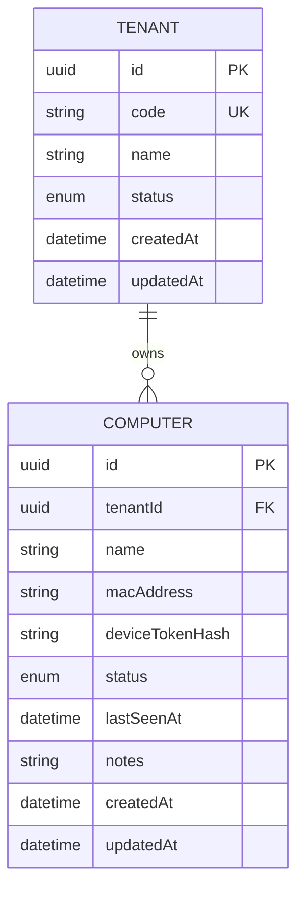
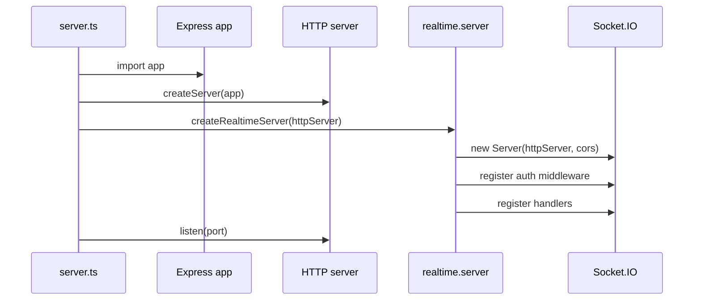
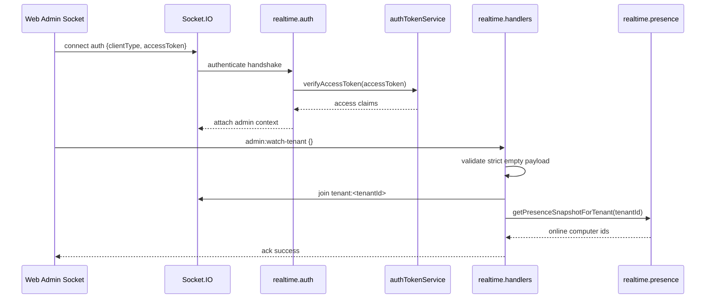
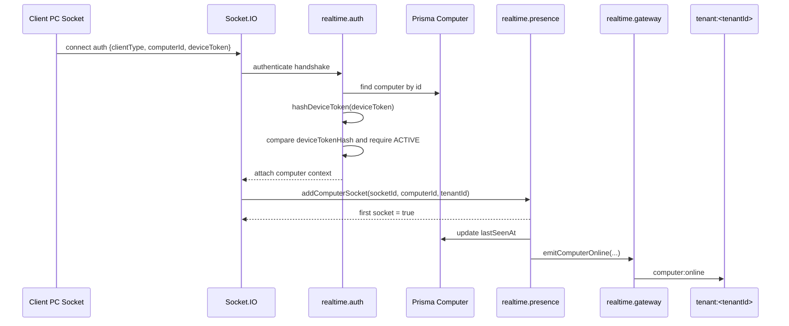
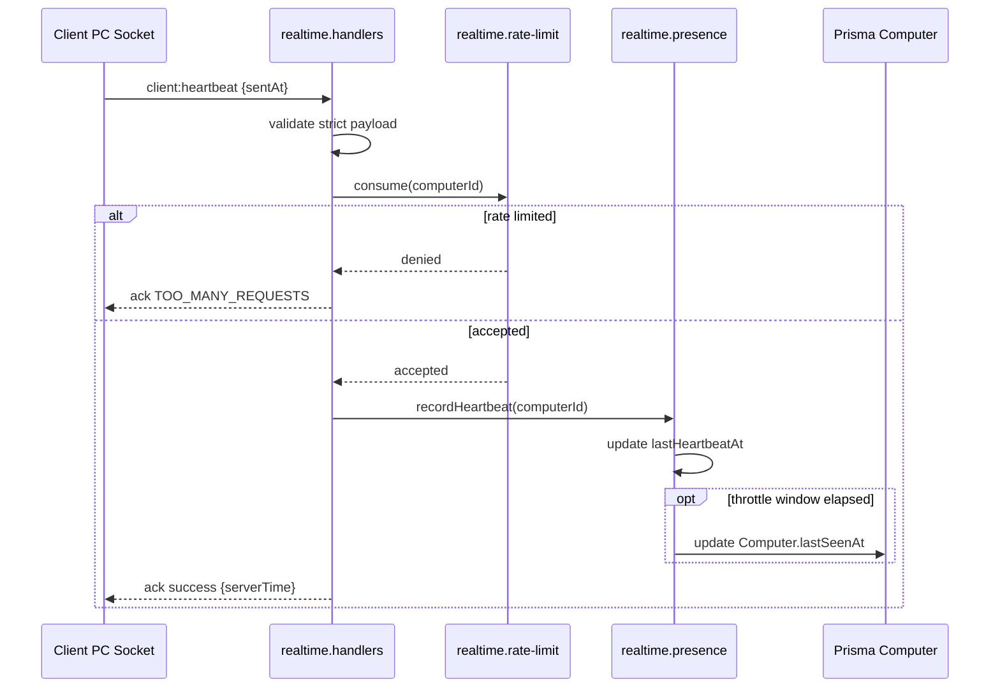
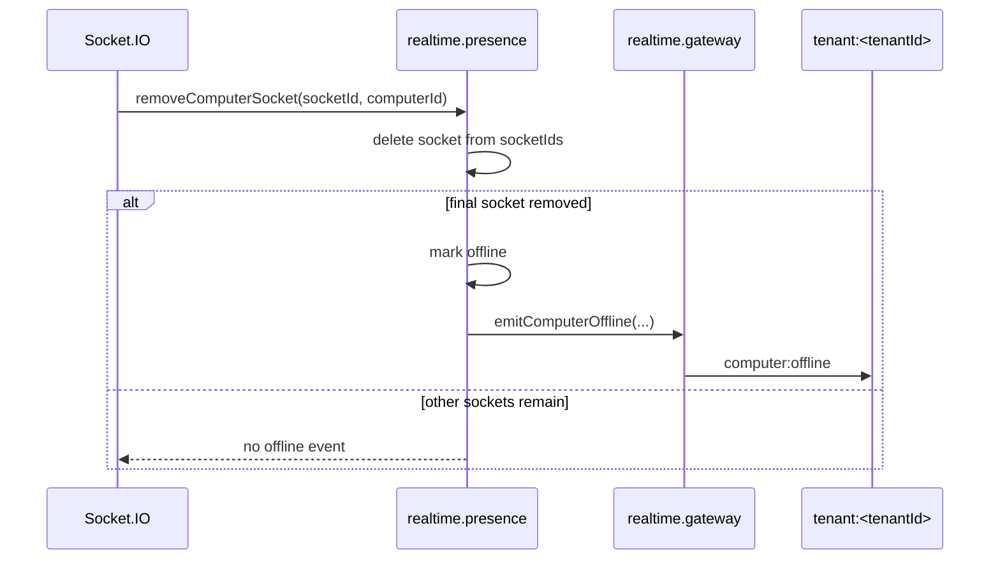

# Technical Design Document: CloudCMS Realtime Module

Date: 2026-05-25

Source SPEC: `docs/SPEC/realtime/SPEC.md`

Source design: `docs/module/realtime/2026-05-25-realtime-module-design.md`

## 1. Overview

The Realtime module adds Socket.IO-based computer presence to the CloudCMS backend. Web Admin sockets can watch online/offline state for computers in their own tenant, while Client PC sockets authenticate with `computerId + deviceToken` and keep their presence fresh through heartbeat events.

This feature is backend-only. It attaches Socket.IO to the existing HTTP server, creates a dedicated `backend/src/modules/realtime` module, tracks volatile online/offline state in memory, updates `Computer.lastSeenAt` with throttling, and exposes sanitized realtime counters for the existing runtime health flow.

The MVP intentionally does not add REST realtime endpoints, realtime Prisma tables, `Computer.onlineStatus`, Redis-backed presence, session commands, usage sync events, policy update events, asset events, subscription events, or UI changes.

The design follows existing backend conventions:

```text
HTTP lifecycle -> module init -> auth/validation -> handler -> service/gateway -> Prisma/logging
```

For Socket.IO, this becomes:

```text
server.ts -> realtime.server -> realtime.auth -> realtime.handlers -> realtime.presence/realtime.gateway
```

## 2. Requirements

### 2.1 Functional Requirements

- As a Web Admin user, I want to connect to `/socket.io` with my JWT access token so I can watch tenant-scoped computer presence.
- As a Web Admin user, I want to emit `admin:watch-tenant` so I can join my trusted tenant room and receive the current online computer snapshot.
- As a Client PC, I want to connect to `/socket.io` with `computerId + deviceToken` so the backend can authenticate my computer identity.
- As a Client PC, I want to emit `client:heartbeat` so the backend can keep my presence active and update `Computer.lastSeenAt`.
- As a Web Admin user, I want to receive `computer:online` and `computer:offline` events for my tenant so the admin view can reflect current computer presence.
- As a backend developer, I want future modules to emit through `realtime.gateway.ts` so Socket.IO internals do not leak across module boundaries.
- As an operator, I want runtime counters for active sockets, online computers, admin sockets, heartbeat accepts, rate limits, auth failures, and offline timeouts so realtime health can be observed.

Functional rules:

- Socket.IO must be attached to the HTTP server created from the existing Express `app`.
- Socket.IO must use the default namespace `/` and endpoint `/socket.io`.
- Socket.IO CORS must reuse `env.app.corsOrigin`.
- Admin sockets must authenticate through `socket.handshake.auth.clientType = "admin"` and `accessToken`.
- Admin auth must verify an access token with `authTokenService.verifyAccessToken`.
- Admin auth must reject missing, malformed, expired, invalid, refresh-token-type, or tenantless tokens.
- Realtime MVP allows tenant-scoped `shop_admin` and `staff` admin sockets.
- Realtime MVP denies `super_admin` admin sockets because tenant context and cross-tenant behavior are not part of the MVP.
- Client PC sockets must authenticate through `socket.handshake.auth.clientType = "computer"`, `computerId`, and `deviceToken`.
- Client PC auth must find the `Computer`, require `Computer.status = ACTIVE`, hash the submitted token with `hashDeviceToken`, and compare it to `Computer.deviceTokenHash`.
- Invalid client auth must not reveal whether `computerId` or `deviceToken` was wrong.
- Admin sockets may join only `tenant:<tenantId>` derived from verified JWT context.
- Client PC sockets may join only `computer:<computerId>` derived from verified computer context.
- Event payloads must not override tenant or computer context.
- `admin:watch-tenant` must return a tenant-scoped `onlineComputers` snapshot.
- `client:heartbeat` must validate strict payload shape, rate-limit by `computerId`, update in-memory `lastHeartbeatAt`, and update `Computer.lastSeenAt` with throttling.
- `computer:online` must emit only when the first active socket for a computer appears.
- `computer:offline` must emit only when the final active socket for a computer disconnects or times out.
- Shutdown must close Socket.IO and clear realtime timers before Prisma disconnect completes.

### 2.2 Non-Functional Requirements

- Security:
  - Never log raw `socket.handshake.auth`.
  - Never log JWTs, access tokens, device tokens, `deviceTokenHash`, authorization headers, or raw payloads that may contain secrets.
  - Use strict validation for socket event payloads.
  - Enforce tenant isolation from verified context, not client payloads.
  - Reject unknown room joins by design; the client must not choose room names.
- Reliability:
  - Presence must support multiple sockets per computer.
  - Presence state may be lost on process restart; clients must reconnect and rebuild it.
  - Heartbeat timeout must eventually mark silent computers offline.
  - `Computer.lastSeenAt` writes must be throttled to avoid excessive database writes.
  - Shutdown must be idempotent with the existing duplicate-signal guard.
- Performance:
  - Presence lookup and transition checks should be in-memory O(1) map/set operations for MVP.
  - Heartbeat rate limiting should use the existing token bucket pattern adapted to socket events.
  - Heartbeat DB writes should be throttled per computer.
- Maintainability:
  - Keep Socket.IO internals inside `backend/src/modules/realtime`.
  - Keep one `realtime.handlers.ts` file for MVP, with a clear split path for future handler growth.
  - Reuse existing Auth, Computers, Prisma, logging, health, and rate-limit patterns.
  - Keep realtime tuning values as module constants in MVP.
- Observability:
  - Emit structured logs for connect, disconnect, heartbeat, rate-limit, auth failure, online, and offline transitions.
  - Expose sanitized counters through `realtime.gateway.ts` or `realtime.presence.ts`.
  - Integrate counters into existing `/api/health/runtime` through `HealthService.getRuntimeHealth()` or a registered snapshot provider.
- Operations:
  - Do not add a separate realtime health endpoint in MVP.
  - Do not add Redis until multi-instance deployment is required.
  - Prisma CLI, migrations, DB commands, server commands, and setup commands are user/team-run actions.

## 3. Technical Design

### 3.1. Data Model Changes

No Prisma schema change is required for the Realtime MVP.

Do not add:

- `Computer.onlineStatus`
- `RealtimePresence`
- `RealtimeConnection`
- `RealtimeConnectionLog`

Realtime reuses the existing `Computer` model:

```prisma
model Computer {
  id              String         @id @default(uuid())
  tenantId        String
  tenant          Tenant         @relation(fields: [tenantId], references: [id])
  name            String?
  macAddress      String
  deviceTokenHash String
  status          ComputerStatus @default(ACTIVE)
  lastSeenAt      DateTime?
  notes           String?
  createdAt       DateTime       @default(now())
  updatedAt       DateTime       @updatedAt
}
```

Realtime-specific usage:

- `id`: the trusted computer identity after auth.
- `tenantId`: trusted tenant scope for presence events.
- `deviceTokenHash`: compared against `hashDeviceToken(submittedDeviceToken)`.
- `status`: only `ACTIVE` computers may connect.
- `lastSeenAt`: updated on accepted connect/heartbeat activity.

Recommended Prisma selects:

```ts
const REALTIME_COMPUTER_AUTH_SELECT = {
  id: true,
  tenantId: true,
  status: true,
  deviceTokenHash: true,
  lastSeenAt: true,
} satisfies Prisma.ComputerSelect;
```

Runtime-only presence state:

```ts
type RealtimeComputerPresence = {
  computerId: string;
  tenantId: string;
  socketIds: Set<string>;
  lastHeartbeatAt: Date;
  lastSeenPersistedAt?: Date;
  offlineTimer?: NodeJS.Timeout;
};
```

Runtime counters:

```ts
type RealtimeHealthSnapshot = {
  activeSockets: number;
  onlineComputers: number;
  adminSockets: number;
  heartbeatAccepted: number;
  heartbeatRateLimited: number;
  authFailures: number;
  heartbeatTimeouts: number;
};
```

ERD, unchanged:



Future data paths:

- Multi-instance presence should use Redis Socket.IO adapter and Redis-backed presence state.
- Connection history should be persisted through the audit module or a dedicated table only after explicit audit retention requirements exist.

### 3.2. API Changes

Realtime adds a Socket.IO contract, not an Express REST API.

Transport:

```text
Socket.IO endpoint: /socket.io
Namespace: /
Auth location: socket.handshake.auth
```

No new `/api/realtime/*` route is added.

#### HTTP Server Lifecycle Change

Current `backend/src/server.ts` calls `app.listen(...)`. Realtime requires an explicit HTTP server:

```ts
import { createServer } from "node:http";
import { app } from "./app";
import { createRealtimeServer } from "./modules/realtime/realtime.server";

export const httpServer = createServer(app);
export const realtimeServer = createRealtimeServer(httpServer);

export const server = httpServer.listen(env.server.port, () => {
  logger.info(...);
});
```

Shutdown sequence should become:

```text
receive SIGINT/SIGTERM
-> close HTTP server
-> close realtime server and clear timers
-> disconnect Prisma
-> flush logger
-> exit
```

The existing duplicate-shutdown guard remains.

#### Runtime Health Shape Change

Existing route:

```text
GET /api/health/runtime
```

Recommended response extension:

```json
{
  "success": true,
  "data": {
    "status": "ok",
    "environment": "development",
    "nodeVersion": "v22.0.0",
    "uptimeSeconds": 120,
    "memory": {
      "rss": 123,
      "heapUsed": 456,
      "heapTotal": 789
    },
    "realtime": {
      "activeSockets": 12,
      "onlineComputers": 8,
      "adminSockets": 2,
      "heartbeatAccepted": 140,
      "heartbeatRateLimited": 3,
      "authFailures": 1,
      "heartbeatTimeouts": 1
    }
  }
}
```

If realtime is not initialized in a test path, `HealthService.getRuntimeHealth()` should either omit `realtime` or use a zero snapshot provider. The TDD recommends a small provider registration function instead of importing Socket.IO internals into the health module.

#### Socket Auth: Admin

Handshake auth:

```json
{
  "clientType": "admin",
  "accessToken": "jwt-access-token"
}
```

Success context:

```ts
type RealtimeAdminSocketContext = {
  clientType: "admin";
  userId: string;
  tenantId: string;
  role: "shop_admin" | "staff";
};
```

Failure:

```text
connect_error
```

Rules:

- Verify token with `authTokenService.verifyAccessToken`.
- Require `tokenType = "access"`.
- Require `tenantId` to be a non-empty string.
- Allow `shop_admin` and `staff`.
- Deny `super_admin` in MVP.
- Do not log `accessToken` or raw auth.

#### Socket Auth: Client PC

Handshake auth:

```json
{
  "clientType": "computer",
  "computerId": "computer-id",
  "deviceToken": "plain-device-token"
}
```

Success context:

```ts
type RealtimeComputerSocketContext = {
  clientType: "computer";
  computerId: string;
  tenantId: string;
};
```

Rules:

- Find the computer by `computerId`.
- Require `status = ACTIVE`.
- Compare `hashDeviceToken(deviceToken)` with `deviceTokenHash`.
- Use a generic auth failure message.
- Do not authenticate with MAC address.
- Do not log `deviceToken`, `deviceTokenHash`, or raw auth.

#### Socket Event: `admin:watch-tenant`

Direction:

```text
Admin socket -> backend
```

Strict payload:

```json
{}
```

Success ack:

```json
{
  "success": true,
  "data": {
    "onlineComputers": ["computer-id-1", "computer-id-2"]
  }
}
```

Error ack:

```json
{
  "success": false,
  "error": {
    "code": "FORBIDDEN",
    "message": "Tenant context is required."
  }
}
```

Handler stack:

```text
admin:watch-tenant
-> require admin socket context
-> validate strict empty payload
-> derive tenantId from context
-> join tenantRoom(tenantId)
-> getPresenceSnapshotForTenant(tenantId)
-> ack success
```

#### Socket Event: `client:heartbeat`

Direction:

```text
Client PC socket -> backend
```

Strict payload:

```json
{
  "sentAt": "2026-05-25T10:00:00.000Z"
}
```

Success ack:

```json
{
  "success": true,
  "data": {
    "serverTime": "2026-05-25T10:00:00.000Z"
  }
}
```

Rate-limit ack:

```json
{
  "success": false,
  "error": {
    "code": "TOO_MANY_REQUESTS",
    "message": "Too many heartbeat events. Please try again later."
  }
}
```

Handler stack:

```text
client:heartbeat
-> require computer socket context
-> validate strict payload
-> consume heartbeat rate-limit token by computerId
-> update in-memory lastHeartbeatAt
-> update Computer.lastSeenAt if throttle window elapsed
-> ack success with serverTime
```

#### Backend Event: `computer:online`

Direction:

```text
backend -> admin sockets in tenant:<tenantId>
```

Payload:

```json
{
  "computerId": "computer-id",
  "tenantId": "tenant-id",
  "lastSeenAt": "2026-05-25T10:00:00.000Z"
}
```

Emit rule:

- Emit only on transition from zero active sockets to one active socket for the computer.

#### Backend Event: `computer:offline`

Direction:

```text
backend -> admin sockets in tenant:<tenantId>
```

Payload:

```json
{
  "computerId": "computer-id",
  "tenantId": "tenant-id",
  "lastSeenAt": "2026-05-25T10:00:00.000Z"
}
```

Emit rule:

- Emit only on transition from one active socket to zero active sockets, including heartbeat timeout.

### 3.3. UI Changes

No backend-owned UI changes are included in this TDD.

Expected consumer behavior outside this backend module:

- Web Admin can connect to `/socket.io`, call `admin:watch-tenant`, render the returned `onlineComputers` snapshot, and subscribe to `computer:online` / `computer:offline`.
- Client PC can connect to `/socket.io` with `computerId + deviceToken`, send `client:heartbeat`, and reconnect after disconnect.

Those UI/client changes are outside the Realtime backend MVP. The backend TDD only defines the contract those clients will consume.

### 3.4. Logic Flow

#### Module Files

```text
backend/src/modules/realtime/
  realtime.server.ts
  realtime.auth.ts
  realtime.rooms.ts
  realtime.presence.ts
  realtime.handlers.ts
  realtime.gateway.ts
  realtime.events.ts
  realtime.types.ts
  realtime.rate-limit.ts
  realtime.logging.ts
```

`realtime.rate-limit.ts` and `realtime.logging.ts` are recommended additions beyond the SPEC file list because they keep event-level rate limiting and sanitized logging isolated from handlers.

#### Server Initialization



#### Admin Connect And Watch



#### Client Connect And Online Transition



#### Heartbeat



#### Disconnect Or Timeout



#### Health Snapshot Integration

```text
HealthController.getRuntimeHealth
-> healthService.getRuntimeHealth()
-> healthService reads registered realtime snapshot provider
-> include `realtime` counters in runtime health response
```

Recommended shape:

```ts
type RealtimeHealthProvider = () => RealtimeHealthSnapshot;

class HealthService {
  private realtimeHealthProvider?: RealtimeHealthProvider;

  public setRealtimeHealthProvider(provider: RealtimeHealthProvider): void;
}
```

`server.ts` or `realtime.server.ts` registers the provider after creating realtime services.

### 3.5. Dependencies

Production dependency:

```json
{
  "dependencies": {
    "socket.io": "^4"
  }
}
```

Development dependency:

```json
{
  "devDependencies": {
    "socket.io-client": "^4"
  }
}
```

Existing dependencies and modules to reuse:

- `express`: existing app mounted on the HTTP server.
- `cors` config source: `env.app.corsOrigin`.
- `zod`: strict socket auth/event validation.
- `@prisma/client`: computer lookup and `lastSeenAt` updates.
- `pino`: structured logging through `shared/logging/logger`.
- `authTokenService.verifyAccessToken`: admin socket token verification.
- `hashDeviceToken`: Client PC token hash comparison.
- Existing rate-limit token bucket pattern: adapt to socket event keys instead of Express requests.

Realtime constants:

```ts
export const REALTIME_HEARTBEAT_RATE_LIMIT_CAPACITY = 3;
export const REALTIME_HEARTBEAT_RATE_LIMIT_REFILL_TOKENS = 1;
export const REALTIME_HEARTBEAT_RATE_LIMIT_REFILL_WINDOW_SECONDS = 10;
export const REALTIME_HEARTBEAT_TIMEOUT_SECONDS = 90;
export const REALTIME_LAST_SEEN_UPDATE_THROTTLE_SECONDS = 30;
```

No new environment variables are required for MVP. If operations later needs runtime tunability, add env schema validation in `backend/src/config/env.ts`.

### 3.6. Security Considerations

Authentication:

- Admin sockets use JWT access tokens only.
- Refresh tokens and wrong-token-type JWTs are rejected.
- Client PC sockets use device tokens only.
- MAC address is not accepted for socket authentication.
- `INACTIVE` and `BLOCKED` computers are rejected.

Authorization:

- Admin socket role allowlist is `shop_admin` and `staff`.
- `super_admin` is denied for realtime MVP because this feature is tenant-scoped.
- Admin tenant scope is derived from verified token claims.
- Client computer scope is derived from verified Computer data.
- Payload-provided `tenantId`, `computerId`, or room name is never trusted for routing.

Validation:

- Use strict Zod schemas for event payloads.
- `admin:watch-tenant` accepts only `{}`.
- `client:heartbeat` accepts only `{ sentAt: string ISO datetime }`.
- Unknown socket event payload fields are rejected.

Logging:

- `realtime.logging.ts` must explicitly construct safe payloads like `computers.logging.ts`.
- Do not pass raw `socket`, raw request, raw handshake, raw headers, or raw payload into logger calls.
- Add type-level forbidden fields for `accessToken`, `deviceToken`, `deviceTokenHash`, `authorization`, `headers`, `handshake`, `rawAuth`, and `payload` where practical.

Error handling:

- `connect_error` messages must be generic.
- Event ack errors must not disclose token validity details, stack traces, Prisma internals, or socket internals.
- Client auth failure should not reveal whether the computer id exists.

Cross-tenant isolation:

- Room helpers are the only way to build room names.
- Gateway methods must require trusted `tenantId`.
- Tests must prove another tenant's admin does not receive events.

### 3.7. Performance and Reliability Considerations

Presence storage:

- Use `Map<string, RealtimeComputerPresence>` keyed by `computerId`.
- Track socket-to-computer mapping with `Map<string, { computerId; tenantId; clientType }>` to make disconnect cleanup O(1).
- Use `Set<string>` for socket ids per computer.

Heartbeat timeout:

- Each computer presence record may own one timeout timer.
- Accepted heartbeat refreshes the timer.
- Timeout fires after `REALTIME_HEARTBEAT_TIMEOUT_SECONDS`.
- Timeout removes stale socket/computer presence and emits offline only if no sockets remain.

Last-seen throttling:

- Update `Computer.lastSeenAt` on initial accepted connect.
- Update again only when `now - lastSeenPersistedAt >= REALTIME_LAST_SEEN_UPDATE_THROTTLE_SECONDS`.
- Use `updateMany` with `id`, `tenantId`, and `status: ACTIVE` if implementation wants an extra guard against stale status changes.

Rate limiting:

- Key heartbeat bucket by `computerId`.
- Use capacity `3`.
- Refill `1` token per `10` seconds.
- A rate-limited heartbeat returns an ack error but should not disconnect the socket by default.

Shutdown:

- Realtime server close must stop accepting socket connections.
- Disconnect sockets and clear timers.
- Shutdown should complete before Prisma disconnect.
- Duplicate signal behavior should remain guarded by `shutdownInProgress`.

Scaling:

- In-memory presence is valid only for a single backend instance.
- Multi-instance deployment must add Redis Socket.IO adapter and Redis-backed presence.
- The Socket.IO contract should stay stable when Redis is introduced later.

### 3.8. Observability and Operations

Structured log events:

- `realtime.admin.connected`
- `realtime.admin.disconnected`
- `realtime.client.connected`
- `realtime.client.disconnected`
- `realtime.client.heartbeat`
- `realtime.client.heartbeat.rate_limited`
- `realtime.client.auth.failed`
- `realtime.computer.online`
- `realtime.computer.offline`

Safe log fields:

- `socketId`
- `tenantId`
- `computerId`
- `actorUserId`
- `actorRole`
- `event`
- `reason`
- `connectedSocketCount`
- `lastHeartbeatAt`
- `ip`
- `userAgent`

Counters:

- active socket count
- online computer count
- admin socket count
- heartbeat accepted count
- heartbeat rate-limited count
- auth failure count
- offline timeout count

Health:

- Extend `/api/health/runtime` through `HealthService.getRuntimeHealth()`.
- Do not create `/api/realtime/health`.
- If realtime is unavailable in isolated tests, return zero counters or omit the `realtime` field consistently.

Operational notes:

- Lost device tokens are recovered through Computers token reissue, not realtime.
- Server restart resets in-memory presence; clients must reconnect.
- Repeated auth failures should be visible through logs/counters.
- Heartbeat rate-limit spikes may indicate client bugs or abusive behavior.

## 4. Testing Plan

### Unit Tests

Room helpers:

- `tenantRoom("tenant-id")` returns `tenant:tenant-id`.
- `computerRoom("computer-id")` returns `computer:computer-id`.

Auth:

- Admin auth accepts valid `shop_admin` access token with tenant context.
- Admin auth accepts valid `staff` access token with tenant context.
- Admin auth rejects missing token.
- Admin auth rejects malformed token.
- Admin auth rejects expired token.
- Admin auth rejects refresh-token-type token.
- Admin auth rejects missing tenant context.
- Admin auth rejects `super_admin` in MVP.
- Client auth accepts valid `computerId + deviceToken` for `ACTIVE` computer.
- Client auth rejects invalid device token.
- Client auth rejects missing computer.
- Client auth rejects `INACTIVE` and `BLOCKED` computers.
- Client auth error does not reveal whether id or token was wrong.

Schemas and ack mapping:

- `admin:watch-tenant` accepts `{}`.
- `admin:watch-tenant` rejects unknown fields.
- `client:heartbeat` accepts valid ISO `sentAt`.
- `client:heartbeat` rejects missing, invalid, and unknown fields.
- Ack mapper returns Foundation-aligned success and error payloads.
- Ack/error mapper never includes token material.

Presence:

- First socket for computer marks online.
- Second socket for same computer does not emit duplicate online.
- Removing one of multiple sockets does not emit offline.
- Removing final socket emits offline.
- Heartbeat refreshes `lastHeartbeatAt`.
- Heartbeat timeout emits offline only once.
- Health snapshot returns sanitized counters.

Rate limiting:

- Heartbeat limiter keys by `computerId`.
- Capacity allows three quick heartbeats.
- Fourth quick heartbeat returns `TOO_MANY_REQUESTS`.
- Refill behavior follows one token per ten seconds.

Logging:

- Realtime log payload builder drops or rejects forbidden sensitive fields.
- Auth failure logs do not contain `accessToken`, `deviceToken`, `deviceTokenHash`, or raw handshake auth.

### Socket Integration Tests

Use `socket.io-client` to connect to an in-test HTTP server.

- Admin connects and `admin:watch-tenant` returns an online snapshot.
- Client connects with valid `computerId + deviceToken`.
- Client connection emits `computer:online` to matching tenant room.
- Client connect updates `Computer.lastSeenAt`.
- Invalid client token receives `connect_error`.
- Blocked computer receives `connect_error`.
- `super_admin` socket receives `connect_error` in MVP.
- `client:heartbeat` returns success ack with `serverTime`.
- Heartbeat spam returns `TOO_MANY_REQUESTS`.
- Disconnecting the final socket emits `computer:offline`.
- Admin from another tenant does not receive cross-tenant events.
- Unknown fields in `client:heartbeat` return `VALIDATION_ERROR`.
- Unknown fields in `admin:watch-tenant` return `VALIDATION_ERROR`.
- Socket handlers do not log raw handshake auth or tokens.

### REST Regression Tests

- `/api/health/runtime` still returns existing runtime fields.
- `/api/health/runtime` includes `realtime` counters after realtime provider registration.
- `/api/computers` responses still include `lastSeenAt` and never include `deviceTokenHash`.

### Manual Verification

- User/team runs dependency install, server, DB, Prisma, test, and typecheck commands manually according to project rules.
- Start backend and connect a Web Admin test socket.
- Emit `admin:watch-tenant` and verify success ack.
- Connect a Client PC test socket with a valid device token.
- Verify Web Admin receives `computer:online`.
- Emit `client:heartbeat` and verify success ack.
- Disconnect Client PC and verify Web Admin receives `computer:offline`.
- Verify `/api/health/runtime` includes safe realtime counters if health integration is enabled.

## 5. Open Questions

No blocking open questions remain for the MVP TDD.

Approved MVP decisions:

- `socket.io-client` is a required dev dependency for socket integration tests.
- Realtime tuning values remain module constants in MVP.
- `super_admin` is denied for realtime admin sockets in MVP.
- Realtime health uses a snapshot provider for existing Foundation runtime health; no realtime-specific health endpoint is added.
- Unknown fields in socket event payloads are rejected strictly.

Deferred future decisions:

- Which Redis topology to use for multi-instance Socket.IO.
- Whether audit requires persistent socket connection history.
- Whether future session, usage, policy, asset, and subscription modules need additional gateway methods.
- Whether operations later needs env-backed realtime tuning.

## 6. Alternatives Considered

### REST Heartbeat First

Rejected. A REST heartbeat endpoint would update `lastSeenAt` but would not satisfy the module boundary for Socket.IO auth, tenant/computer rooms, online/offline state, and event emission.

### Full Socket Contract Skeleton

Rejected for MVP. Creating session, usage, policy, asset, and subscription event stubs before those business modules exist would add public API surface without implementation.

### Persistent `Computer.onlineStatus`

Rejected for MVP. Online/offline is volatile socket state and can become stale after crashes, deploys, or network partitions. `Computer.lastSeenAt` remains the durable field.

### Realtime Prisma Tables

Deferred. `RealtimePresence`, `RealtimeConnection`, or `RealtimeConnectionLog` would only be justified by explicit audit, reporting, or multi-instance persistence requirements.

### Redis Presence From Day One

Deferred. The MVP is single-instance and can use in-memory maps. Redis should be added when horizontal scaling is required.

### Separate Realtime Health Endpoint

Rejected for MVP. Existing health routes already include `/api/health/runtime`; realtime should expose a snapshot for that path rather than add a separate endpoint.

### Env-Backed Realtime Tuning From Day One

Rejected for MVP. Module constants are simpler and sufficient until operations needs runtime configurability.
