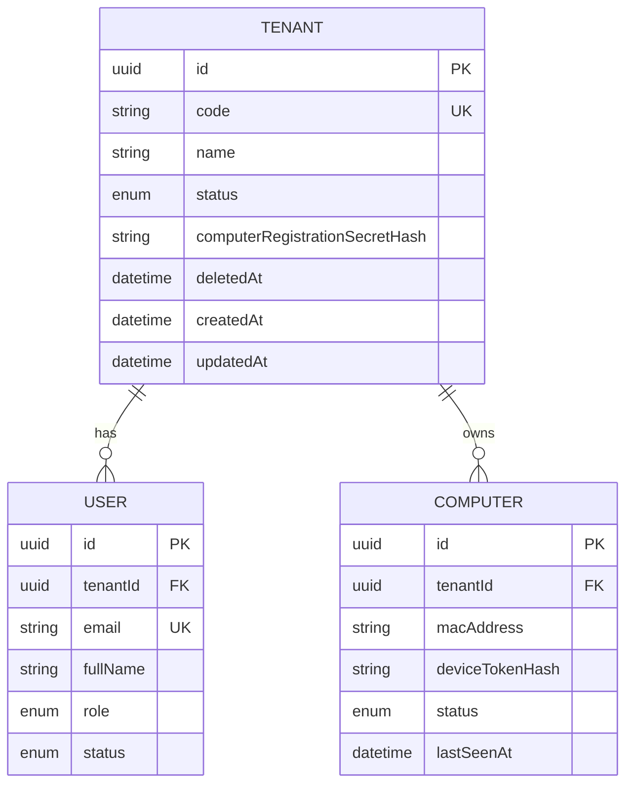
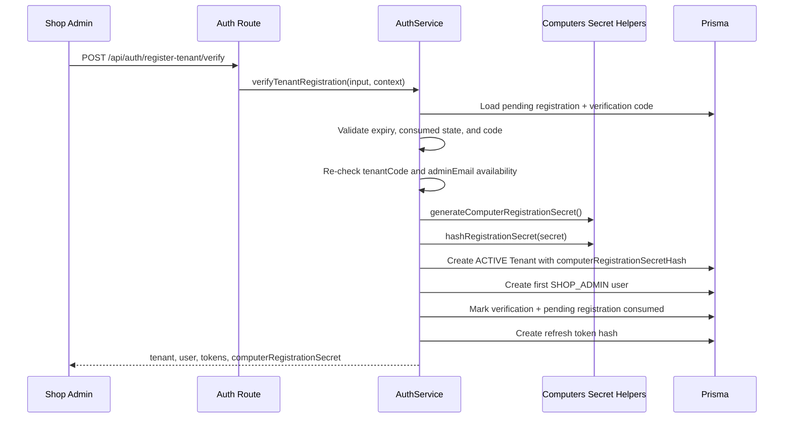
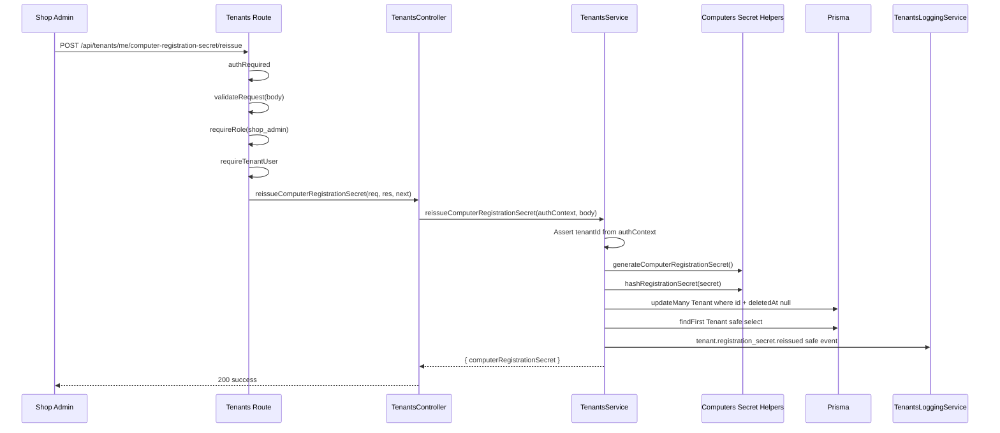

# Technical Design Document: Computer Registration Secret Provisioning

Date: 2026-05-26

Source SPEC: `docs/SPEC/registrationSecret/SPEC.md`

Source design: `docs/plans/2026-05-26-computer-registration-secret-design.md`

Source implementation plan: `docs/plans/2026-05-26-computer-registration-secret-implementation-plan.md`

## 1. Overview

Computer registration already requires `tenantCode`, `registrationSecret`, and `macAddress` through `POST /api/computers/register`. The missing backend flow is how a tenant obtains the plain registration secret without manual database setup.

This feature provisions a tenant-level `computerRegistrationSecret` during tenant onboarding and adds a `shop_admin` reissue endpoint for lost or compromised secrets. The plain secret is returned exactly once from each provisioning action, while the database stores only `Tenant.computerRegistrationSecretHash`.

The implementation follows the existing CloudCMS Express backend pattern:

```text
routes -> validation/auth middleware -> controller -> service -> Prisma
```

Affected modules:

- Auth: generate and return the initial secret in `POST /api/auth/register-tenant/verify`.
- Tenants: expose `POST /api/tenants/me/computer-registration-secret/reissue`.
- Computers: provide reusable registration-secret generation and hashing primitives.
- Prisma: reuse the existing nullable `Tenant.computerRegistrationSecretHash` field.
- Tests/docs: add focused unit, service, Supertest, security, and manual verification coverage.

## 2. Requirements

### 2.1 Functional Requirements

- As a new `shop_admin`, I want tenant verification to return a `computerRegistrationSecret` so I can register Client PCs without manual DB setup.
- As an existing `shop_admin`, I want to reissue the tenant registration secret so I can recover from a lost or compromised secret.
- As a Client PC, I want the existing `POST /api/computers/register` flow to continue accepting `tenantCode + registrationSecret + macAddress`.
- As QA, I want Postman verification to work end-to-end after tenant verification without direct Prisma Studio, SQL, or manual hash setup.
- As a backend developer, I want the implementation to reuse the existing `Tenant.computerRegistrationSecretHash` field and Computers secret hashing helper.

Functional rules:

- Successful `POST /api/auth/register-tenant/verify` must generate a high-entropy secret with prefix `crs_live_`.
- Tenant verification must hash the generated secret and persist only the hash in `Tenant.computerRegistrationSecretHash`.
- Tenant verification response must include `data.computerRegistrationSecret` exactly once.
- Tenant verification response must not include `computerRegistrationSecretHash`.
- Reissue endpoint path is `POST /api/tenants/me/computer-registration-secret/reissue`.
- Reissue must require `authRequired`, `requireRole("shop_admin")`, and `requireTenantUser`.
- Reissue must accept `{}` and `{ "reason": "..." }`.
- Reissue must reject unknown body fields.
- Reissue `reason` must be trimmed and limited to 200 characters.
- Reissue must generate a new plain secret, hash it, overwrite the current tenant hash, and return the new plain secret exactly once.
- The old plain secret must fail future `POST /api/computers/register` attempts after reissue.
- The new plain secret must succeed on `POST /api/computers/register` when all other registration inputs are valid.

### 2.2 Non-Functional Requirements

- Security:
  - Plain registration secrets must never be stored.
  - Registration secret hashes must never be returned from API responses.
  - Plain registration secrets, registration secret hashes, authorization headers, access tokens, refresh tokens, device tokens, and raw secret-bearing request bodies must never be logged.
  - Failure responses must not reveal whether an old or new secret exists.
- Reliability:
  - Reissue must overwrite the tenant hash deterministically.
  - Reissue must scope updates by the authenticated tenant context.
  - Missing or deleted current tenant must return existing current-tenant not-found behavior.
- Maintainability:
  - Keep the feature inside existing Auth, Tenants, and Computers module boundaries.
  - Do not add new Prisma tables or new Tenant fields for MVP.
  - Reuse existing middleware, validation, error handling, logging, Prisma, and password hashing conventions.
- Observability:
  - Emit safe structured logs for reissue.
  - Existing Auth tenant verification logs remain safe and must not include the generated secret.
  - Include request id and actor/tenant metadata where available.
- Operations:
  - No autonomous Prisma CLI, migration, DB setup, server command, or DB command execution in this workspace.
  - Existing health endpoints remain sufficient; no new registration-secret health endpoint is required.

## 3. Technical Design

### 3.1. Data Model Changes

No schema change is required. The current Prisma schema already contains:

```prisma
model Tenant {
  id                             String
  code                           String
  name                           String
  computerRegistrationSecretHash String?
  status                         TenantStatus
}
```

Storage rules:

- `computerRegistrationSecretHash` remains nullable for existing tenants and transitional states.
- New tenant verification must set `computerRegistrationSecretHash`.
- Reissue must overwrite `computerRegistrationSecretHash`.
- Plain `computerRegistrationSecret` is never persisted.
- Do not add:
  - `computerRegistrationSecretCreatedAt`
  - `computerRegistrationSecretRotatedAt`
  - registration-secret audit table
  - secret version table

#### ERD



### 3.2. API Changes

#### Update: `POST /api/auth/register-tenant/verify`

Existing request body remains unchanged.

Response adds `computerRegistrationSecret` inside `data`:

```json
{
  "success": true,
  "data": {
    "tenant": {
      "id": "tenant-id",
      "code": "DEMO_CAFE",
      "name": "Demo Cafe",
      "status": "ACTIVE"
    },
    "user": {
      "id": "user-id",
      "email": "admin@example.com",
      "fullName": "Demo Admin",
      "role": "shop_admin",
      "tenantId": "tenant-id"
    },
    "accessToken": "access-token",
    "refreshToken": "refresh-token",
    "computerRegistrationSecret": "crs_live_generated_secret"
  }
}
```

Implementation notes:

- Add `computerRegistrationSecret: string` to `VerifyRegisterTenantOutput`.
- Generate the secret before tenant creation after all pending registration and verification checks pass.
- Hash the secret with the Computers registration-secret hash helper.
- Pass the hash into tenant creation and select only safe tenant fields.
- Return the plain secret in the service output once.
- Existing invalid/expired verification errors remain unchanged.

#### New: `POST /api/tenants/me/computer-registration-secret/reissue`

Middleware stack:

```text
authRequired
-> validateRequest({ body: reissueComputerRegistrationSecretSchema })
-> requireRole("shop_admin")
-> requireTenantUser
-> tenantsController.reissueComputerRegistrationSecret
-> tenantsService.reissueComputerRegistrationSecret
```

The route must be declared before parameterized routes such as `/:id`.

Request body:

```json
{
  "reason": "lost secret"
}
```

Validation rules:

- `{}` is valid.
- `reason` is optional.
- `reason` is trimmed.
- `reason` max length is 200.
- Unknown fields are rejected.

Recommended schema:

```ts
export const reissueComputerRegistrationSecretSchema = z
  .object({
    reason: z.string().trim().max(200).optional(),
  })
  .strict();
```

Successful response:

```json
{
  "success": true,
  "data": {
    "computerRegistrationSecret": "crs_live_new_generated_secret"
  }
}
```

Error behavior:

- Missing or invalid access token: `401 UNAUTHORIZED`.
- Authenticated non-`shop_admin`: `403 FORBIDDEN`.
- Missing tenant context: existing `requireTenantUser` or Tenants service forbidden behavior.
- Missing/deleted tenant: existing Tenants current-tenant not-found behavior.
- Validation failure: existing validation error shape.
- Unexpected failure: existing generic internal error shape without secret material.

#### Existing: `POST /api/computers/register`

No API contract change.

Behavioral dependency:

- The endpoint must continue verifying submitted `registrationSecret` against `Tenant.computerRegistrationSecretHash`.
- After reissue, the previous secret must fail because the stored hash has been overwritten.

### 3.3. UI Changes

No frontend UI is required for MVP.

Future Web Admin behavior should be documented but not implemented now:

- Show the secret only immediately after tenant verification or reissue.
- Warn that the secret cannot be recovered after leaving the response screen.
- Provide copy affordance.
- Require explicit confirmation before reissue because old setup material stops working immediately.
- Avoid storing the plain secret in local storage, session storage, analytics, logs, or URLs.

### 3.4. Logic Flow

#### Tenant Verification Provisioning



Implementation detail:

- The current code uses helper methods with `$transaction` per write group. This feature should follow the existing pattern unless a broader Auth transaction refactor is intentionally scheduled.
- If transaction boundaries are tightened later, tenant creation, user creation, verification consumption, pending-registration consumption, and refresh-token creation should be in one database transaction.

#### Reissue Flow



Service algorithm:

```text
normalize tenantId from authContext
normalize reason from input
generate computerRegistrationSecret
hash computerRegistrationSecret
update Tenant where id = tenantId and deletedAt = null:
  computerRegistrationSecretHash = hash
if update count is 0:
  throw NOT_FOUND
log safe reissue event
return { computerRegistrationSecret }
```

### 3.5. Dependencies

No new package dependency is required.

Existing dependencies and helpers:

- `node:crypto` `randomBytes` for high-entropy secret generation.
- `authPasswordService.hashPassword()` via `hashRegistrationSecret()`.
- `zod` for strict request validation.
- Express router/controller/service pattern.
- Prisma client.
- Existing Auth middleware and RBAC helpers:
  - `authRequired`
  - `requireRole`
  - `requireTenantUser`
- Existing centralized error handling through `AppError`.
- Existing Pino logger wrapper through Auth/Tenants logging services.

Configuration:

- No new `.env` variable is needed for registration-secret generation.
- Existing password hashing configuration applies through Auth password service.
- Existing `env.computers.deviceTokenHashSecret` is unrelated to registration secret hashing and must not be reused directly for plain registration-secret storage.

### 3.6. Security Considerations

Secret generation:

- Use `randomBytes(32).toString("base64url")` or equivalent high-entropy URL-safe generation.
- Prefix with `crs_live_`.
- Do not derive from tenant code, tenant id, user id, email, MAC address, timestamp, or request id.

Secret storage:

- Store only bcrypt-compatible hash output from the existing password hashing service.
- Never store plain secret in Prisma, audit tables, logs, background jobs, or docs.

Logging:

- Auth verification completion logs must not include `computerRegistrationSecret`.
- Tenants reissue logs must not include:
  - `computerRegistrationSecret`
  - `computerRegistrationSecretHash`
  - raw request body
  - authorization header
  - access token
  - refresh token
  - device token
- Prefer logging `reasonLength` or a locally approved sanitized reason field.
- Existing `TenantsLoggingService` currently allowlists payload fields and avoids spreading caller input. Extend this style for the reissue event.

Authorization:

- Route-level auth must require `shop_admin`.
- Service-level tenant scope must come only from `authContext.tenantId`.
- Client-provided tenant id must not be accepted.
- `super_admin`, `staff`, unauthenticated users, and device-token-only clients are not allowed to reissue tenant registration secrets in MVP.

Response safety:

- Only two successful responses can expose plain `computerRegistrationSecret`:
  - `POST /api/auth/register-tenant/verify`
  - `POST /api/tenants/me/computer-registration-secret/reissue`
- Generic tenant DTOs must continue excluding `computerRegistrationSecretHash`.
- Computer DTOs must continue excluding tenant registration secret material.

### 3.7. Performance and Reliability Considerations

- Secret generation is local CPU work and should not materially affect endpoint latency.
- Password hashing adds bounded CPU cost similar to existing password hashing; use the existing hashing service to keep operational behavior consistent.
- Reissue performs one tenant update plus optional follow-up read/logging. This is low-volume admin behavior.
- Reissue should use `updateMany` scoped by `id` and `deletedAt: null` or an equivalent safe update path so deleted tenants do not rotate.
- If the tenant row disappears between auth and update, return existing not-found behavior.
- Existing `POST /api/computers/register` rate limiting remains the protection for repeated secret guessing.
- A future production hardening pass may add dedicated rate limiting for reissue, but it is not required for MVP unless abuse appears in testing.

### 3.8. Observability and Operations

Recommended new log event:

```ts
TENANTS_LOG_EVENTS.COMPUTER_REGISTRATION_SECRET_REISSUED =
  "tenant.computer_registration_secret.reissued";
```

Recommended safe log payload:

```ts
{
  requestId,
  event: "tenant.computer_registration_secret.reissued",
  actorUserId,
  actorRole,
  actorTenantId,
  targetTenantId,
  status: "success",
  reasonLength
}
```

Operational notes:

- No new health endpoint is required.
- No migration is required if `Tenant.computerRegistrationSecretHash` is already present in the deployed schema.
- If any environment lacks the field, the team must run the already-approved migration path manually. The assistant must not run Prisma CLI or DB commands autonomously.
- Documentation should be updated so Postman flow captures `data.computerRegistrationSecret` after tenant verification.

## 4. Testing Plan

### 4.1 Unit Tests

Computers secret helper:

- `generateComputerRegistrationSecret()` returns `crs_live_<url-safe-token>`.
- Two consecutive calls return different values.
- Returned secret does not include whitespace.
- `hashRegistrationSecret()` still verifies through existing compare behavior.

Tenants schema:

- `{}` passes.
- `{ reason: " lost secret " }` trims to `lost secret`.
- `reason` length 200 passes.
- `reason` length 201 fails.
- Unknown field fails.
- Secret-like fields such as `computerRegistrationSecret`, `computerRegistrationSecretHash`, `accessToken`, and `authorization` fail because schema is strict.

Logging:

- Tenants reissue logging helper does not spread raw input.
- Sensitive fields are dropped or omitted.
- Reissue event payload includes only safe actor/tenant metadata and reason metadata.

### 4.2 Service Tests

Auth service verification:

- Successful verification returns `computerRegistrationSecret`.
- Generated secret matches `^crs_live_[A-Za-z0-9_-]+$`.
- Tenant create data includes `computerRegistrationSecretHash`.
- Stored hash does not contain the plain secret.
- Stored hash verifies against the returned secret.
- Invalid verification code does not generate or return a registration secret.
- Generic verification failure logs do not include secret material.

Tenants service reissue:

- Missing `tenantId` in auth context returns `403 FORBIDDEN`.
- Missing/deleted tenant returns `404 NOT_FOUND`.
- Valid `shop_admin` tenant context updates `Tenant.computerRegistrationSecretHash`.
- Response returns the new plain `computerRegistrationSecret`.
- Previous hash is replaced.
- Plain secret is not passed into logging.
- Optional reason is normalized before logging metadata.

Computers registration compatibility:

- Old secret fails registration after reissue.
- New secret succeeds registration with a fresh MAC address.
- Registration response still returns `deviceToken` and safe computer DTO.
- Registration response does not expose `computerRegistrationSecretHash`.

### 4.3 API/Supertest Tests

Auth API:

- `POST /api/auth/register-tenant/verify` success includes `data.computerRegistrationSecret`.
- Response does not include `computerRegistrationSecretHash`.
- Existing success shape for tenant, user, access token, and refresh token remains intact.
- Existing invalid/expired verification behavior remains unchanged.

Tenants API:

- Missing bearer token on reissue returns `401`.
- Staff bearer token returns `403`.
- Super admin bearer token returns `403` for MVP unless it has tenant-bound `shop_admin` role.
- Shop admin bearer token returns `200` with `data.computerRegistrationSecret`.
- `{}` request body returns `200`.
- `{ "reason": "lost secret" }` returns `200`.
- Unknown fields return validation error.
- Reason longer than 200 returns validation error.
- Route ordering prevents `/me/computer-registration-secret/reissue` from being captured by `/:id`.

Security API tests:

- Reissue response does not include `computerRegistrationSecretHash`.
- Reissue logs do not include plain secret.
- Auth verification logs do not include plain secret.
- Logs do not include authorization header, access token, refresh token, device token, or raw body.

### 4.4 Contract and Manual Verification

Postman manual flow:

1. `POST /api/auth/register-tenant`.
2. `POST /api/auth/register-tenant/verify`.
3. Save `data.computerRegistrationSecret` as `registrationSecret`.
4. `POST /api/computers/register` with:

```json
{
  "tenantCode": "{{tenantCode}}",
  "registrationSecret": "{{registrationSecret}}",
  "macAddress": "AA:BB:CC:DD:EE:01",
  "name": "PC-01"
}
```

5. Confirm `200` and response includes `deviceToken`.
6. `POST /api/tenants/me/computer-registration-secret/reissue`.
7. Save new `data.computerRegistrationSecret`.
8. Confirm old registration secret fails with a fresh MAC.
9. Confirm new registration secret succeeds with a fresh MAC.

## 5. Open Questions

No blocking questions remain for MVP. The SPEC already decides:

- Long-lived tenant-level secret.
- Initial provisioning during tenant verification.
- Shop-admin-only reissue endpoint.
- Reuse of existing `Tenant.computerRegistrationSecretHash`.
- No new Prisma fields or tables.

Optional decisions before implementation:

- Exact filename and placement for docs/Postman updates.
- Whether reissue logs store sanitized `reason` or only `reasonLength`.
- Whether to add route-specific rate limiting for reissue now or defer.

## 6. Alternatives Considered

### Out-of-band DB setup

Rejected. It makes Postman and onboarding verification confusing, requires database access, and hides the product flow from the admin and Client PC setup.

### Short-lived per-computer invite key

Deferred. It is more secure but requires extra lifecycle concepts: invite creation, expiry, used state, UI timing, and likely new database fields or tables. The MVP needs a simpler tenant-level secret flow.

### Static human-chosen tenant password

Rejected. Human-chosen secrets are weaker, require additional setup UX, and create avoidable password-management concerns.

### New audit or rotation table

Deferred. The MVP can emit structured logs for reissue. Persistent audit can be added later when the broader audit module exists.
