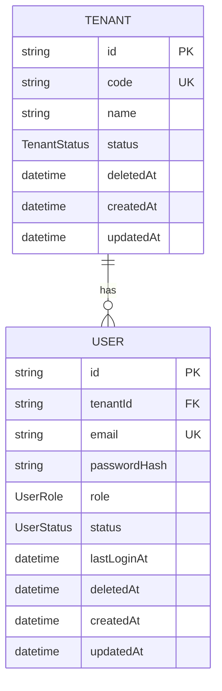
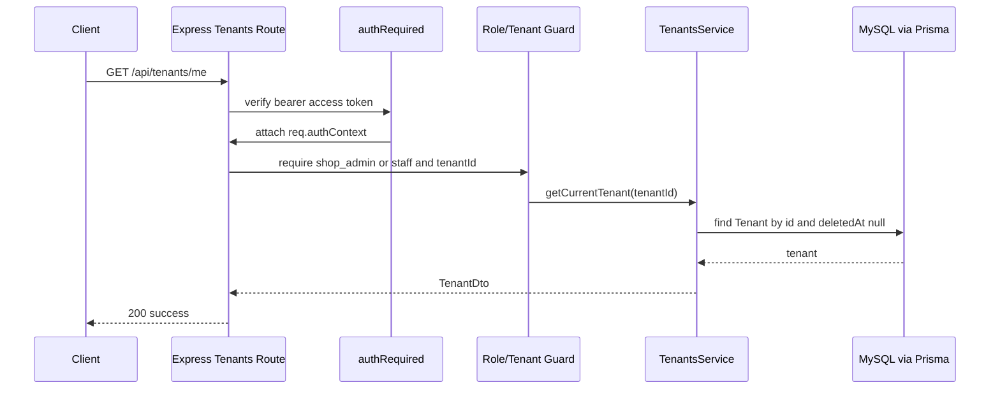
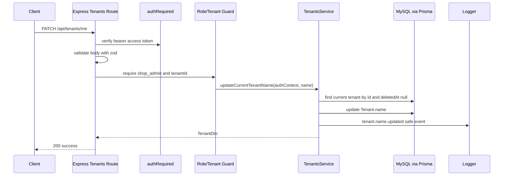
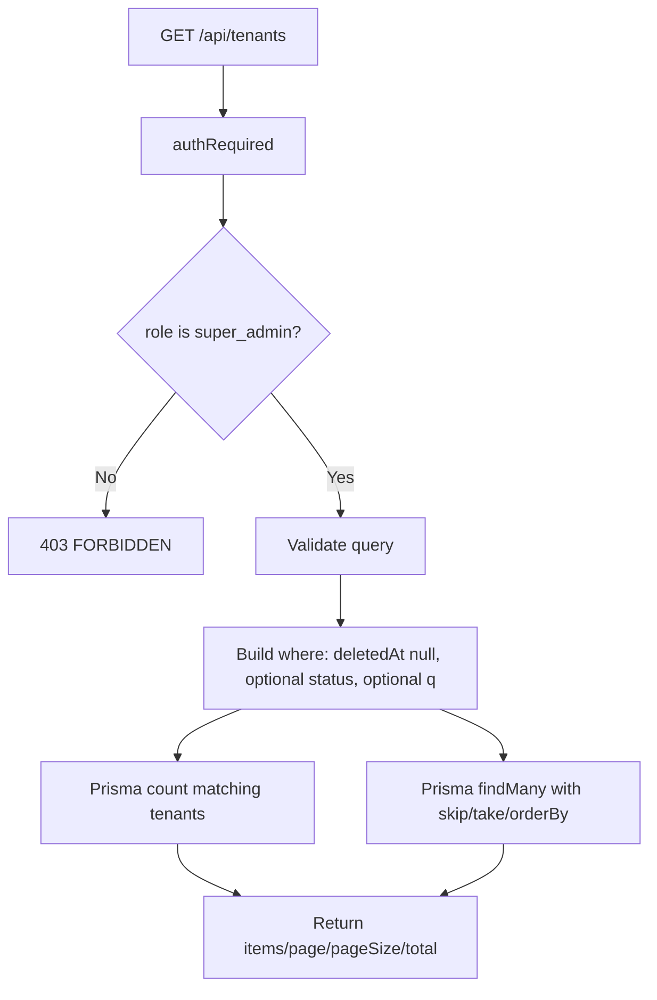
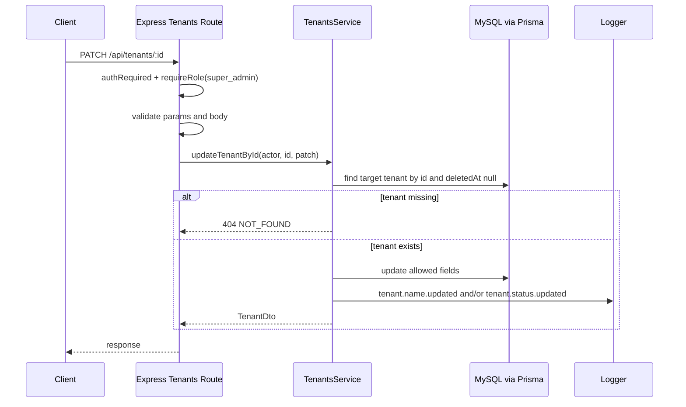
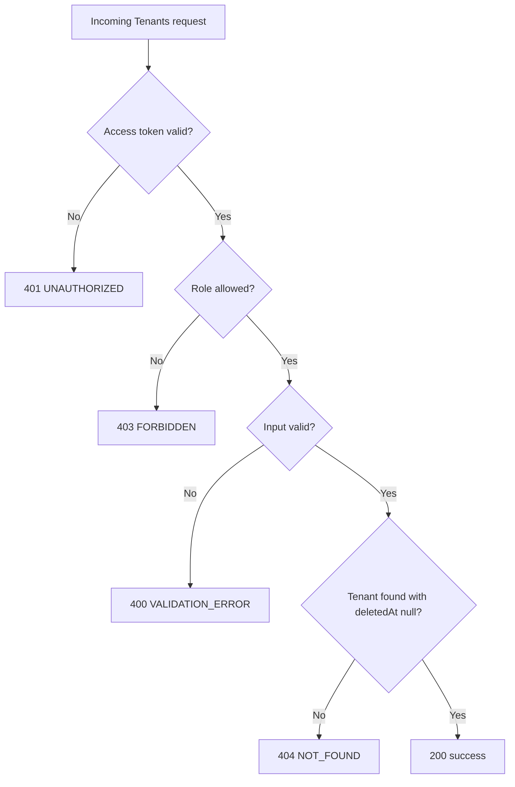

# Technical Design Document: CloudCMS Tenants Module

Date: 2026-05-20

## 1. Overview

The `tenants` module provides backend-only tenant management APIs for CloudCMS after the Auth module has created the initial tenant through public registration.

This TDD is based on:

- Source SPEC: `docs/SPEC/tenants/SPEC.md`
- Source design: `docs/module/tenants/2026-05-20-tenants-design.md`
- Backend-wide design: `docs/backend/2026-05-17-cloudcms-backend-design.md`
- Existing Auth module pattern under `backend/src/modules/auth/`
- Existing Prisma schema at `backend/prisma/schema.prisma`

Confirmed implementation context:

- Runtime: Node.js backend.
- Package manager: `npm`.
- Language: TypeScript with the existing backend configuration.
- API framework: Express.
- ORM: Prisma.
- Database: MySQL.
- Test runner: Vitest with Supertest.
- Existing module pattern: route -> controller -> service -> Prisma/shared adapters.
- Existing validation: `zod` through `validateRequest`.
- Existing auth middleware: `authRequired` from `backend/src/modules/auth/auth.middleware.ts`.
- Existing auth context: `req.authContext` with `userId`, `tenantId`, `role`, and `tokenType`.
- Existing role values in auth context: `super_admin`, `shop_admin`, and `staff`.
- Existing error handling: `AppError` and centralized `errorHandler`.
- Existing logging: request id middleware and structured request logger.

Tenants owns:

- Current-tenant profile read.
- Current-tenant name update by `shop_admin`.
- Super-admin tenant listing.
- Super-admin tenant detail lookup.
- Super-admin tenant name/status updates.
- Tenant list pagination, status filtering, and lightweight search.
- Safe tenant update event logging.

Tenants does not own:

- Public tenant registration.
- User/staff management.
- Computer registration.
- Sessions, usage tracking, URL rules, assets, subscriptions, or audit persistence.
- Soft delete, restore, archive jobs, or tenant lifecycle deletion policy.
- New health endpoints.
- Web Admin UI implementation.

## 2. Requirements

### 2.1 Functional Requirements

- The backend must expose `GET /api/tenants/me` for tenant-bound users to read their current tenant profile.
- `GET /api/tenants/me` must allow `shop_admin` and `staff`.
- `GET /api/tenants/me` must resolve the tenant from `req.authContext.tenantId`, never from client input.
- The backend must expose `PATCH /api/tenants/me` for `shop_admin` users to update their own tenant name.
- `PATCH /api/tenants/me` must reject attempts to update `status`, `code`, `id`, timestamps, `deletedAt`, or unknown fields.
- The backend must expose `GET /api/tenants` for `super_admin` users to list tenants.
- `GET /api/tenants` must support `page`, `pageSize`, `status`, and `q`.
- `GET /api/tenants` must default to `page = 1`, `pageSize = 20`, and cap `pageSize` at `100`.
- `GET /api/tenants` must sort by `createdAt desc`.
- The backend must expose `GET /api/tenants/:id` for `super_admin` users to view tenant detail.
- The backend must expose `PATCH /api/tenants/:id` for `super_admin` users to update tenant name and/or status.
- `PATCH /api/tenants/:id` must require at least one valid field.
- Only `super_admin` may update `Tenant.status`.
- `Tenant.code` must remain immutable after registration.
- All Tenants reads and writes must defensively exclude records where `deletedAt` is not null.
- Tenants responses must not expose `deletedAt` in the MVP.
- Unknown tenant ids and deleted tenants must return `404 NOT_FOUND`.
- Missing, malformed, invalid, or expired access tokens must return `401 UNAUTHORIZED`.
- Role violations and missing tenant context on `/me` must return `403 FORBIDDEN`.
- Validation failures must return `400 VALIDATION_ERROR`.

### 2.2 Non-Functional Requirements

- Security: all Tenants endpoints must require a valid access token.
- Security: all route inputs must be validated with `zod` before controller/service logic.
- Security: `/me` routes must never trust tenant ids supplied by body, params, or query.
- Security: tenant-bound users must not list, read, or update arbitrary tenant ids.
- Security: logs must never include authorization headers, access tokens, refresh tokens, raw request headers, or raw secrets.
- Scalability: super-admin tenant list must always use pagination and must never return the entire tenant table.
- Scalability: `pageSize` must be capped at `100`.
- Observability: request logs must continue to include `requestId`; tenant update events should include safe actor and target identifiers.
- Maintainability: source files should follow the existing Auth module style under a dedicated `backend/src/modules/tenants/` boundary.
- Maintainability: no new runtime dependency is required for the Tenants MVP.
- Maintainability: no Prisma migration is required unless implementation discovers schema drift.
- Reliability: database reads/writes must use the existing Prisma client singleton.
- Reliability: Tenants has no background jobs, queues, external network calls, or retry workers in the MVP.
- Team workflow: DB, migration, server, test, and typecheck commands remain user/team-run actions.

## 3. Technical Design

### 3.1. Data Model Changes

No Prisma schema change is expected for the Tenants MVP. The module uses the existing `Tenant` model and `TenantStatus` enum.

Existing enum:

```prisma
enum TenantStatus {
  ACTIVE
  SUSPENDED
}
```

Existing model:

```prisma
model Tenant {
  id        String       @id @default(uuid())
  code      String       @unique
  name      String
  status    TenantStatus @default(ACTIVE)
  deletedAt DateTime?
  createdAt DateTime     @default(now())
  updatedAt DateTime     @updatedAt

  users User[]
}
```

Service-layer invariants:

- `code` is read-only in Tenants.
- `name` is mutable.
- `status` is mutable only through super-admin routes.
- `deletedAt` is reserved for a later lifecycle/archive policy.
- Every MVP query must include or logically enforce `deletedAt: null`.

Tenant DTO:

```ts
export type TenantDto = {
  id: string;
  code: string;
  name: string;
  status: "ACTIVE" | "SUSPENDED";
  createdAt: string;
  updatedAt: string;
};
```

List output:

```ts
export type ListTenantsOutput = {
  items: TenantDto[];
  page: number;
  pageSize: number;
  total: number;
};
```

ERD:



### 3.2. API Changes

Create a new Express router in:

```text
backend/src/modules/tenants/tenants.routes.ts
```

Mount it in `backend/src/app.ts`:

```ts
app.use("/api/tenants", tenantsRouter);
```

Mounting should happen after `authContextMiddleware` and before `notFoundHandler`.

General app middleware order:

```text
requestIdMiddleware
-> requestLogger
-> helmet/cors/body parsers
-> authContextMiddleware
-> healthRouter
-> authRouter
-> tenantsRouter
-> notFoundHandler
-> errorHandler
```

Tenants route-level pattern:

```text
authRequired
-> validateRequest
-> role / tenant guard
-> tenantsController
-> tenantsService
-> Prisma
-> errorHandler
```

Implementation note:

- `authRequired` should be reused from `backend/src/modules/auth/auth.middleware.ts`.
- Existing role helpers from `backend/src/modules/auth/auth.rbac.ts` may be reused for MVP.
- If more modules later require RBAC helpers, move those helpers into `backend/src/shared/middleware/` or `backend/src/shared/auth/` in a separate refactor.

#### `GET /api/tenants/me`

Purpose: return the tenant associated with the current authenticated tenant user.

Authentication: `Authorization: Bearer <accessToken>`.

Allowed roles:

```text
shop_admin
staff
```

Middleware stack:

```text
authRequired
-> requireRole("shop_admin", "staff")
-> requireTenantUser
-> tenantsController.getCurrentTenant
```

Request body: none.

Params: none.

Query: none.

Response:

```json
{
  "success": true,
  "data": {
    "tenant": {
      "id": "tenant-id",
      "code": "CYBER01",
      "name": "Cyber Game 24H",
      "status": "ACTIVE",
      "createdAt": "2026-05-20T00:00:00.000Z",
      "updatedAt": "2026-05-20T00:00:00.000Z"
    }
  }
}
```

Expected errors:

- `UNAUTHORIZED` for missing or invalid access token.
- `FORBIDDEN` for wrong role or missing `tenantId`.
- `NOT_FOUND` if the tenant does not exist or is deleted.

Controller/service mapping:

```text
tenants.routes.ts
-> authRequired
-> requireRole("shop_admin", "staff")
-> requireTenantUser
-> tenantsController.getCurrentTenant
-> tenantsService.getCurrentTenant(authContext.tenantId)
-> prisma.tenant.findFirst({ where: { id: tenantId, deletedAt: null } })
```

#### `PATCH /api/tenants/me`

Purpose: update the current tenant name for the current shop admin.

Authentication: `Authorization: Bearer <accessToken>`.

Allowed roles:

```text
shop_admin
```

Middleware stack:

```text
authRequired
-> requireRole("shop_admin")
-> requireTenantUser
-> validateRequest({ body: updateCurrentTenantSchema })
-> tenantsController.updateCurrentTenant
```

Request:

```json
{
  "name": "Cyber Game 24H"
}
```

Response:

```json
{
  "success": true,
  "data": {
    "tenant": {
      "id": "tenant-id",
      "code": "CYBER01",
      "name": "Cyber Game 24H",
      "status": "ACTIVE",
      "createdAt": "2026-05-20T00:00:00.000Z",
      "updatedAt": "2026-05-20T00:00:00.000Z"
    }
  }
}
```

Expected errors:

- `UNAUTHORIZED` for missing or invalid access token.
- `FORBIDDEN` for wrong role or missing `tenantId`.
- `VALIDATION_ERROR` for invalid `name` or protected/unknown fields.
- `NOT_FOUND` if the current tenant does not exist or is deleted.

Controller/service mapping:

```text
tenants.routes.ts
-> validateRequest(updateCurrentTenantSchema)
-> tenantsController.updateCurrentTenant
-> tenantsService.updateCurrentTenantName(authContext, body)
-> prisma.tenant.update or updateMany guarded by id + deletedAt null
-> logTenantNameUpdated
```

#### `GET /api/tenants`

Purpose: list tenants for super-admin operations.

Authentication: `Authorization: Bearer <accessToken>`.

Allowed roles:

```text
super_admin
```

Middleware stack:

```text
authRequired
-> requireRole("super_admin")
-> validateRequest({ query: listTenantsQuerySchema })
-> tenantsController.listTenants
```

Query:

```text
page=1
pageSize=20
status=ACTIVE
q=cyber
```

Response:

```json
{
  "success": true,
  "data": {
    "items": [
      {
        "id": "tenant-id",
        "code": "CYBER01",
        "name": "Cyber Game 24H",
        "status": "ACTIVE",
        "createdAt": "2026-05-20T00:00:00.000Z",
        "updatedAt": "2026-05-20T00:00:00.000Z"
      }
    ],
    "page": 1,
    "pageSize": 20,
    "total": 1
  }
}
```

Query behavior:

```text
where.deletedAt = null
optional where.status = status
optional OR search over name/code when q is present
orderBy createdAt desc
skip = (page - 1) * pageSize
take = pageSize
```

Expected errors:

- `UNAUTHORIZED` for missing or invalid access token.
- `FORBIDDEN` for non-super-admin roles.
- `VALIDATION_ERROR` for invalid query params.

#### `GET /api/tenants/:id`

Purpose: return one tenant for super-admin operations.

Authentication: `Authorization: Bearer <accessToken>`.

Allowed roles:

```text
super_admin
```

Middleware stack:

```text
authRequired
-> requireRole("super_admin")
-> validateRequest({ params: tenantIdParamsSchema })
-> tenantsController.getTenantById
```

Params:

```text
id: non-empty string
```

Response:

```json
{
  "success": true,
  "data": {
    "tenant": {
      "id": "tenant-id",
      "code": "CYBER01",
      "name": "Cyber Game 24H",
      "status": "ACTIVE",
      "createdAt": "2026-05-20T00:00:00.000Z",
      "updatedAt": "2026-05-20T00:00:00.000Z"
    }
  }
}
```

Expected errors:

- `UNAUTHORIZED` for missing or invalid access token.
- `FORBIDDEN` for non-super-admin roles.
- `VALIDATION_ERROR` for invalid params.
- `NOT_FOUND` if the tenant does not exist or is deleted.

#### `PATCH /api/tenants/:id`

Purpose: update tenant name and/or status as a super admin.

Authentication: `Authorization: Bearer <accessToken>`.

Allowed roles:

```text
super_admin
```

Middleware stack:

```text
authRequired
-> requireRole("super_admin")
-> validateRequest({ params: tenantIdParamsSchema, body: updateTenantByIdSchema })
-> tenantsController.updateTenantById
```

Request:

```json
{
  "name": "Cyber Game 24H",
  "status": "SUSPENDED"
}
```

Rules:

- `name` and `status` are optional individually.
- At least one of `name` or `status` must be present.
- `code`, `id`, `deletedAt`, `createdAt`, and `updatedAt` are rejected.
- Unknown fields are rejected.

Response:

```json
{
  "success": true,
  "data": {
    "tenant": {
      "id": "tenant-id",
      "code": "CYBER01",
      "name": "Cyber Game 24H",
      "status": "SUSPENDED",
      "createdAt": "2026-05-20T00:00:00.000Z",
      "updatedAt": "2026-05-20T00:00:00.000Z"
    }
  }
}
```

Expected errors:

- `UNAUTHORIZED` for missing or invalid access token.
- `FORBIDDEN` for non-super-admin roles.
- `VALIDATION_ERROR` for invalid params/body.
- `NOT_FOUND` if the tenant does not exist or is deleted.

### 3.3. UI Changes

No backend UI changes are required for this TDD.

Expected Web Admin follow-up is outside this TDD:

- Current tenant profile screen can call `GET /api/tenants/me`.
- Shop admin settings screen can call `PATCH /api/tenants/me`.
- Super-admin tenant management screens can call `GET /api/tenants`, `GET /api/tenants/:id`, and `PATCH /api/tenants/:id`.

### 3.4. Logic Flow

#### Current Tenant Read



#### Current Tenant Name Update



#### Super-Admin List



#### Super-Admin Update



#### Error Flow



### 3.5. Dependencies

No new runtime dependency is required.

Reused internal dependencies:

```text
backend/src/modules/auth/auth.middleware.ts
backend/src/modules/auth/auth.rbac.ts
backend/src/shared/validation/validate-request.ts
backend/src/shared/errors/app-error.ts
backend/src/shared/prisma/prisma.client.ts
backend/src/shared/logging/logger.ts
backend/src/shared/middleware/request-id.ts
```

External packages already present through existing backend work:

```text
express
zod
@prisma/client
vitest
supertest
```

Environment variables:

- No new Tenants-specific environment variables.
- Existing database, logging, CORS, body-limit, and auth JWT configuration remain sufficient.

Migration:

- No Prisma migration is expected.
- If implementation discovers that the current `Tenant` model differs from this TDD, stop and document the schema drift before changing migrations.

### 3.6. Security Considerations

#### Authentication

- Every Tenants endpoint must use `authRequired`.
- The middleware must accept only valid access tokens.
- Missing, malformed, expired, or wrong-token-type bearer tokens must return `UNAUTHORIZED`.

#### Authorization

- `GET /api/tenants/me`: `shop_admin` and `staff`.
- `PATCH /api/tenants/me`: `shop_admin` only.
- `GET /api/tenants`: `super_admin` only.
- `GET /api/tenants/:id`: `super_admin` only.
- `PATCH /api/tenants/:id`: `super_admin` only.

#### Tenant Isolation

- `/me` endpoints must use `req.authContext.tenantId`.
- `/me` endpoints must not accept target tenant id in body, params, or query.
- Tenant users must not list tenants.
- Tenant users must not read arbitrary tenant ids.
- Tenant users must not update arbitrary tenant ids.

#### Input Protection

- Strict schemas must reject unknown fields.
- Protected fields must not be accepted:

```text
id
code
deletedAt
createdAt
updatedAt
```

- `name` must be trimmed and constrained to `1..120` characters.
- `status` must be `ACTIVE` or `SUSPENDED`.
- `page`, `pageSize`, and `q` must be validated before service execution.

#### Logging Safety

Never log:

```text
Authorization header
access token
refresh token
raw request headers
raw request body
raw secrets
```

Safe event fields:

```text
requestId
actorUserId
actorRole
actorTenantId
targetTenantId
action
oldStatus
newStatus
statusCode
latencyMs
```

### 3.7. Performance and Reliability Considerations

- Super-admin list must always use `skip` and `take`.
- `pageSize` must default to `20` and must not exceed `100`.
- Default ordering must be `createdAt desc` for stable operations.
- Search is lightweight over `Tenant.name` and `Tenant.code`; no full-text index is required in the MVP.
- The service should avoid N+1 queries; Tenants DTOs do not need relations.
- Count and list queries may run separately for simplicity.
- All reads and writes must filter out `deletedAt != null` records.
- No cache is required for the MVP because Tenants management is low-volume admin traffic.
- No queue, worker, retry, or external integration is required.
- No route-specific rate limit is required for the MVP because endpoints are authenticated admin APIs; this can be revisited if admin abuse or automation becomes a concern.
- If database health fails, Tenants read/write operations are expected to fail through existing Prisma/error handling paths.
- The app must not run Prisma migrations or schema pushes during startup.

### 3.8. Observability and Operations

Tenants uses existing request-level logging and request id middleware.

Required event logs:

```text
tenant.name.updated
tenant.status.updated
```

Optional debug-only event logs:

```text
tenant.profile.viewed
tenant.list.viewed
```

Recommended logging helper:

```text
backend/src/modules/tenants/tenants.logging.ts
```

Operational behavior:

- No Tenants-specific health endpoint is added.
- Existing `/health` and `/api/health/db` remain the operational health checks.
- Super admins manage suspended tenants through `GET /api/tenants?status=SUSPENDED`.
- Full audit persistence is intentionally out of scope for MVP.
- Background archive/delete jobs are intentionally out of scope for MVP.

### 3.9. Implementation Plan

Create:

```text
backend/src/modules/tenants/tenants.routes.ts
backend/src/modules/tenants/tenants.controller.ts
backend/src/modules/tenants/tenants.service.ts
backend/src/modules/tenants/tenants.schema.ts
backend/src/modules/tenants/tenants.types.ts
backend/src/modules/tenants/tenants.logging.ts
backend/tests/tenants/tenants.api.test.ts
```

Update:

```text
backend/src/app.ts
```

Optional later files:

```text
backend/tests/tenants/tenants.api.live.test.ts
backend/tests/tenants/tenants.api.live.security.test.ts
```

#### `tenants.types.ts`

Define:

```text
TenantDto
ListTenantsInput
ListTenantsOutput
UpdateCurrentTenantInput
UpdateTenantByIdInput
```

Add mapper:

```text
mapTenantDto
```

Mapper rules:

- Include `id`, `code`, `name`, `status`, `createdAt`, and `updatedAt`.
- Convert dates to JSON-safe output through normal Express JSON serialization or explicit ISO strings.
- Do not include `deletedAt`.

#### `tenants.schema.ts`

Define:

```text
tenantNameSchema
tenantStatusSchema
tenantIdParamsSchema
updateCurrentTenantSchema
updateTenantByIdSchema
listTenantsQuerySchema
```

Validation details:

- Use strict objects for body schemas.
- Reject unknown fields.
- Parse query integers safely.
- Default `page = 1`.
- Default `pageSize = 20`.
- Cap `pageSize <= 100`.
- Trim `q`; omit or normalize empty strings.

#### `tenants.routes.ts`

Route registration:

```text
GET    /me
PATCH  /me
GET    /
GET    /:id
PATCH  /:id
```

Route order matters:

- Register `/me` routes before `/:id` routes.

#### `tenants.controller.ts`

Controller methods:

```text
getCurrentTenant
updateCurrentTenant
listTenants
getTenantById
updateTenantById
```

Controller rules:

- Keep controllers thin.
- Read validated `req.body`, `req.query`, `req.params`, and `req.authContext`.
- Call service methods.
- Return Foundation success shape.
- Pass errors to `next(error)`.

#### `tenants.service.ts`

Service methods:

```text
getCurrentTenant(tenantId)
updateCurrentTenantName(authContext, input)
listTenants(input)
getTenantById(id)
updateTenantById(authContext, id, input)
```

Service rules:

- Throw `AppError(403, "FORBIDDEN", ...)` for missing tenant context if guard was bypassed.
- Throw `AppError(404, "NOT_FOUND", ...)` for missing/deleted tenants.
- Use Prisma client singleton.
- Always exclude deleted tenants.
- Use only allowlisted update fields.
- Emit safe update logs after successful mutation.

#### `tenants.logging.ts`

Provide helpers:

```text
logTenantNameUpdated
logTenantStatusUpdated
```

Do not accept or log raw request headers, tokens, or bodies.

## 4. Testing Plan

Use Vitest and Supertest following the existing Auth API test style. API tests should import `app` directly and avoid opening a network port.

### 4.1 API Authentication Tests

- Missing token on `GET /api/tenants/me` returns `401 UNAUTHORIZED`.
- Missing token on `GET /api/tenants` returns `401 UNAUTHORIZED`.
- Malformed bearer token on Tenants API returns `401 UNAUTHORIZED`.
- Invalid or expired access token on Tenants API returns `401 UNAUTHORIZED`.

### 4.2 Current Tenant Tests

- `shop_admin` can call `GET /api/tenants/me`.
- `staff` can call `GET /api/tenants/me`.
- `GET /api/tenants/me` uses `req.authContext.tenantId`.
- `GET /api/tenants/me` returns `403 FORBIDDEN` when tenant id is missing.
- `GET /api/tenants/me` returns `404 NOT_FOUND` when the current tenant is missing.
- `GET /api/tenants/me` does not expose `deletedAt`.

### 4.3 Current Tenant Update Tests

- `shop_admin` can update own tenant name through `PATCH /api/tenants/me`.
- `staff` cannot call `PATCH /api/tenants/me`.
- `super_admin` without tenant id cannot use `PATCH /api/tenants/me`.
- `PATCH /api/tenants/me` trims `name`.
- `PATCH /api/tenants/me` rejects empty `name`.
- `PATCH /api/tenants/me` rejects overlong `name`.
- `PATCH /api/tenants/me` rejects `status`.
- `PATCH /api/tenants/me` rejects `code`.
- `PATCH /api/tenants/me` rejects `id`, `deletedAt`, `createdAt`, and `updatedAt`.
- `PATCH /api/tenants/me` does not accept target tenant id from the client.

### 4.4 Super-Admin List Tests

- `super_admin` can list tenants.
- List defaults to `page = 1` and `pageSize = 20`.
- List caps or rejects `pageSize > 100` according to schema decision; recommended behavior is reject with `VALIDATION_ERROR`.
- List supports `status=ACTIVE`.
- List supports `status=SUSPENDED`.
- List rejects invalid `status`.
- List supports `q` search over tenant name.
- List supports `q` search over tenant code.
- List rejects overlong `q`.
- List rejects invalid `page`.
- List rejects invalid `pageSize`.
- List returns `items`, `page`, `pageSize`, and `total`.
- List does not expose `deletedAt`.
- List excludes tenants where `deletedAt` is not null.
- `shop_admin` and `staff` cannot call `GET /api/tenants`.

### 4.5 Super-Admin Detail Tests

- `super_admin` can get tenant detail.
- Unknown tenant returns `404 NOT_FOUND`.
- Deleted tenant returns `404 NOT_FOUND`.
- Invalid `id` returns `400 VALIDATION_ERROR`.
- Detail response does not expose `deletedAt`.
- `shop_admin` and `staff` cannot call `GET /api/tenants/:id`.

### 4.6 Super-Admin Update Tests

- `super_admin` can update tenant name.
- `super_admin` can update tenant status to `ACTIVE`.
- `super_admin` can update tenant status to `SUSPENDED`.
- `super_admin` can update name and status in one request.
- Empty body returns `400 VALIDATION_ERROR`.
- Invalid `status` returns `400 VALIDATION_ERROR`.
- Empty or overlong `name` returns `400 VALIDATION_ERROR`.
- Unknown fields return `400 VALIDATION_ERROR`.
- Attempts to update `code` return `400 VALIDATION_ERROR`.
- Attempts to update `id`, `deletedAt`, `createdAt`, or `updatedAt` return `400 VALIDATION_ERROR`.
- Unknown tenant returns `404 NOT_FOUND`.
- Deleted tenant returns `404 NOT_FOUND`.
- `shop_admin` and `staff` cannot call `PATCH /api/tenants/:id`.

### 4.7 Security And Logging Tests

- Tenant update logs include `requestId` when available.
- Tenant update logs include actor role and target tenant id.
- Tenant status update logs include `oldStatus` and `newStatus`.
- Logs do not include authorization headers.
- Logs do not include access tokens or refresh tokens.
- Logs do not include raw request headers.
- Logs do not include raw request body.

### 4.8 Service/Unit Tests

Add service/unit tests if the API suite becomes too broad or slow:

- `mapTenantDto` omits `deletedAt`.
- `listTenants` builds pagination correctly.
- `listTenants` always filters `deletedAt: null`.
- `updateCurrentTenantName` uses auth context tenant id.
- `updateTenantById` only applies allowlisted fields.
- `updateTenantById` throws `NOT_FOUND` for missing/deleted tenants.

### 4.9 Manual Verification

Manual verification is user/team-run in this workspace:

```text
1. Ensure backend env and database are configured.
2. Start the backend server manually.
3. Obtain valid access tokens for shop_admin, staff, and super_admin.
4. Call GET /api/tenants/me as shop_admin and staff.
5. Call PATCH /api/tenants/me as shop_admin.
6. Confirm staff cannot patch /me.
7. Call GET /api/tenants as super_admin with pagination and filters.
8. Call GET /api/tenants/:id as super_admin.
9. Call PATCH /api/tenants/:id as super_admin for name/status changes.
10. Confirm tenant users cannot access super-admin routes.
```

Do not run DB, migration, server, test, or typecheck commands autonomously.

## 5. Open Questions

None for the Tenants MVP.

Future decisions:

- When to add tenant archive/delete lifecycle policy.
- Whether tenant changes should be persisted in a formal audit table.
- Whether Tenants should get live API tests immediately or after Web Admin begins consuming the endpoints.
- Whether RBAC helpers should move from `modules/auth` to `shared` after additional modules need them.

## 6. Alternatives Considered

### Add Tenant Endpoints To Auth

Rejected. Auth owns registration, login, tokens, and current-user identity. Post-registration tenant administration is a separate business concern and should live in `backend/src/modules/tenants/`.

### Create A Broad Admin Module

Rejected for MVP. A broad Admin module would mix unrelated admin concerns. Tenants has clear data ownership, authorization rules, and future lifecycle policy decisions.

### Allow `shop_admin` To Update Tenant Status

Rejected. A shop admin could suspend their own tenant and then be unable to recover without super-admin intervention. Status changes are operational controls and belong to `super_admin`.

### Allow Tenant Code Edits

Rejected. Tenant code is used by registration/onboarding flows and future client PC identity flows. Mutating it after registration creates downstream identity and support risk.

### Implement Soft Delete In MVP

Rejected. Soft delete affects Auth, users, computers, sessions, usage, billing/subscriptions, and future audit/restore policy. The MVP only filters out `deletedAt != null` defensively and reserves lifecycle policy for a later phase.

### Add Tenants-Specific Health Endpoint

Rejected. Tenants has no external dependency beyond the existing database connection. Existing `/health` and `/api/health/db` are sufficient for MVP operations.

### Add New Metrics/Audit Infrastructure Now

Rejected. The approved MVP uses safe structured logs and request ids. Formal metrics and audit persistence can be introduced when operational requirements become concrete.
