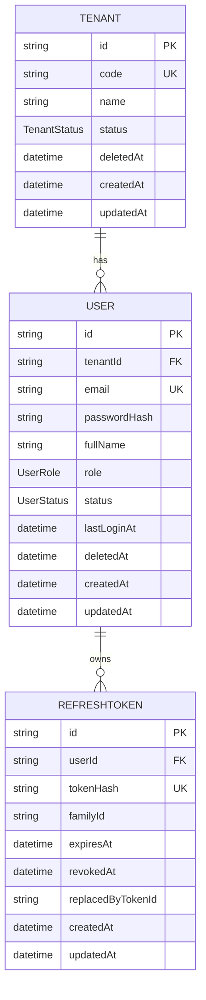
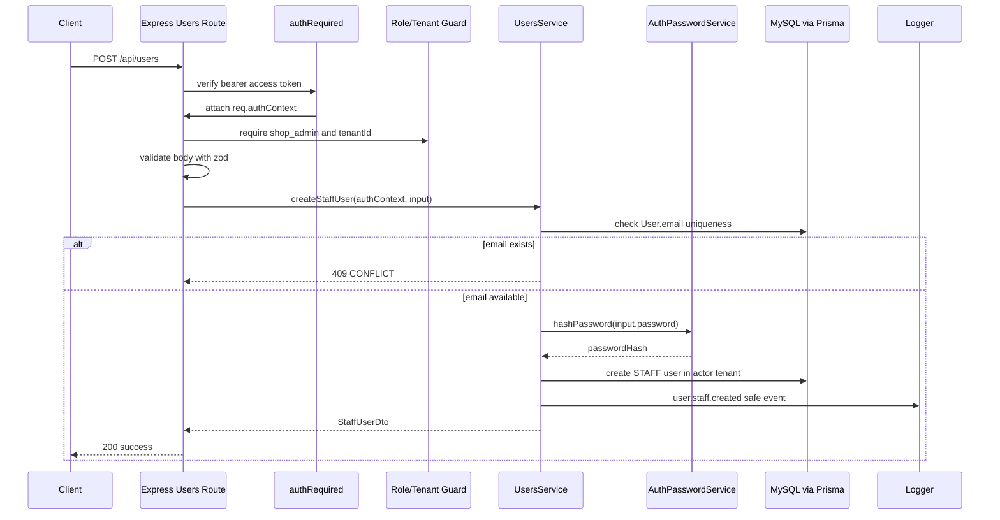
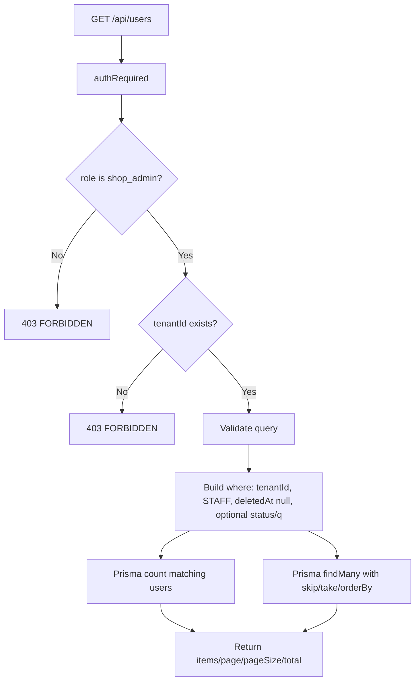
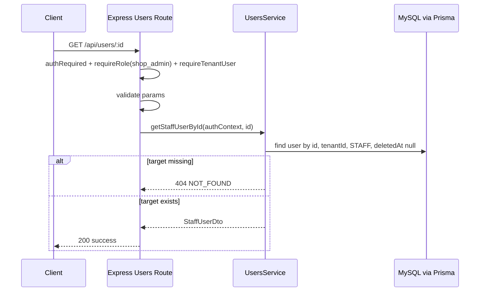
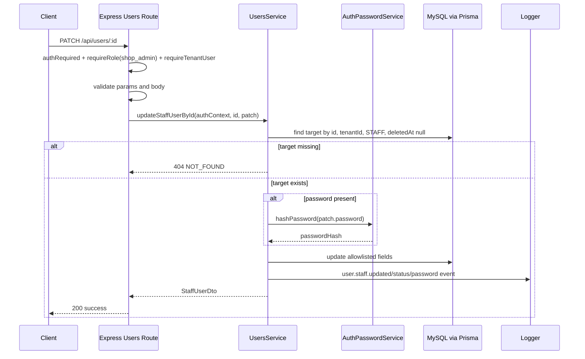
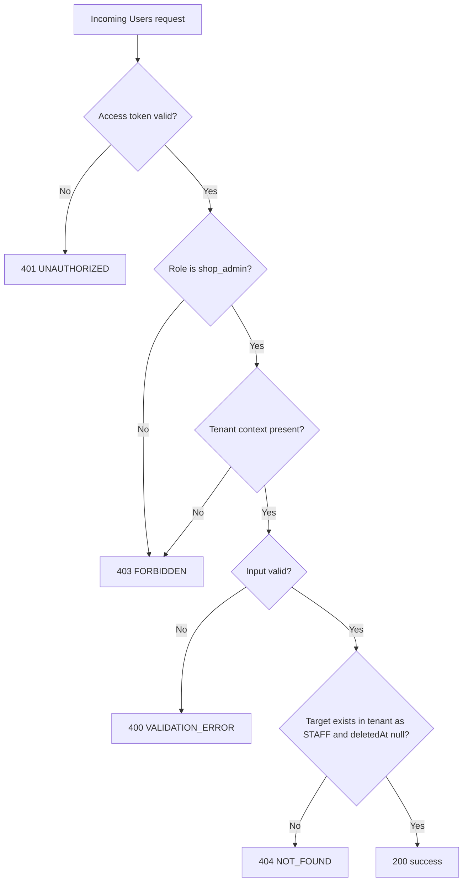

# Technical Design Document: CloudCMS Users Module

Date: 2026-05-22

## 1. Overview

The `users` module provides backend-only staff management APIs for CloudCMS tenant administrators. It starts after the Auth module has created the initial tenant and `shop_admin` through public tenant registration.

This TDD is based on:

- Source SPEC: `docs/SPEC/users/SPEC.md`
- Existing Prisma schema: `backend/prisma/schema.prisma`
- Existing Auth module pattern under `backend/src/modules/auth/`
- Existing Tenants module pattern under `backend/src/modules/tenants/`
- Existing app mount point at `backend/src/app.ts`
- Rule: `rule/technical-design-documentation-rule.mdc`

This TDD intentionally does not use `docs/plans/2026-05-22-users-mvp-implementation-plan.md` as a source, per user direction.

Confirmed implementation context:

- Runtime: Node.js backend.
- Package manager: `npm`.
- Language: TypeScript.
- API framework: Express.
- ORM: Prisma.
- Database: MySQL.
- Test runner: Vitest with Supertest.
- Existing module pattern: route -> controller -> service -> Prisma/shared adapters.
- Existing validation: `zod` through `validateRequest`.
- Existing auth middleware: `authRequired` from `backend/src/modules/auth/auth.middleware.ts`.
- Existing RBAC helpers: `requireRole` and `requireTenantUser` from `backend/src/modules/auth/auth.rbac.ts`.
- Existing password hashing: `authPasswordService` from `backend/src/modules/auth/auth.password.ts`.
- Existing error handling: `AppError` and centralized `errorHandler`.
- Existing logging: request id middleware and structured request logger.

Users owns:

- Staff account creation by authenticated `shop_admin`.
- Tenant-scoped staff list.
- Tenant-scoped staff detail.
- Tenant-scoped staff update for `fullName`, `status`, and temporary password reset.
- Safe staff lifecycle event logging.

Users does not own:

- Public tenant registration.
- Login, refresh, logout, or current-user lookup.
- Staff self-profile endpoints.
- `shop_admin` account management.
- `super_admin` user administration.
- Staff invite-email onboarding.
- Physical user deletion.
- New health endpoints.
- Web Admin UI implementation.

## 2. Requirements

### 2.1 Functional Requirements

- The backend must expose `POST /api/users` for `shop_admin` users to create staff in their own tenant.
- `POST /api/users` must accept `email`, `fullName`, and `password`.
- `POST /api/users` must derive `tenantId` from `req.authContext.tenantId`.
- `POST /api/users` must create only `STAFF` users with `ACTIVE` status.
- `POST /api/users` must hash the incoming password before persistence.
- `POST /api/users` must reject duplicate email with `409 CONFLICT`.
- The backend must expose `GET /api/users` for `shop_admin` users to list staff in their own tenant.
- `GET /api/users` must support `page`, `pageSize`, `status`, and `q`.
- `GET /api/users` must default to `page = 1`, `pageSize = 20`, and cap `pageSize` at `100`.
- `GET /api/users` must search over `email` and `fullName` when `q` is present.
- `GET /api/users` must sort by `createdAt desc`.
- The backend must expose `GET /api/users/:id` for `shop_admin` users to view one staff user in their own tenant.
- The backend must expose `PATCH /api/users/:id` for `shop_admin` users to update a staff user in their own tenant.
- `PATCH /api/users/:id` must allow only `fullName`, `status`, and `password`.
- `PATCH /api/users/:id` must require at least one valid field.
- `PATCH /api/users/:id` must hash `password` before storing it.
- Users must not implement `DELETE /api/users/:id` in MVP.
- Staff lock/unlock must use `User.status` (`ACTIVE` and `DISABLED`).
- All Users reads and writes must scope by `tenantId = req.authContext.tenantId`, `role = STAFF`, and `deletedAt = null`.
- Users responses must not expose `passwordHash`, `deletedAt`, refresh tokens, or token material.
- Missing, malformed, invalid, or expired access tokens must return `401 UNAUTHORIZED`.
- Role violations and missing tenant context must return `403 FORBIDDEN`.
- Validation failures must return `400 VALIDATION_ERROR`.
- Unknown, deleted, cross-tenant, or non-STAFF targets must return `404 NOT_FOUND`.

### 2.2 Non-Functional Requirements

- Security: every Users endpoint must require a valid access token.
- Security: every Users endpoint must allow only `shop_admin` in MVP.
- Security: all route inputs must be validated with `zod` before controller/service logic.
- Security: Users must never trust `tenantId`, `role`, `status` on create, `passwordHash`, ids, or timestamps from client payloads.
- Security: logs must never include raw passwords, password hashes, authorization headers, access tokens, refresh tokens, raw request bodies, or raw request headers.
- Scalability: staff list must always use pagination and must never return an entire tenant staff table without bounds.
- Scalability: `pageSize` must be capped at `100`.
- Observability: staff create/update/status/password-reset events should include request id and safe actor/target metadata.
- Maintainability: source files should follow the existing Auth/Tenants module style under `backend/src/modules/users/`.
- Maintainability: no new runtime dependency is required for Users MVP.
- Maintainability: no Prisma migration is expected unless implementation discovers schema drift.
- Reliability: database reads/writes must use the existing Prisma client singleton.
- Reliability: Users has no background jobs, queues, external network calls, or retry workers in MVP.
- Team workflow: DB, migration, server, test, and typecheck commands remain user/team-run actions.

## 3. Technical Design

### 3.1. Data Model Changes

No Prisma schema change is expected for Users MVP. The module uses the existing `User`, `Tenant`, `RefreshToken`, `UserRole`, and `UserStatus` schema.

Existing enums:

```prisma
enum UserRole {
  SHOP_ADMIN
  STAFF
  SUPER_ADMIN
}

enum UserStatus {
  ACTIVE
  DISABLED
}
```

Existing model:

```prisma
model User {
  id           String     @id @default(uuid())
  tenantId     String?
  email        String     @unique
  passwordHash String
  fullName     String
  role         UserRole
  status       UserStatus @default(ACTIVE)
  lastLoginAt  DateTime?
  deletedAt    DateTime?
  createdAt    DateTime   @default(now())
  updatedAt    DateTime   @updatedAt

  tenant        Tenant?        @relation(fields: [tenantId], references: [id])
  refreshTokens RefreshToken[]

  @@index([tenantId])
  @@index([role])
  @@index([status])
}
```

Service-layer invariants:

- `email` is immutable through Users MVP.
- `tenantId` is server-controlled and derived from auth context.
- `role` is server-controlled and always `STAFF` for Users-created records.
- `status` defaults to `ACTIVE` on create and is mutable only through `PATCH /api/users/:id`.
- `passwordHash` is derived from incoming password and never returned.
- `deletedAt` is reserved for future soft-delete lifecycle policy.
- Every target query must enforce `deletedAt: null`.

Staff DTO:

```ts
export type StaffUserDto = {
  id: string;
  tenantId: string;
  email: string;
  fullName: string;
  role: "STAFF";
  status: "ACTIVE" | "DISABLED";
  lastLoginAt: string | null;
  createdAt: string;
  updatedAt: string;
};
```

List output:

```ts
export type ListStaffUsersOutput = {
  items: StaffUserDto[];
  page: number;
  pageSize: number;
  total: number;
};
```

ERD:



### 3.2. API Changes

Create a new Express router in:

```text
backend/src/modules/users/users.routes.ts
```

Mount it in `backend/src/app.ts`:

```ts
app.use("/api/users", usersRouter);
```

Mounting should happen after `authContextMiddleware` and after `/api/auth`; placing it near `/api/tenants` keeps business modules grouped.

General app middleware order:

```text
requestIdMiddleware
-> requestLogger
-> helmet/cors/body parsers
-> authContextMiddleware
-> healthRouter
-> authRouter
-> tenantsRouter
-> usersRouter
-> notFoundHandler
-> errorHandler
```

Users route-level pattern:

```text
authRequired
-> requireRole("shop_admin")
-> requireTenantUser
-> validateRequest
-> usersController
-> usersService
-> Prisma
-> errorHandler
```

#### `POST /api/users`

Purpose: create a staff account in the current tenant.

Authentication: `Authorization: Bearer <accessToken>`.

Allowed role:

```text
shop_admin
```

Middleware stack:

```text
authRequired
-> requireRole("shop_admin")
-> requireTenantUser
-> validateRequest({ body: createStaffUserSchema })
-> usersController.createStaffUser
```

Request:

```json
{
  "email": "staff@example.com",
  "fullName": "Nguyen Van A",
  "password": "Temp@123456"
}
```

Server-controlled fields:

```text
tenantId = req.authContext.tenantId
role = STAFF
status = ACTIVE
passwordHash = hash(password)
```

Response:

```json
{
  "success": true,
  "data": {
    "user": {
      "id": "user-id",
      "tenantId": "tenant-id",
      "email": "staff@example.com",
      "fullName": "Nguyen Van A",
      "role": "STAFF",
      "status": "ACTIVE",
      "lastLoginAt": null,
      "createdAt": "2026-05-22T00:00:00.000Z",
      "updatedAt": "2026-05-22T00:00:00.000Z"
    }
  }
}
```

Expected errors:

- `UNAUTHORIZED` for missing or invalid access token.
- `FORBIDDEN` for wrong role or missing `tenantId`.
- `VALIDATION_ERROR` for invalid body or protected fields.
- `CONFLICT` when normalized email already exists.

Controller/service mapping:

```text
users.routes.ts
-> validateRequest(createStaffUserSchema)
-> usersController.createStaffUser
-> usersService.createStaffUser(authContext, body)
-> authPasswordService.hashPassword(password)
-> prisma.user.create({ data: { tenantId, email, fullName, role: STAFF, status: ACTIVE, passwordHash } })
-> usersLoggingService.logStaffCreated
```

#### `GET /api/users`

Purpose: list staff accounts in the current tenant.

Authentication: `Authorization: Bearer <accessToken>`.

Allowed role:

```text
shop_admin
```

Middleware stack:

```text
authRequired
-> requireRole("shop_admin")
-> requireTenantUser
-> validateRequest({ query: listStaffUsersQuerySchema })
-> usersController.listStaffUsers
```

Query:

```text
page=1
pageSize=20
status=ACTIVE
q=nguyen
```

Response:

```json
{
  "success": true,
  "data": {
    "items": [
      {
        "id": "user-id",
        "tenantId": "tenant-id",
        "email": "staff@example.com",
        "fullName": "Nguyen Van A",
        "role": "STAFF",
        "status": "ACTIVE",
        "lastLoginAt": null,
        "createdAt": "2026-05-22T00:00:00.000Z",
        "updatedAt": "2026-05-22T00:00:00.000Z"
      }
    ],
    "page": 1,
    "pageSize": 20,
    "total": 1
  }
}
```

Query behavior:

```text
where.tenantId = req.authContext.tenantId
where.role = STAFF
where.deletedAt = null
optional where.status = status
optional OR search over email/fullName when q is present
orderBy createdAt desc
skip = (page - 1) * pageSize
take = pageSize
```

Expected errors:

- `UNAUTHORIZED` for missing or invalid access token.
- `FORBIDDEN` for wrong role or missing tenant context.
- `VALIDATION_ERROR` for invalid query params.

#### `GET /api/users/:id`

Purpose: return one staff account in the current tenant.

Authentication: `Authorization: Bearer <accessToken>`.

Allowed role:

```text
shop_admin
```

Middleware stack:

```text
authRequired
-> requireRole("shop_admin")
-> requireTenantUser
-> validateRequest({ params: staffUserIdParamsSchema })
-> usersController.getStaffUserById
```

Params:

```text
id: non-empty string
```

Response:

```json
{
  "success": true,
  "data": {
    "user": {
      "id": "user-id",
      "tenantId": "tenant-id",
      "email": "staff@example.com",
      "fullName": "Nguyen Van A",
      "role": "STAFF",
      "status": "ACTIVE",
      "lastLoginAt": null,
      "createdAt": "2026-05-22T00:00:00.000Z",
      "updatedAt": "2026-05-22T00:00:00.000Z"
    }
  }
}
```

Expected errors:

- `UNAUTHORIZED` for missing or invalid access token.
- `FORBIDDEN` for wrong role or missing tenant context.
- `VALIDATION_ERROR` for invalid params.
- `NOT_FOUND` for missing, deleted, cross-tenant, or non-STAFF user.

#### `PATCH /api/users/:id`

Purpose: update one staff account in the current tenant.

Authentication: `Authorization: Bearer <accessToken>`.

Allowed role:

```text
shop_admin
```

Middleware stack:

```text
authRequired
-> requireRole("shop_admin")
-> requireTenantUser
-> validateRequest({ params: staffUserIdParamsSchema, body: updateStaffUserSchema })
-> usersController.updateStaffUserById
```

Request:

```json
{
  "fullName": "Nguyen Van B",
  "status": "DISABLED",
  "password": "NewTemp@123456"
}
```

Rules:

- `fullName`, `status`, and `password` are optional individually.
- At least one valid field must be present.
- `password` is a temporary reset password and must be hashed before persistence.
- `email`, `tenantId`, `role`, `passwordHash`, `deletedAt`, ids, timestamps, and `lastLoginAt` are rejected.
- Unknown fields are rejected.

Response:

```json
{
  "success": true,
  "data": {
    "user": {
      "id": "user-id",
      "tenantId": "tenant-id",
      "email": "staff@example.com",
      "fullName": "Nguyen Van B",
      "role": "STAFF",
      "status": "DISABLED",
      "lastLoginAt": null,
      "createdAt": "2026-05-22T00:00:00.000Z",
      "updatedAt": "2026-05-22T00:00:00.000Z"
    }
  }
}
```

Expected errors:

- `UNAUTHORIZED` for missing or invalid access token.
- `FORBIDDEN` for wrong role or missing tenant context.
- `VALIDATION_ERROR` for invalid params/body.
- `NOT_FOUND` for missing, deleted, cross-tenant, or non-STAFF user.

### 3.3. UI Changes

No backend UI changes are required for this TDD.

Expected Web Admin follow-up is outside this TDD:

- Staff management screen can call `GET /api/users`.
- Add-staff form can call `POST /api/users`.
- Staff detail/edit panel can call `GET /api/users/:id` and `PATCH /api/users/:id`.
- Staff self-profile remains handled by `GET /api/auth/me`, not Users.

### 3.4. Logic Flow

#### Staff Create



#### Staff List



#### Staff Detail



#### Staff Update



#### Error Flow



### 3.5. Dependencies

No new runtime dependency is required.

Reused internal dependencies:

```text
backend/src/modules/auth/auth.middleware.ts
backend/src/modules/auth/auth.rbac.ts
backend/src/modules/auth/auth.password.ts
backend/src/shared/validation/validate-request.ts
backend/src/shared/errors/app-error.ts
backend/src/shared/prisma/prisma.client.ts
backend/src/shared/logging/logger.ts
backend/src/shared/middleware/request-id.ts
```

External packages already present through existing backend work:

```text
express
zod
@prisma/client
bcrypt
vitest
supertest
```

Environment variables:

- No new Users-specific environment variables.
- Existing database, logging, CORS, body-limit, and auth JWT configuration remain sufficient.

Migration:

- No Prisma migration is expected.
- If implementation discovers schema drift in `User`, `UserRole`, or `UserStatus`, stop and document it before changing migrations.

### 3.6. Security Considerations

#### Authentication

- Every Users endpoint must use `authRequired`.
- The middleware must accept only valid access tokens.
- Missing, malformed, expired, or wrong-token-type bearer tokens must return `UNAUTHORIZED`.

#### Authorization

- `POST /api/users`: `shop_admin` only.
- `GET /api/users`: `shop_admin` only.
- `GET /api/users/:id`: `shop_admin` only.
- `PATCH /api/users/:id`: `shop_admin` only.
- `staff`, `super_admin`, and unauthenticated callers are denied in MVP.

#### Tenant Isolation

- Users endpoints must use `req.authContext.tenantId`.
- Client `tenantId` must be rejected in body/query/params where applicable.
- All target queries must include `tenantId`, `role: STAFF`, and `deletedAt: null`.
- `shop_admin` must not read or mutate staff from another tenant.
- `shop_admin` must not read or mutate `SHOP_ADMIN` or `SUPER_ADMIN` accounts through `/api/users`.

#### Input Protection

- Strict schemas must reject unknown fields.
- Protected fields must not be accepted:

```text
id
email on patch
tenantId
role
passwordHash
deletedAt
createdAt
updatedAt
lastLoginAt
```

- `email` must be trimmed, lowercased, and validated.
- `fullName` must be trimmed and constrained to `1..120` characters.
- `password` must reuse Auth password strength rules.
- `status` must be `ACTIVE` or `DISABLED`.
- `page`, `pageSize`, and `q` must be validated before service execution.

#### Secret Handling

- Raw passwords are accepted only in create/update request bodies.
- Passwords must be converted to `passwordHash` before persistence.
- Raw passwords must not be returned, logged, or stored.
- `passwordHash` must never appear in response DTOs.
- Refresh token material must not be loaded or returned by Users DTOs.

#### Logging Safety

Never log:

```text
password
passwordHash
Authorization header
access token
refresh token
raw request headers
raw request body
```

Safe event fields:

```text
requestId
actorUserId
actorRole
actorTenantId
targetUserId
targetTenantId
changedFields
oldStatus
newStatus
```

### 3.7. Performance and Reliability Considerations

- Staff list must always use `skip` and `take`.
- `pageSize` must default to `20` and must not exceed `100`.
- Default ordering must be `createdAt desc` for stable admin operations.
- Search is lightweight over `User.email` and `User.fullName`; no full-text index is required in MVP.
- The service should avoid N+1 queries; Users DTOs do not need relations.
- Count and list queries may run separately for clarity.
- All reads and writes must filter out `deletedAt != null` records.
- No cache is required for MVP because staff management is authenticated admin traffic.
- No queue, worker, retry, or external integration is required.
- No route-specific rate limit is required for MVP by default; this can be revisited if staff creation becomes abuse-prone.
- If database health fails, Users read/write operations are expected to fail through existing Prisma/error handling paths.
- The app must not run Prisma migrations or schema pushes during startup.

### 3.8. Observability and Operations

Users uses existing request-level logging and request id middleware.

Recommended event logs:

```text
user.staff.created
user.staff.updated
user.staff.status.updated
user.staff.password.reset
```

Recommended logging helper:

```text
backend/src/modules/users/users.logging.ts
```

Operational behavior:

- No Users-specific health endpoint is added.
- Existing `/health` and `/api/health/db` remain the operational health checks.
- Disabled staff cannot login, refresh, or use `GET /api/auth/me` because Auth already rejects `UserStatus.DISABLED`.
- Physical deletion is intentionally out of scope.
- Staff invite email is intentionally out of scope.
- Formal audit persistence is intentionally out of scope for MVP.

### 3.9. Implementation Plan

Create:

```text
backend/src/modules/users/users.routes.ts
backend/src/modules/users/users.controller.ts
backend/src/modules/users/users.service.ts
backend/src/modules/users/users.schema.ts
backend/src/modules/users/users.types.ts
backend/src/modules/users/users.logging.ts
backend/tests/users/users.api.test.ts
backend/tests/users/users.service.test.ts
backend/tests/users/users.unit.test.ts
```

Update:

```text
backend/src/app.ts
```

#### `users.types.ts`

Define:

```text
StaffUserDto
CreateStaffUserInput
ListStaffUsersInput
ListStaffUsersOutput
UpdateStaffUserInput
```

Add mapper:

```text
mapStaffUserDto
```

Mapper rules:

- Include `id`, `tenantId`, `email`, `fullName`, `role`, `status`, `lastLoginAt`, `createdAt`, and `updatedAt`.
- Convert dates through normal Express JSON serialization or explicit ISO strings.
- Do not include `passwordHash`, `deletedAt`, `refreshTokens`, or token material.

#### `users.schema.ts`

Define:

```text
staffEmailSchema
staffFullNameSchema
staffStatusSchema
staffUserIdParamsSchema
createStaffUserSchema
updateStaffUserSchema
listStaffUsersQuerySchema
```

Validation details:

- Use strict objects for body schemas.
- Reject unknown fields.
- Normalize email with trim + lowercase.
- Reuse Auth password-strength rule.
- Parse query integers safely.
- Default `page = 1`.
- Default `pageSize = 20`.
- Cap `pageSize <= 100`.
- Trim `q`; omit or normalize empty strings.

#### `users.routes.ts`

Route registration:

```text
POST   /
GET    /
GET    /:id
PATCH  /:id
```

All routes use:

```text
authRequired
requireRole("shop_admin")
requireTenantUser
validateRequest
```

#### `users.controller.ts`

Controller methods:

```text
createStaffUser
listStaffUsers
getStaffUserById
updateStaffUserById
```

Controller rules:

- Keep controllers thin.
- Read validated `req.body`, `req.query`, `req.params`, and `req.authContext`.
- Call service methods.
- Return Foundation success shape.
- Pass errors to `next(error)`.

#### `users.service.ts`

Service methods:

```text
createStaffUser(authContext, input)
listStaffUsers(authContext, input)
getStaffUserById(authContext, id)
updateStaffUserById(authContext, id, input)
```

Service rules:

- Throw `AppError(403, "FORBIDDEN", ...)` for missing tenant context if guard was bypassed.
- Throw `AppError(404, "NOT_FOUND", ...)` for missing/deleted/cross-tenant/non-staff targets.
- Throw `AppError(409, "CONFLICT", ...)` for duplicate email.
- Use Prisma client singleton.
- Always scope staff targets by `tenantId`, `role: STAFF`, and `deletedAt: null`.
- Use only allowlisted update fields.
- Hash passwords before create/update persistence.
- Emit safe lifecycle logs after successful mutation.

#### `users.logging.ts`

Provide helpers:

```text
logStaffCreated
logStaffUpdated
logStaffStatusUpdated
logStaffPasswordReset
```

Do not accept or log raw passwords, password hashes, raw request headers, tokens, or raw bodies.

## 4. Testing Plan

Use Vitest and Supertest following the existing Auth/Tenants API test style. API tests should import `app` directly and avoid opening a network port.

### 4.1 API Authentication Tests

- Missing token on `GET /api/users` returns `401 UNAUTHORIZED`.
- Missing token on `POST /api/users` returns `401 UNAUTHORIZED`.
- Malformed bearer token on Users API returns `401 UNAUTHORIZED`.
- Invalid or expired access token on Users API returns `401 UNAUTHORIZED`.

### 4.2 Authorization Tests

- `shop_admin` can access `POST /api/users`.
- `shop_admin` can access `GET /api/users`.
- `shop_admin` can access `GET /api/users/:id`.
- `shop_admin` can access `PATCH /api/users/:id`.
- `staff` cannot access any `/api/users` endpoint.
- `super_admin` cannot access any `/api/users` endpoint in MVP.
- `shop_admin` without tenant context receives `403 FORBIDDEN`.

### 4.3 Create Staff Tests

- `shop_admin` can create staff with email, fullName, and password.
- Created staff has caller `tenantId`, `role = STAFF`, and `status = ACTIVE`.
- Email is trimmed and lowercased.
- Password is stored as a hash and raw password is not persisted.
- Duplicate email returns `409 CONFLICT`.
- Invalid email returns `400 VALIDATION_ERROR`.
- Empty or overlong fullName returns `400 VALIDATION_ERROR`.
- Weak or missing password returns `400 VALIDATION_ERROR`.
- Create rejects `tenantId`, `role`, `status`, `passwordHash`, `id`, `deletedAt`, `createdAt`, `updatedAt`, and `lastLoginAt`.
- Create response does not expose `passwordHash`, `deletedAt`, refresh tokens, or token material.

### 4.4 Staff List Tests

- `shop_admin` can list staff in own tenant.
- List defaults to `page = 1` and `pageSize = 20`.
- List rejects or caps `pageSize > 100`; recommended behavior is reject with `VALIDATION_ERROR`.
- List supports `status=ACTIVE`.
- List supports `status=DISABLED`.
- List rejects invalid `status`.
- List supports `q` search over email.
- List supports `q` search over fullName.
- List trims `q` and treats empty search as omitted.
- List rejects overlong `q`.
- List rejects invalid `page`.
- List rejects invalid `pageSize`.
- List sorts by `createdAt desc`.
- List returns `items`, `page`, `pageSize`, and `total`.
- List excludes users where `deletedAt` is not null.
- List excludes `SHOP_ADMIN` and `SUPER_ADMIN` users.
- List excludes staff from other tenants.
- List response does not expose `passwordHash`, `deletedAt`, or token material.

### 4.5 Staff Detail Tests

- `shop_admin` can get staff detail in own tenant.
- Unknown staff id returns `404 NOT_FOUND`.
- Deleted staff returns `404 NOT_FOUND`.
- Staff from another tenant returns `404 NOT_FOUND`.
- `SHOP_ADMIN` target returns `404 NOT_FOUND`.
- `SUPER_ADMIN` target returns `404 NOT_FOUND`.
- Invalid `id` returns `400 VALIDATION_ERROR`.
- Detail response does not expose `passwordHash`, `deletedAt`, or token material.

### 4.6 Staff Update Tests

- `shop_admin` can update staff `fullName`.
- `shop_admin` can update staff `status` to `ACTIVE`.
- `shop_admin` can update staff `status` to `DISABLED`.
- `shop_admin` can reset staff password.
- Password reset stores a hash and does not persist raw password.
- `PATCH /api/users/:id` can update multiple allowed fields in one request.
- Empty body returns `400 VALIDATION_ERROR`.
- Unknown fields return `400 VALIDATION_ERROR`.
- Invalid `status` returns `400 VALIDATION_ERROR`.
- Empty or overlong `fullName` returns `400 VALIDATION_ERROR`.
- Weak password returns `400 VALIDATION_ERROR`.
- Patch rejects `email`, `tenantId`, `role`, `passwordHash`, `id`, `deletedAt`, `createdAt`, `updatedAt`, and `lastLoginAt`.
- Unknown staff id returns `404 NOT_FOUND`.
- Deleted staff returns `404 NOT_FOUND`.
- Staff from another tenant returns `404 NOT_FOUND`.
- `SHOP_ADMIN` target returns `404 NOT_FOUND`.
- `SUPER_ADMIN` target returns `404 NOT_FOUND`.
- Update response does not expose `passwordHash`, `deletedAt`, or token material.

### 4.7 Security And Logging Tests

- Staff create logs include `requestId` when available.
- Staff update logs include actor role and target user id.
- Staff status update logs include `oldStatus` and `newStatus`.
- Password reset logs do not include raw password or password hash.
- Logs do not include authorization headers.
- Logs do not include access tokens or refresh tokens.
- Logs do not include raw request headers.
- Logs do not include raw request body.
- Client-supplied `tenantId` cannot affect create/list/detail/update target scope.
- Client-supplied role-like data cannot create or mutate non-STAFF users.

### 4.8 Service/Unit Tests

- `mapStaffUserDto` omits `passwordHash`, `deletedAt`, and relations.
- `createStaffUser` hashes password before persistence.
- `createStaffUser` creates only `STAFF` users.
- `listStaffUsers` builds pagination correctly.
- `listStaffUsers` always filters by tenant id, `role = STAFF`, and `deletedAt = null`.
- `getStaffUserById` returns `NOT_FOUND` for cross-tenant and non-STAFF users.
- `updateStaffUserById` only applies allowlisted fields.
- `updateStaffUserById` hashes password when password reset is requested.
- `updateStaffUserById` throws `NOT_FOUND` for missing/deleted/cross-tenant/non-STAFF users.

### 4.9 Manual Verification

Manual verification is user/team-run in this workspace:

```text
1. Ensure backend env and database are configured.
2. Start the backend server manually.
3. Obtain valid access tokens for shop_admin, staff, and super_admin.
4. Call POST /api/users as shop_admin to create staff.
5. Call GET /api/users as shop_admin with pagination and filters.
6. Call GET /api/users/:id as shop_admin for the created staff.
7. Call PATCH /api/users/:id as shop_admin for fullName/status/password reset.
8. Confirm staff cannot access /api/users endpoints.
9. Confirm super_admin cannot access /api/users endpoints in MVP.
10. Confirm disabled staff cannot login, refresh, or use GET /api/auth/me.
```

Do not run DB, migration, server, test, or typecheck commands autonomously.

## 5. Open Questions

None for Users MVP based on the approved SPEC and user-provided TDD inputs.

Future decisions:

- When to introduce staff invite-email onboarding.
- Whether to add Users self-service profile endpoints or keep all profile reads in Auth.
- Whether staff password reset should force password change on next login.
- Whether staff status changes and password resets should be persisted in a formal audit table.
- Whether RBAC helpers should move from `modules/auth` to `shared` after more modules reuse them.
- Whether rate limits should be added to staff creation and password reset once usage patterns are known.

## 6. Alternatives Considered

### Add Staff Management To Auth

Rejected. Auth owns registration, login, token lifecycle, and current-user lookup. Staff lifecycle management after tenant registration is a separate business concern and should live in `backend/src/modules/users/`.

### Allow Staff Self-Profile Endpoints In Users

Rejected for MVP. Staff should continue to use `GET /api/auth/me` for current-user profile data. Adding self-profile endpoints in Users would duplicate Auth behavior and expand scope.

### Allow `super_admin` To Manage Users Through `/api/users`

Rejected for MVP. `/api/users` is tenant-scoped staff management for `shop_admin`. Cross-tenant user administration needs separate authorization, search, audit, and operational rules.

### Allow `shop_admin` Account Management Through `/api/users`

Rejected for MVP. The endpoint family is scoped to `STAFF` records only. Managing `shop_admin` accounts has higher privilege and recovery implications.

### Add `DELETE /api/users/:id`

Rejected for MVP. Staff account control uses `User.status` with `ACTIVE` and `DISABLED`. Deletion or soft-delete APIs need lifecycle policy, audit, and Auth/session implications.

### Add Invite Email Flow

Rejected for MVP. The approved onboarding model is direct password creation by `shop_admin`. Invite email requires verification codes, delivery retries, expiration, and resend behavior.

### Add New Dependencies

Rejected for MVP. Existing Express, Zod, Prisma, Auth password hashing, shared validation, shared errors, and logging infrastructure are sufficient.

### Add Users-Specific Health Endpoint

Rejected. Users has no runtime dependency beyond Prisma and shared Auth/middleware infrastructure. Existing app and DB health endpoints are sufficient.
