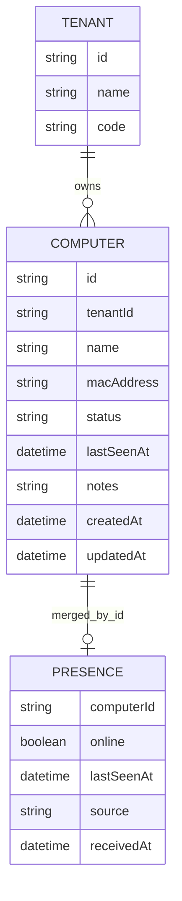
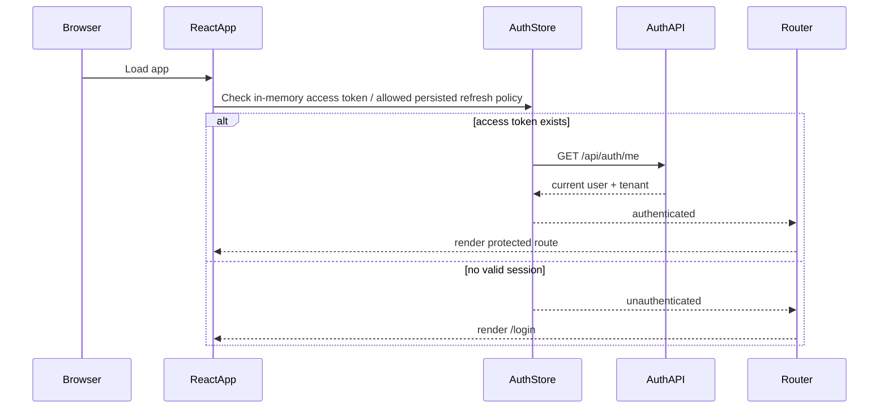
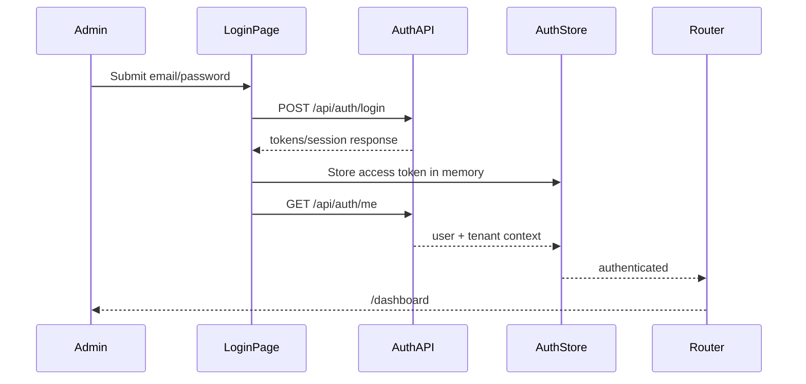
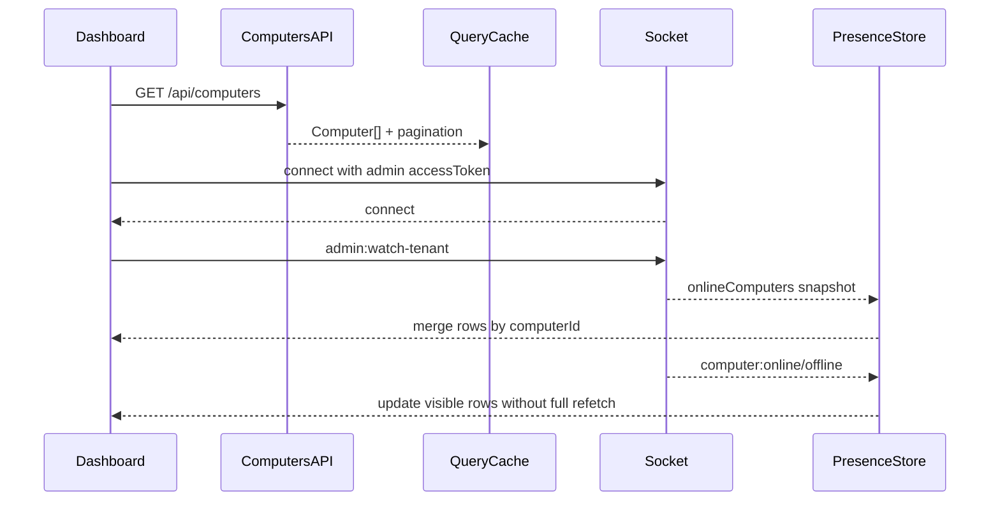
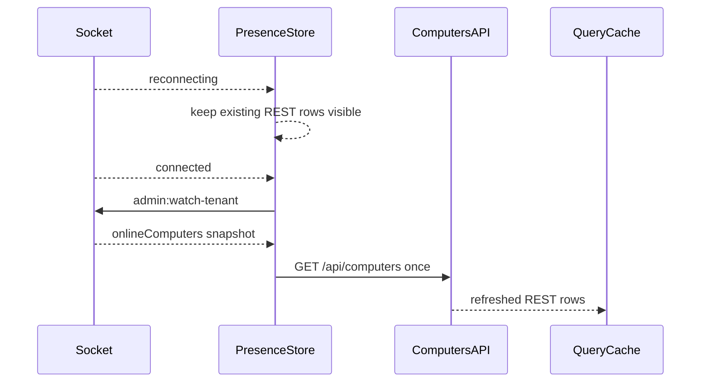
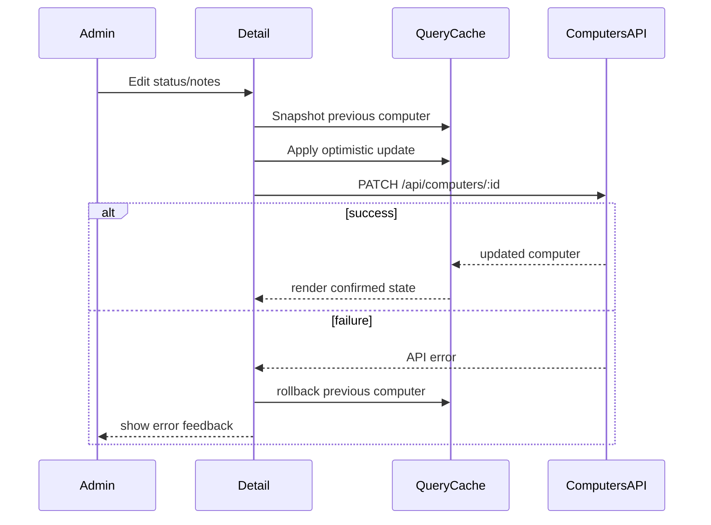
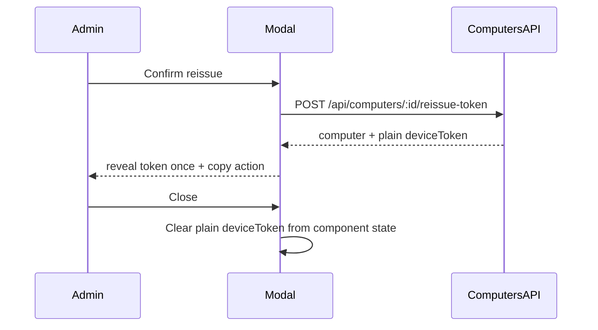

# Technical Design Document: CloudCMS Web Admin MVP

Date: 2026-05-27

Source SPEC: `docs/SPEC/web_admin/SPEC.md`

Source design: `docs/web_admin/2026-05-26-web-admin-mvp-design.md`

API reference: `docs/SPEC/web_admin/api-reference.md`

## 1. Overview

CloudCMS Web Admin MVP adds a tenant-admin web application for computer operations. It lets a `shop_admin` log in, view tenant-scoped computers, monitor realtime online/offline state, update computer status and notes, and reissue a one-time device token for a client PC.

This feature is frontend-only. It creates a new `web-admin/` React + Vite + TypeScript application that consumes the existing backend Auth, Computers, and Realtime contracts. It does not change backend schemas, Prisma migrations, REST endpoints, Socket.IO event names, or backend authorization logic.

The MVP intentionally excludes tenant registration UI, staff/user management, tenant settings, super-admin multi-tenant views, sessions, usage, URL rules, lock-screen assets, subscriptions, reporting, persistent realtime history, and Client PC UI.

The selected product direction is an operations-focused Hybrid Light App + Dark Realtime Panel:

```text
React SPA -> Auth state -> REST query cache -> Realtime presence store -> responsive operations UI
```

## 2. Requirements

### 2.1 Functional Requirements

- As a `shop_admin`, I want to log in with email and password so I can access the tenant admin dashboard.
- As a `shop_admin`, I want authenticated routes to protect `/dashboard` and `/computers` so unauthenticated users cannot see operational data.
- As a `shop_admin`, I want to see total, online, offline, and blocked/inactive computer counts so I can understand tenant computer health quickly.
- As a `shop_admin`, I want to search, filter, sort, and paginate computers so I can manage larger tenant inventories.
- As a `shop_admin`, I want to open a computer detail drawer or mobile sheet so I can inspect metadata, admin status, realtime presence, notes, and timestamps.
- As a `shop_admin`, I want to update a computer's allowed fields (`name`, `status`, `notes`) so I can manage operational state.
- As a `shop_admin`, I want to reissue a device token with confirmation so I can recover a reinstalled or lost-token client PC.
- As a `shop_admin`, I want the new device token to be revealed once with a copy action so I can transfer it to the client PC without storing it in the web app.
- As a `shop_admin`, I want realtime online/offline row updates so I can monitor Client PC presence without manually refreshing.
- As a `shop_admin`, I want reconnect behavior to resubscribe and resync once so the dashboard recovers after network interruptions.

Functional rules:

- `/login` is public.
- `/dashboard` and `/computers` are protected.
- Successful login calls `POST /api/auth/login` and then bootstraps current user/tenant context through `GET /api/auth/me` when needed.
- `401` clears auth state, disconnects Socket.IO, and redirects to `/login`.
- `403` keeps the session and renders a forbidden state.
- The app reads computers from `GET /api/computers`.
- Detail data is fetched from `GET /api/computers/:id` when opening detail from stale or incomplete list data.
- MVP detail opens as a drawer on desktop/tablet and as a full-screen sheet on mobile; route-backed `/computers/:id` deep linking is deferred.
- Computer updates call `PATCH /api/computers/:id` with only `name`, `status`, and `notes`.
- Token reissue calls `POST /api/computers/:id/reissue-token` after explicit confirmation.
- The plain reissued token is held only in modal/sheet component state and cleared on close.
- Socket.IO admin auth uses `socket.handshake.auth = { clientType: "admin", accessToken }`.
- The app emits `admin:watch-tenant` after socket connect and reconnect.
- `computer:online` and `computer:offline` update `presenceByComputerId` by `computerId`.
- Realtime events must not trigger a full computer-list refetch per event.
- On reconnect, the app emits `admin:watch-tenant` again and performs one REST list refresh to resync.

### 2.2 Non-Functional Requirements

- Security:
  - Keep the access token memory-first.
  - Persist refresh token only if the backend refresh flow is confirmed for the environment.
  - Do not log access tokens, refresh tokens, device tokens, Socket.IO auth payloads, authorization headers, or plain reissue responses.
  - Do not persist plain device tokens in localStorage, sessionStorage, query cache, URLs, app-wide state, telemetry, or logs.
  - Do not send forbidden backend fields such as `tenantId`, `macAddress`, `deviceToken`, `deviceTokenHash`, `lastSeenAt`, `createdAt`, or `updatedAt` in update requests.
- Accessibility:
  - All interactive controls must be keyboard reachable.
  - Focus rings must be visible.
  - Status indicators must include text and not rely on color alone.
  - Drawer/sheet and reissue modal must manage focus correctly.
  - Mobile interactive targets must be at least 44px high.
- Responsiveness:
  - Desktop `>= 1280px`: fixed sidebar, full KPI strip, full table columns.
  - Laptop `1024-1279px`: compact actions and responsive panel layout.
  - Tablet `768-1023px`: sidebar drawer, KPI 2x2, hidden non-critical table columns.
  - Mobile `375-767px`: no horizontal scroll, computer cards instead of table, full-screen detail sheet.
- Reliability:
  - Reconnecting realtime state must keep REST data visible.
  - Disconnected realtime state must not mark all computers offline destructively.
  - Optimistic updates require rollback on failure.
  - Async actions must disable duplicate submit.
- Performance:
  - Realtime events update local presence maps in O(1) by `computerId`.
  - Search/filter/sort state should debounce text search where needed before issuing API requests.
  - Computer lists should use backend pagination rather than loading all rows.
- Maintainability:
  - Keep REST API clients, auth state, realtime client, and UI components in separate feature folders.
  - Centralize design tokens.
  - Use typed API responses and typed view models.
  - Keep route-level pages thin and move reusable UI into components.
- Operations:
  - User/team runs backend, DB, Prisma, migration, server, and local setup commands manually.
  - Playwright is not required in the initial scaffold; it is a recommended tool for the verification phase if automated responsive/browser QA is needed.

## 3. Technical Design

### 3.1. Data Model Changes

No backend database or Prisma schema changes are required.

The frontend defines TypeScript models mirroring existing backend responses.

REST computer model:

```ts
export type ComputerStatus = "ACTIVE" | "INACTIVE" | "BLOCKED";

export type Computer = {
  id: string;
  tenantId: string;
  name: string | null;
  macAddress: string;
  status: ComputerStatus;
  lastSeenAt: string | null;
  notes: string | null;
  createdAt: string;
  updatedAt: string;
};
```

Runtime presence model:

```ts
export type PresenceSource = "snapshot" | "socket-event" | "rest";

export type Presence = {
  online: boolean;
  lastSeenAt: string | null;
  source: PresenceSource;
  receivedAt: string;
};
```

Merged row view model:

```ts
export type ComputerRowViewModel = {
  computer: Computer;
  presence: Presence;
  displayName: string;
  adminStatusLabel: "Active" | "Inactive" | "Blocked";
  realtimeLabel: "Online" | "Offline" | "Unavailable" | "Reconnecting";
};
```

Query response model:

```ts
export type ComputersListResponse = {
  items: Computer[];
  pagination: {
    page: number;
    pageSize: number;
    total: number;
    totalPages: number;
  };
};
```

State ownership:

- Auth store owns token/session/user/tenant readiness.
- Query cache owns REST computer list/detail data.
- Realtime store owns socket connection status, `presenceByComputerId`, and bounded recent event feed.
- UI state owns filters, selected computer id, drawer/sheet state, modal state, and transient plain token reveal.

Data relation, frontend view:



### 3.2. API Changes

No backend API change is required. The frontend integrates existing REST and Socket.IO contracts.

#### REST Client

Create a shared API client:

```text
web-admin/src/lib/apiClient.ts
```

Responsibilities:

- Set `Authorization: Bearer <accessToken>` when an access token exists.
- Parse Foundation success/error response shapes.
- Normalize API errors into frontend-safe error objects.
- Trigger auth clearing on `401`.
- Keep `403`, `404`, `409`, `429`, and `500` available for UI-specific states.

Core REST functions:

```ts
login(input: LoginInput): Promise<LoginResult>;
getMe(): Promise<CurrentUser>;
refreshToken(input: RefreshInput): Promise<RefreshResult>;
logout(): Promise<void>;
listComputers(query: ComputersListQuery): Promise<ComputersListResponse>;
getComputer(id: string): Promise<Computer>;
updateComputer(id: string, input: UpdateComputerInput): Promise<Computer>;
reissueComputerToken(id: string, input: ReissueTokenInput): Promise<ReissueTokenResult>;
```

`POST /api/auth/login` request:

```json
{
  "email": "admin@example.com",
  "password": "password"
}
```

`GET /api/computers` query:

```text
?page=1&pageSize=20&status=ACTIVE&q=pc&sort=createdAt:desc
```

`PATCH /api/computers/:id` request:

```json
{
  "name": "PC-01 Front Desk",
  "status": "ACTIVE",
  "notes": "Near cashier"
}
```

`POST /api/computers/:id/reissue-token` request:

```json
{
  "reason": "Client PC was reinstalled"
}
```

Reissue response handling:

```ts
type ReissueTokenResult = {
  computer: Computer;
  deviceToken: string;
};
```

The returned `deviceToken` must not be written into query cache. The mutation handler should return it directly to the modal state.

#### Socket.IO Client

Create realtime client files:

```text
web-admin/src/realtime/
  realtime.client.ts
  realtime.store.ts
  realtime.types.ts
  useAdminPresence.ts
```

Socket auth:

```ts
io(baseUrl, {
  path: "/socket.io",
  auth: {
    clientType: "admin",
    accessToken,
  },
});
```

Events:

- Emit `admin:watch-tenant` with `{}`.
- Receive `computer:online`.
- Receive `computer:offline`.

Ack shape:

```ts
type WatchTenantAck =
  | { success: true; data: { onlineComputers: string[] } }
  | { success: false; error: { code: string; message: string } };
```

Online/offline payload:

```ts
type ComputerPresenceEvent = {
  computerId: string;
  tenantId: string;
  lastSeenAt: string;
};
```

### 3.3. UI Changes

Create a new `web-admin/` application.

Recommended app structure:

```text
web-admin/
  package.json
  index.html
  vite.config.ts
  tsconfig.json
  src/
    main.tsx
    app/
      App.tsx
      routes.tsx
      providers.tsx
    auth/
      auth.api.ts
      auth.store.ts
      LoginPage.tsx
      ProtectedRoute.tsx
    computers/
      computers.api.ts
      computers.types.ts
      ComputersPage.tsx
      ComputerTable.tsx
      ComputerCardList.tsx
      ComputerDetailDrawer.tsx
      ReissueTokenModal.tsx
    dashboard/
      DashboardPage.tsx
      KpiStrip.tsx
      RealtimePanel.tsx
    realtime/
      realtime.client.ts
      realtime.store.ts
      realtime.types.ts
      useAdminPresence.ts
    ui/
      AppShell.tsx
      StatusBadge.tsx
      EmptyState.tsx
      ErrorState.tsx
      Skeleton.tsx
      tokens.css
    lib/
      apiClient.ts
      date.ts
      errors.ts
```

Routes:

- `/login`: public route.
- `/dashboard`: protected route and default authenticated landing page.
- `/computers`: protected management list.

MVP detail behavior:

- Clicking a row/card sets `selectedComputerId` and opens detail.
- Desktop/tablet detail uses `ComputerDetailDrawer`.
- Mobile detail uses full-screen sheet behavior.
- Deep-link route `/computers/:id` is deferred until after MVP unless explicitly requested.

Visual system:

- Use Tailwind CSS with centralized tokens, or equivalent token CSS if Tailwind is not selected during implementation.
- Main app uses light operations colors.
- Realtime panel uses dark colors.
- Fira Sans is the primary font.
- Fira Code is reserved for MAC addresses, tokens, IDs, and timestamps.

Responsive behavior:

- Desktop: fixed sidebar, dashboard grid, full table columns.
- Laptop: compact action buttons and responsive panel sizing.
- Tablet: sidebar drawer, KPI 2x2, hidden non-critical table columns.
- Mobile: compact computer cards, bounded realtime feed, full-screen detail sheet, no horizontal page scroll.

Required UI states:

- Loading skeleton.
- Empty computers state.
- Error state with retry action.
- Forbidden state.
- Rate-limited action feedback.
- Reconnecting realtime state.
- Realtime unavailable state.
- Optimistic update rollback feedback.
- Token reveal state with copy action.

### 3.4. Logic Flow

#### App Bootstrap



#### Login Flow



#### Dashboard Data And Realtime Flow



#### Reconnect Flow



#### Update Flow



#### Token Reissue Flow



### 3.5. Dependencies

Production dependencies:

- `@vitejs/plugin-react`: React support for Vite.
- `react`, `react-dom`: UI runtime.
- `react-router-dom`: route definitions and protected routes.
- `@tanstack/react-query`: REST query cache, mutation state, rollback, invalidation.
- `socket.io-client`: admin realtime presence connection.
- `zod`: frontend form/schema validation.
- `react-hook-form`: login/update/reissue form state.
- Tailwind CSS runtime/build packages if Tailwind is selected during scaffold.

Development dependencies:

- `typescript`: type checking.
- `vite`: dev/build tool.
- `vitest`: unit tests.
- `@testing-library/react`: component tests.
- `@testing-library/user-event`: interaction tests.
- `jsdom`: DOM environment for component tests.
- `eslint` and Prettier-compatible tooling according to local frontend setup.
- `playwright`: recommended for verification phase only, not required in initial scaffold.

Configuration:

- `VITE_API_BASE_URL`: backend REST base URL.
- `VITE_SOCKET_URL`: Socket.IO base URL; may equal API base URL.
- `VITE_APP_ENV`: optional environment label for diagnostics.

No database, Prisma, Redis, queue, or backend env changes are required for this frontend MVP.

### 3.6. Security Considerations

Token handling:

- Access token is memory-first.
- Refresh token persistence is conditional and must follow confirmed backend policy.
- Logout clears local auth state and disconnects Socket.IO.
- `401` clears auth state and disconnects Socket.IO.
- Socket.IO auth payload must never be logged.

Device token handling:

- Reissued `deviceToken` is a secret.
- Store it only in `ReissueTokenModal` local state.
- Do not write it to TanStack Query cache.
- Do not write it to browser storage.
- Do not include it in route params, query strings, logs, analytics, or error reports.
- Clear it when the modal/sheet closes.

Request hardening:

- Update payloads must be constructed from an allowlist: `name`, `status`, `notes`.
- UI must not send `tenantId`, `macAddress`, `deviceToken`, `deviceTokenHash`, `lastSeenAt`, `createdAt`, or `updatedAt`.
- Tenant scope is always backend-derived; there is no user-entered tenant id.

Error handling:

- Do not display stack traces or raw backend internals.
- Auth failures should use stable UI states.
- Invalid socket auth should not expose token details.

Browser safety:

- Avoid `dangerouslySetInnerHTML`.
- Escape user-provided notes through normal React rendering.
- Avoid storing sensitive values in global debug state.

### 3.7. Performance and Reliability Considerations

REST/query performance:

- Use backend pagination.
- Keep search text in UI state and debounce before updating query params or query keys if needed.
- Use query keys that include page, page size, status, search, and sort.
- Avoid full-table refetch for every realtime event.

Realtime performance:

- Store presence in a map keyed by `computerId`.
- Apply online/offline events in O(1).
- Keep recent event feed bounded, for example latest 20-50 events.
- On reconnect, perform one resync list fetch rather than repeated refetches.

Reliability:

- Reconnecting should show warning state while preserving REST data.
- Disconnected realtime should show unavailable state without marking all rows offline.
- If `admin:watch-tenant` ack fails, keep REST data visible and show realtime error state.
- Optimistic mutations must rollback on error.
- Duplicate mutation submits must be disabled.

Responsive reliability:

- Fixed-format UI elements such as KPI cards, icon buttons, table cells, and status badges must have stable dimensions.
- Long MAC addresses, IDs, and tokens must wrap or truncate with an expansion/copy path.
- Mobile layout must avoid horizontal page scroll.

### 3.8. Observability and Operations

Frontend logging:

- Keep console logging minimal and disabled for sensitive paths.
- Do not log access tokens, refresh tokens, device tokens, Socket.IO auth payloads, or API authorization headers.
- Log only sanitized development diagnostics if needed.

Recommended client-side events for future telemetry:

- `web_admin.login.success`
- `web_admin.login.failure`
- `web_admin.computers.list.failure`
- `web_admin.computer.update.success`
- `web_admin.computer.update.failure`
- `web_admin.computer.token_reissue.success`
- `web_admin.computer.token_reissue.failure`
- `web_admin.realtime.connected`
- `web_admin.realtime.reconnecting`
- `web_admin.realtime.disconnected`

Telemetry payloads must exclude secrets and raw request/response bodies.

Operational notes:

- User/team starts the backend and frontend manually.
- User/team runs DB, Prisma, migration, and server commands manually.
- Browser QA should verify 1440px, 1024px, 768px, and 375px viewports.
- Playwright can automate responsive/browser verification later, but manual browser QA is acceptable for the initial TDD scope.

## 4. Testing Plan

Unit tests:

- `apiClient` attaches auth headers when access token exists.
- `apiClient` maps Foundation error responses into frontend error types.
- Auth store clears session on `401`.
- Computer update payload builder includes only `name`, `status`, and `notes`.
- Presence reducer applies snapshot, online event, offline event, reconnecting state, and disconnected state.
- Merged row selector separates admin status from realtime presence.
- KPI selector computes total, online, offline, and blocked/inactive counts.
- Reissue modal state clears plain token on close.

Component tests:

- Login form validates required email/password fields and disables submit while loading.
- Protected route redirects unauthenticated users to `/login`.
- App shell renders sidebar/topbar and tenant context.
- Dashboard renders loading, empty, error, forbidden, reconnecting, disconnected, and populated states.
- Computer table supports search, status filter, sort controls, pagination controls, and row actions.
- Mobile computer card list renders the same core computer data as table rows.
- Detail drawer/sheet renders metadata, status, notes, presence, and timestamps.
- Update failure rolls back optimistic state and shows feedback.
- Reissue modal requires confirmation, reveals token once, supports copy action, and clears token on close.

Realtime tests with mocked socket client:

- Socket connects with `handshake.auth.clientType = "admin"` and current access token.
- `admin:watch-tenant` emits after connect.
- Reconnect emits `admin:watch-tenant` again.
- Watch snapshot populates `presenceByComputerId`.
- `computer:online` marks only the matching computer online.
- `computer:offline` marks only the matching computer offline.
- Event feed remains bounded.
- Realtime events do not trigger list refetch per event.
- Reconnecting/disconnected state does not mark all computers offline.

Integration-style frontend tests:

- Login success flows to dashboard.
- `401` during computer list clears auth and redirects.
- `403` during computer list renders forbidden state.
- Update success updates cache.
- Update error rolls back cache.
- Reissue success displays token outside the query cache path.

Browser QA:

- Verify 1440px desktop layout: fixed sidebar, full table, KPI strip, dark realtime panel.
- Verify 1024px laptop layout: compact actions, no overlapping controls.
- Verify 768px tablet layout: sidebar drawer, KPI 2x2, hidden non-critical table columns.
- Verify 375px mobile layout: no horizontal scroll, cards instead of table, full-screen detail sheet.
- Verify keyboard focus order across login, sidebar, filters, table/cards, drawer/sheet, modal, and copy action.
- Verify focus rings are visible.
- Verify contrast on light app surfaces and dark realtime panel.
- Verify long token text wraps while copy action remains visible.

Manual verification:

- User/team starts backend and frontend.
- User/team runs DB, Prisma, migration, and server commands manually when needed.
- Login as a tenant `shop_admin`.
- Confirm dashboard loads tenant computers.
- Confirm Socket.IO admin connection succeeds and emits `admin:watch-tenant`.
- Confirm a test Client PC socket causes `computer:online` and `computer:offline` updates.
- Confirm manual refresh reloads REST data.
- Confirm reconnect resubscribes and refreshes once.
- Confirm status/notes update persists after refresh.
- Confirm reissue token reveals the new token once and does not show it after modal close.

## 5. Open Questions

- Confirm final refresh-token persistence policy before production hardening.
- Confirm whether Tailwind CSS is the final styling implementation or whether CSS modules with token CSS should be used.
- Confirm whether route-backed `/computers/:id` deep linking should be added after MVP.
- Confirm whether `staff` receives read-only Web Admin access in a future phase.
- Confirm whether Playwright should be added during the verification phase or kept as manual browser QA.

## 6. Alternatives Considered

### Next.js Instead Of Vite SPA

Next.js would provide routing and server-side rendering, but the MVP is an authenticated operations app with no SEO requirement. Vite SPA keeps the implementation smaller and fits the existing backend API boundary.

### Route-Backed `/computers/:id` Detail In MVP

Route-backed detail supports deep links and reload restoration. It is deferred for MVP because drawer/sheet state is simpler and the current requirement focuses on management workflows rather than shareable links.

### Plain React State Without TanStack Query

Plain state reduces dependency count, but pagination, refetch, mutation rollback, cache replacement, and reconnect resync are easier to implement and test with a query/cache layer.

### Persisting Device Token Reveal In Query Cache

Persisting the reissued token in query cache would simplify mutation handling, but it increases the risk of exposing a one-time secret. The token must remain modal-local and be cleared on close.

### Playwright As Initial Required Dependency

Playwright is useful for responsive and browser QA, but adding it at scaffold time increases setup cost. The TDD treats it as a recommended verification-phase tool, with manual browser QA acceptable for the initial MVP.
